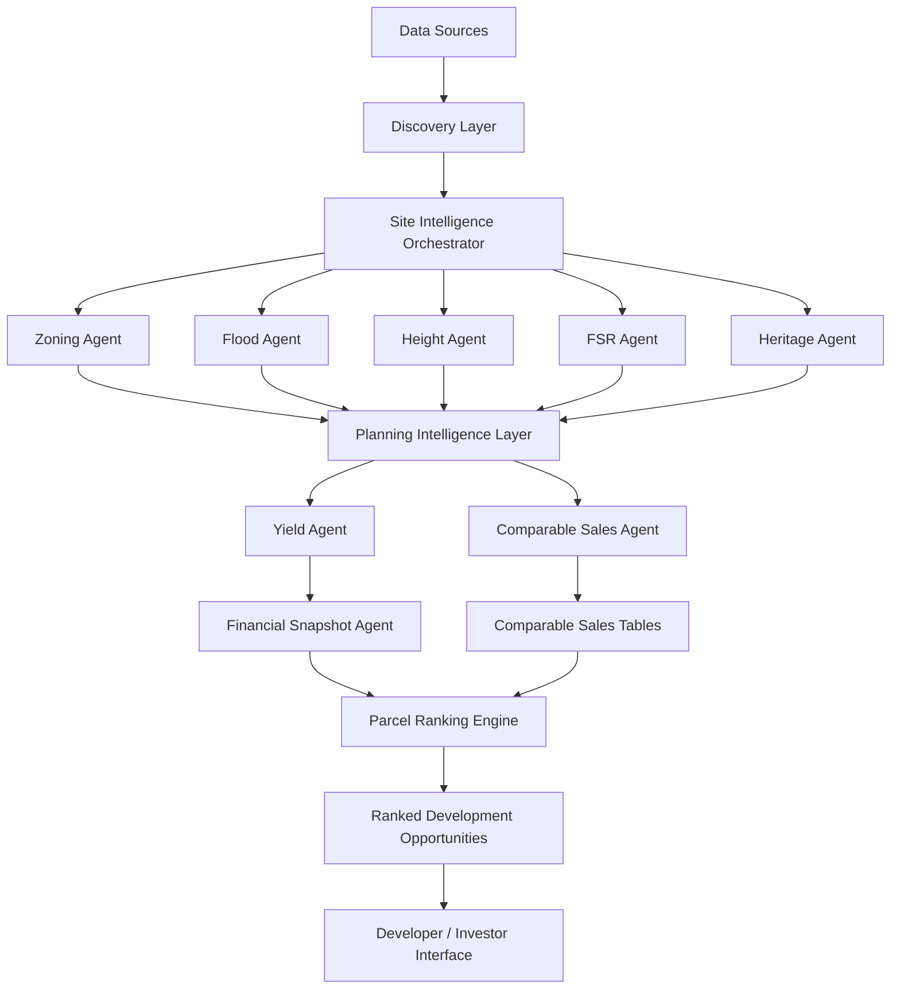
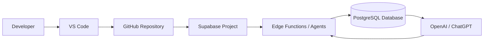

# AI Deal Platform Master

Combined reference of all Markdown documents under `docs/`, excluding `docs/developer-diary`.

Generated on 2026-04-12.

## ai-governance

### AGENT_CREATION_WORKFLOW

Source: `docs\ai-governance\AGENT_CREATION_WORKFLOW.md`

DEPRECATED - see docs_v2/CORE_SYSTEM_PROMPT.md and docs_v2/SYSTEM_RUNTIME.md
This file is retained for compatibility and historical reference.

# AGENT_CREATION_WORKFLOW.md

Referenced by:

docs/operations/AI_SYSTEM_PROMPT.md  
docs/ai-governance/DEVELOPMENT_AUTOMATION_WORKFLOW.md  

## Purpose

This document defines the **standard workflow for creating new agents** in the AI Deal Platform.

All new agents must follow this workflow to maintain system consistency.

---

# Step 1 — Define Purpose

Every agent must have a **single clear responsibility**.

Examples:

- retrieve zoning data  
- estimate development yield  
- analyse flood overlays  

---

# Step 2 — Create Agent Folder

Create directory:

supabase/functions/{agent-name}

---

# Step 3 — Create Core File

Create:

index.ts

Follow the structure defined in:

docs/ai-governance/AI_AGENT_TEMPLATE.md

---

# Step 4 — Implement Logic

Agent must include:

- request validation  
- structured logging  
- clear error handling  
- database write logic  
- environment variable usage if required  

---

# Step 5 — Define Input Schema

Example:

{
  "deal_id": "uuid",
  "address": "string"
}

---

# Step 6 — Define Output Schema

Example:

{
  "zoning": "string",
  "permitted_use": "string"
}

---

# Step 7 — Create Test Payload

Each agent must have a simple JSON payload used for testing.

---

# Step 8 — Update Documentation

Whenever a new agent is created the following files must be updated:

docs/system/AGENTS.md  
docs/system/API.md  
docs/system/PROJECT_STATE.md  

If the agent introduces architectural change:

docs/architecture/ARCHITECTURE.md must also be updated.

---

# Step 9 — Review

AI should check:

- documentation updated  
- schema consistency  
- error handling present  
- logging present  
- test payload present  

---

# Step 10 — Commit

Prepare commit summary explaining:

- new agent purpose  
- new endpoints  
- documentation updates

### AI_AGENT_TEMPLATE

Source: `docs\ai-governance\AI_AGENT_TEMPLATE.md`

DEPRECATED - see docs_v2/CORE_SYSTEM_PROMPT.md and docs_v2/SYSTEM_RUNTIME.md
This file is retained for compatibility and historical reference.

# AI Agent Template

This template defines the structure every new agent must follow.

## Agent Name

Example: zoning-agent

## Purpose

Describe the single responsibility of the agent.

Example:
Retrieve zoning controls for a site.

## Input Schema

{
"deal_id": "uuid",
"address": "string"
}

## Output Schema

{
"zoning": "string",
"permitted_use": "string"
}

## Responsibilities

- fetch external data
- process information
- write results to database

## Logging

Every agent must log:

- request received
- processing status
- success/failure

## Error Handling

Return consistent format:

{
"error": "description"
}

## Database Writes

Agents must store key results in the database.

## Documentation

Every new agent must update:

AGENTS.md  
API.md  
PROJECT_STATE.md

## Test Payload

Example test JSON:

{
"deal_id": "test",
"address": "12 Marine Parade Kingscliff NSW"
}

### AI_BUILD_RULES

Source: `docs\ai-governance\AI_BUILD_RULES.md`

DEPRECATED - see docs_v2/CORE_SYSTEM_PROMPT.md and docs_v2/SYSTEM_RUNTIME.md
This file is retained for compatibility and historical reference.

# AI_BUILD_RULES.md

# AI Build Rules

IMPORTANT

Any AI system assisting development in this repository must read:

docs_v2/CORE_SYSTEM_PROMPT.md  
docs_v2/SYSTEM_RUNTIME.md  

before generating or modifying code.

---

## Purpose

This document defines the operational rules for AI-assisted development in the AI Deal Platform project.

ChatGPT (or other AI coding agents) acts as a development operator but must follow strict guidelines to ensure system stability, architectural consistency, and security.

---

# Core Principles

1. The Git repository is the **source of truth**  
2. Architecture decisions must be documented  
3. AI-generated code must follow existing project templates  
4. All new agents must update project documentation  
5. High-risk operations require explicit human approval  
6. System stability is more important than development speed  

---

# AI Responsibilities

AI tools are allowed to:

• generate code  
• scaffold new agents  
• edit existing code  
• update documentation  
• generate test payloads  
• suggest architecture improvements  
• diagnose errors  

AI tools must **explain reasoning when proposing structural changes**.

---

# Operations Allowed Without Approval

AI may automatically perform:

• creating new files  
• updating documentation  
• refactoring small code sections  
• generating Supabase edge functions  
• adding test payloads  
• improving logging  
• preparing commit messages  

---

# Operations Requiring Human Approval

AI must NOT perform these actions automatically:

• database schema changes  
• production deployments  
• environment variable changes  
• secret handling  
• deleting major components  
• replacing architecture patterns  
• modifying financial calculations  

AI must propose the change and wait for approval.

---

# Coding Standards

All agents must follow:

• TypeScript  
• Supabase Edge Function format  
• structured logging  
• consistent error handling  
• documented inputs and outputs  

---

# Documentation Rules

When new agents are created the AI must update:

docs/system/AGENTS.md  
docs/system/API.md  
docs/system/PROJECT_STATE.md  

If architecture changes:

docs/architecture/ARCHITECTURE.md must also be updated.

---

# Security Rules

AI must never:

• expose secrets  
• hardcode API keys  
• commit credentials  
• modify authentication without approval  

---

# Development Philosophy

AI accelerates engineering work but does not replace human oversight.

The developer remains responsible for:

• system architecture  
• final design decisions  
• approving high-risk changes  
• long-term product direction

### AI_SYSTEM_PROMPT

Source: `docs\ai-governance\AI_SYSTEM_PROMPT.md`

DO NOT USE - replaced by docs_v2 system
DEPRECATED - see docs_v2/CORE_SYSTEM_PROMPT.md and docs_v2/SYSTEM_RUNTIME.md
This file is retained for compatibility and historical reference.

# AI SYSTEM PROMPT  QUOTA OPTIMISED BUILD MODE

## CORE PRINCIPLE

Maximise output per token.

The system must:
- minimise token usage
- avoid unnecessary computation
- maintain determinism and traceability
- prioritise practical, buildable outcomes

---

## MODEL USAGE STRATEGY

Default:
- Use GPT-5.4-mini

Escalate to GPT-5.4 ONLY when:
- repeated errors cannot be resolved
- logic or architecture ambiguity blocks progress

If escalation occurs:
1. Use GPT-5.4 for diagnosis only
2. Return to mini for implementation

---

## EXECUTION STRATEGY

### 1. STAGED BUILDS ONLY

- Work in small, isolated steps
- One subsystem per execution
- Never batch large multi-step builds unless explicitly instructed

---

### 2. NARROW SCOPE ENFORCEMENT

- Only create or modify files directly related to the current task
- Do NOT refactor unrelated modules
- Do NOT scan or rebuild the entire codebase

---

### 3. ERROR HANDLING

- Fix errors ONLY within touched files
- Do NOT trigger global fix loops
- If an error cannot be resolved:
  - log it in FINAL_REPORT.md under 'Required Fixes'
  - continue where possible

---

### 4. CONTEXT REUSE (MANDATORY)

Always reference:
- FINAL_REPORT.md
- PROJECT_STATE.md

Do NOT re-explain system architecture.

---

### 5. TEST EXECUTION POLICY

- Do NOT run full test suites by default
- Only run tests when:
  - explicitly required
  - or changes directly affect test logic

Preferred fallback:
- npx jest --runInBand

---

### 6. FILE MODIFICATION RULES

- Reuse existing architecture
- Do NOT duplicate logic
- Keep implementations minimal and explicit
- Preserve compatibility with existing artifacts

---

### 7. DETERMINISM REQUIREMENT

All outputs must be:
- deterministic
- reproducible
- traceable

Same input must produce same output.

---

### 8. ARTIFACT HANDLING

- Use existing canonical artifact structures
- Persist outputs in correct directories
- Do NOT introduce new formats unless required

---

### 9. DOCUMENTATION POLICY

- Append only to:
  - FINAL_REPORT.md
  - PROJECT_STATE.md

Do NOT rewrite existing sections.

---

### 10. BUILD VALIDATION

Default:
- Run: npm run build

Run tests ONLY if needed.

---

## FORBIDDEN BEHAVIOURS

- Full repo refactors
- Running all tests unnecessarily
- Rebuilding existing working systems
- Expanding scope beyond instruction
- Introducing non-deterministic logic

---

## SUCCESS CRITERIA

A successful execution:
- completes the requested task
- keeps scope minimal
- avoids unnecessary token usage
- maintains system stability
- produces deterministic outputs

---

## OPERATING MODE

This system operates in:

HIGH EFFICIENCY MODE
 Minimum tokens
 Maximum output
 No wasted work

### DEVELOPMENT_AUTOMATION_WORKFLOW

Source: `docs\ai-governance\DEVELOPMENT_AUTOMATION_WORKFLOW.md`

DEPRECATED - see docs_v2/CORE_SYSTEM_PROMPT.md and docs_v2/SYSTEM_RUNTIME.md
This file is retained for compatibility and historical reference.

# DEVELOPMENT_AUTOMATION_WORKFLOW.md

## Purpose

This document defines the workflow for AI-assisted development of the AI Deal Platform.

ChatGPT operates as a **development automation layer** working alongside the developer to accelerate coding, documentation, testing, and system improvements.

---

# Development Roles

## Developer (Human)

Responsible for:

• product vision  
• architecture decisions  
• approving major changes  
• reviewing AI-generated work  

## ChatGPT / AI Tools

Responsible for:

• generating code  
• updating project files  
• creating agents  
• maintaining documentation  
• troubleshooting errors  

## Development Tools

• VS Code — development environment  
• Supabase — backend infrastructure  
• GitHub — version control  
• Terminal / CLI — command execution  

Supabase-specific operations are defined in:

docs/ai-governance/SUPABASE_WORKFLOWS.md  

Agent creation standards are defined in:

docs/ai-governance/AGENT_CREATION_WORKFLOW.md  

---

# AI-Assisted Development Flow

## Step 1 — Design Phase

Developer describes a feature or system improvement.

AI proposes:

• architecture approach  
• required agents  
• data structures  
• API changes  

Developer approves before implementation.

---

## Step 2 — Build Phase

AI generates:

• folders  
• code files  
• Supabase edge functions  
• test payloads  
• documentation updates  

---

## Step 3 — Review Phase

AI performs a code review of its own work and identifies:

• potential bugs  
• architecture inconsistencies  
• missing documentation  
• test gaps  

Developer then reviews.

---

## Step 4 — Test Phase

AI generates:

• Postman payloads  
• curl commands  
• test scenarios  

Developer runs tests.

---

## Step 5 — Commit Phase

AI prepares:

• commit message  
• change summary  
• documentation updates  

Developer executes git commit and push.

---

# Documentation Workflow

Whenever the system changes AI must update:

docs/architecture/ARCHITECTURE.md  
docs/system/AGENTS.md  
docs/system/API.md  
docs/system/PROJECT_STATE.md  

---

# Deployment Rules

AI may prepare deployment steps but must NOT deploy automatically.

Deployment always requires human approval.

---

# Long-Term Automation Vision

Eventually ChatGPT will be able to:

• scaffold large system features  
• analyze project structure  
• recommend architecture improvements  
• maintain documentation automatically  
• generate test coverage  
• orchestrate development tasks across tools  

The developer remains the **final authority** over system direction.

### SUPABASE_WORKFLOWS

Source: `docs\ai-governance\SUPABASE_WORKFLOWS.md`

DEPRECATED - see docs_v2/CORE_SYSTEM_PROMPT.md and docs_v2/SYSTEM_RUNTIME.md
This file is retained for compatibility and historical reference.

# SUPABASE_WORKFLOWS.md

Referenced by:

docs/operations/AI_SYSTEM_PROMPT.md  
docs/ai-governance/DEVELOPMENT_AUTOMATION_WORKFLOW.md  

## Purpose

This document defines the **standard workflows for interacting with Supabase infrastructure** in the AI Deal Platform repository.

These workflows ensure AI-assisted development remains:

- consistent  
- predictable  
- safe  
- well documented  

AI systems working with this repository must follow the procedures defined here.

---

# Workflow 1 — Create New Edge Function

1. Create folder:

supabase/functions/{agent-name}

2. Create file:

index.ts

3. Follow the structure defined in:

docs/ai-governance/AI_AGENT_TEMPLATE.md

4. Ensure the function includes:

- request validation  
- structured logging  
- error handling  
- database writes  
- environment variable usage  

5. Add a **test payload**.

6. Update documentation.

Required doc updates:

docs/system/AGENTS.md  
docs/system/API.md  
docs/system/PROJECT_STATE.md  

---

# Workflow 2 — Update Edge Function

Steps:

1. Review existing code  
2. Preserve input/output schema unless change approved  
3. Maintain logging format  
4. Maintain error response format  
5. Update tests if behaviour changes  
6. Update documentation where necessary  

---

# Workflow 3 — Create SQL Migration

1. Generate migration SQL  
2. Explain schema change  
3. Wait for developer approval before execution  

AI must **never automatically modify production schema**.

---

# Workflow 4 — API Documentation Updates

Whenever endpoints change:

Update:

docs/system/API.md  

Include:

- endpoint path  
- request schema  
- response schema  
- example payload  

---

# Workflow 5 — Generate Test Payload

Each agent must include a test payload.

Example:

{
  "deal_id": "test-id",
  "address": "12 Marine Parade Kingscliff NSW"
}

---

# Workflow 6 — Register New Agent

After creating an agent AI must update:

docs/system/AGENTS.md  
docs/system/API.md  
docs/system/PROJECT_STATE.md  

---

# Workflow 7 — Deployment

AI may prepare deployment commands but must **not deploy automatically**.

Deployment requires developer approval.

## Deployment Rule

AI must NOT deploy functions automatically.

Default:
- generate deploy command
- wait for developer instruction

Only deploy if explicitly instructed:
"deploy this agent"

## CREATE TABLE WORKFLOW

When a required table does not exist:

1. Design schema
2. Generate SQL migration
3. Apply via Supabase migration system

Example:

create table comparable_sales (
  id uuid primary key default gen_random_uuid(),
  deal_id uuid,
  address text,
  sale_price numeric,
  sale_date date,
  metadata jsonb,
  created_at timestamp default now()
);

4. Update documentation if needed


## architecture

### AGENT_INTERACTION_MAP

Source: `docs\architecture\AGENT_INTERACTION_MAP.md`

DEPRECATED - see docs_v2/CORE_SYSTEM_PROMPT.md and docs_v2/SYSTEM_RUNTIME.md
This file is retained for compatibility and historical reference.

# Agent Interaction Map

This document describes how agents interact in the AI Deal Platform pipeline.

Email Lead
  ->
email-agent
  ->
site-discovery-agent
  ->
site-intelligence-agent (orchestrator)
  ->
zoning-agent
flood-agent
height-agent
fsr-agent
heritage-agent
  ->
yield-agent
comparable-sales-agent
  ->
add-financial-snapshot
  ->
parcel-ranking-agent
  ->
ranked development opportunities

Purpose:
Provide a quick reference for how data moves between agents.

### ARCHITECTURE

Source: `docs\architecture\ARCHITECTURE.md`

DEPRECATED - see docs_v2/CORE_SYSTEM_PROMPT.md and docs_v2/SYSTEM_RUNTIME.md
This file is retained for compatibility and historical reference.

# System Architecture

The AI Deal Platform uses a modular Supabase Edge Function architecture with
stage-specific agents and an event-driven orchestration layer.

## Core Pipeline

Data Sources ↓ Discovery Agents ↓ Site Intelligence Orchestrator ↓ Planning
Analysis Agents ↓ Feasibility Agents ↓ Ranking Engine ↓ Event Dispatcher ↓ Rule
Engine ↓ Triggered Actions

## Major Layers

### Discovery Layer

Brings candidate sites into the system.

Sources:

- inbound emails
- planning portals
- real estate listings
- manual input

### Intelligence Layer

Collects planning constraints:

- zoning
- flood overlays
- height limits
- FSR
- heritage restrictions

### Feasibility Layer

Estimates development potential:

- GFA
- unit count
- revenue
- build cost
- profit
- sale price per sqm from comparable developments

### Ranking Layer

Evaluates opportunities based on:

- planning flexibility
- yield potential
- site size
- feasibility
- adaptive feedback from predicted vs actual outcomes stored in
  `scoring_feedback`

### Capital Allocation Layer

Assigns capital to the highest-priority deals using `priority_score`, persists
allocations in `capital_allocations`, and logs allocation decisions for
auditability.

### Investor And Capital Layer

Maintains the investor registry in `investors`, links multiple investors to a
deal through `deal_investors`, stores one lightweight active terms record per
deal in `deal_terms`, and now computes deterministic fit scores into
`deal_investor_matches` using investor preferences plus current deal strategy,
location, target margin, and deal-size signals. The layer remains rule-based and
lightweight, leaving notifications, allocation expansion, and CRM workflows out
of scope. It now also includes a simple CRM foundation through
`investor_deal_pipeline` and `investor_communications`, so each investor-deal
pair can carry pipeline state, follow-up timing, and recent structured
communication summaries without introducing outbound automation or autonomous
messaging. It now also includes a deterministic investor action layer through
`investor-actions`, which can execute `contact_investor` by logging an investor
communication and promoting `investor_deal_pipeline` through early-stage CRM
states, while exposing threshold-based suggestions from `deal_investor_matches`
without creating autonomous action loops. It now also includes lightweight
outreach generation through `investor-outreach`, which assembles ready-to-send
investor message drafts from stored deal, financial, risk, and preference
context without introducing external messaging integrations. It now also
includes lightweight
investor commitment tracking through `deal_capital_allocations`, allowing each
investor-deal pair to store committed capital, optional allocation percentage,
and commitment status without coupling that data to payment or distribution
logic. It now also includes a thin capital visibility layer through the derived
`deal_capital_summary` view, which computes raise totals, remaining capital,
investor counts, and pipeline-status counts for direct UI and context
consumption without adding new capital workflows.

### Analytics Layer

Tracks final deal outcomes, scoring feedback, and lifecycle funnel performance
through `deal_outcomes`, `deal_performance`, `scoring_feedback`, and
`get-deal-funnel`.

### Cost And Safety Layer

Tracks runtime activity in `usage_metrics`, applies operator kill-switch
settings from `system_settings`, enforces per-agent hourly controls from
`agent_rate_limits`, and exposes operator controls through `get-usage-summary`,
`update-system-settings`, `cleanup`, and the internal dashboard.

### Event-Driven Decision Layer

Uses stage-completion events to drive downstream orchestration rules.

- `site-discovery-agent` dispatches `post-discovery`
- `site-intelligence-agent` dispatches `post-intelligence`
- `parcel-ranking-agent` dispatches `post-ranking`
- `financial-engine-agent` dispatches `post-financial`
- the shared event dispatcher invokes `rule-engine-agent`, logs
  `event_triggered` and `rule_engine_invoked` records to `ai_actions`, and
  suppresses duplicate processing for the same `deal_id` and event
- `rule-engine-agent` fetches event-scoped rules from `get-agent-rules`,
  evaluates them against persisted planning, yield, ranking, and financial
  context, and executes matching actions in priority order
- `notification-agent` now extends the action layer with external high-priority
  email and webhook delivery, while recording delivery status in `ai_actions`
- shared agent runtime validation now records per-agent execution state in
  `agent_registry` and standardized `agent_execution` rows in `ai_actions`
- failed notification triggers now retry with bounded attempts and downgrade
  priority when retries are exhausted
- failed `deal_feed` persistence now retries with deduplicated queue fallback in
  `agent_retry_queue`
- `system-health-check` snapshots key agent, database, and recent-activity
  status into `system_health`
- the shared agent runtime records one `usage_metrics` row per successful or
  client-error execution, checks the global `system_settings` kill switch before
  agent work starts, and blocks over-limit agents using `agent_rate_limits`
- database workflow triggers promote `deals.status` from `active` to `reviewing`
  when high-priority feed entries are persisted and from `reviewing` to
  `approved` when all linked tasks are completed, with deduplicated
  status-transition logging
- `site-intelligence-agent` preserves the legacy score-threshold fallback if
  post-ranking rule execution fails or no report rule matches
- hosted environments may require additive schema-alignment migrations before
  autonomous orchestration can persist deal, feasibility, comparable-sales, and
  ranking outputs consistently
- `internal-ops-dashboard` provides the operator-facing web surface for deal
  feed review, notification audit, approvals, funnel monitoring, health checks,
  cleanup, report generation, and kill-switch controls

## Architecture Principles

- Modular
- Extensible
- Data-driven
- AI-assisted

### SYSTEM_ARCHITECTURE_DIAGRAM

Source: `docs\architecture\SYSTEM_ARCHITECTURE_DIAGRAM.md`

DEPRECATED - see docs_v2/CORE_SYSTEM_PROMPT.md and docs_v2/SYSTEM_RUNTIME.md
This file is retained for compatibility and historical reference.

# SYSTEM_ARCHITECTURE_DIAGRAM.md

## AI Deal Platform -- System Architecture

This document provides a visual and conceptual overview of the AI Deal Platform architecture.

It describes how agents, infrastructure, and data layers interact to produce development opportunity intelligence.

------------------------------------------------------------------------

# High Level System Diagram



------------------------------------------------------------------------

# Infrastructure Architecture



------------------------------------------------------------------------

# Core System Layers

## 1. Discovery Layer

Responsible for bringing candidate development sites into the system.

Sources may include:

- inbound email leads
- real estate listings
- planning portal data
- developer submissions
- automated site scanning

Agents:

- email-agent
- domain-discovery-agent
- site-discovery-agent

------------------------------------------------------------------------

## 2. Site Intelligence Layer

This layer retrieves planning controls and constraints for each site.

Agents:

- zoning-agent
- flood-agent
- height-agent
- fsr-agent
- heritage-agent

Outputs:

- zoning classification
- height limits
- FSR limits
- environmental overlays
- heritage restrictions

------------------------------------------------------------------------

## 3. Feasibility Layer

This layer estimates development potential.

Agents:

- yield-agent
- comparable-sales-agent
- add-financial-snapshot

Outputs:

- gross floor area (GFA)
- estimated unit count
- development revenue
- construction cost
- projected margin
- estimated sale price per sqm from nearby comparable developments

------------------------------------------------------------------------

## 4. Ranking Layer

The ranking engine evaluates opportunities based on development viability.

Example scoring inputs:

- zoning flexibility
- site size
- yield potential
- planning constraints
- feasibility margin

Output:

Development opportunity score and ranking tier.

------------------------------------------------------------------------

# Database Architecture

The database acts as the system memory.

Key tables:

- deals
- communications
- site_candidates
- planning_constraints
- yield_estimates
- financial_snapshots
- comparable_sales_estimates
- comparable_sales_evidence
- knowledge_documents

Agents read and write to the database so intelligence accumulates over time.

------------------------------------------------------------------------

# AI Integration

AI is used primarily for:

- interpreting unstructured data
- summarizing deal intelligence
- assisting with decision support
- generating reports

AI does not replace deterministic logic for planning or financial calculations.

------------------------------------------------------------------------

# Future Architecture Expansion

Planned additions:

### Parcel Scanner

Scan the entire NSW cadastre for development potential.

### DA Discovery Agent

Monitor planning approvals and rezoning proposals.

### Machine Learning Ranking

Improve opportunity scoring based on historical deal success.

### Automated Feasibility Reports

Generate investor-ready development memorandums.

### Investor Opportunity Feed

Notify developers or investors of ranked opportunities.

------------------------------------------------------------------------

# Long-Term Vision

The platform evolves into:

**An AI-powered development acquisition engine** capable of:

- scanning property markets
- identifying development opportunities
- analyzing planning constraints
- estimating feasibility
- ranking deals
- notifying investors

------------------------------------------------------------------------

# Diagram Usage

This document serves as a visual reference for the system architecture and should be updated whenever:

- new agents are added
- major pipelines change
- infrastructure architecture evolves


## database

### SCHEMA

Source: `docs\database\SCHEMA.md`

DEPRECATED - see docs_v2/CORE_SYSTEM_PROMPT.md and docs_v2/SYSTEM_RUNTIME.md
This file is retained for compatibility and historical reference.

# DATABASE SCHEMA REGISTRY

This document is the source of truth for agent-facing database schema in this repository.

All new tables MUST be registered here after creation or modification.

---

## NAMING CONVENTIONS

- snake_case only
- plural table names
- jsonb for flexible AI-generated payloads
- `id`, `created_at`, and `updated_at` are standard on mutable tables unless noted otherwise

---

## deals

Primary table for development opportunities.

Fields:
- id (uuid, pk, default gen_random_uuid())
- address (text, required)
- suburb (text)
- state (text)
- postcode (text)
- status (text, default `new`; deal workflow lifecycle now supports `active -> reviewing -> approved -> funded -> completed`, with workflow triggers able to promote high-priority deals and fully completed task sets)
- stage (text, default `opportunity`)
- source (text)
- metadata (jsonb)
- created_at (timestamptz)
- updated_at (timestamptz)

---

## deal_feed

Source of truth for surfaced opportunities and feed entries emitted for a deal. One row per `deal_id + trigger_event`.

Fields:
- id (uuid, pk, default gen_random_uuid())
- deal_id (uuid, fk -> deals.id)
- score (numeric)
- priority_score (numeric)
- status (text, default `active`; lifecycle `active -> stale -> archived`)
- trigger_event (text)
- summary (text)
- metadata (jsonb)
- stale_at (timestamptz)
- archived_at (timestamptz)
- created_at (timestamptz)
- updated_at (timestamptz)

Unique:
- (deal_id, trigger_event)

Indexes:
- deal_id
- created_at
- priority_score + updated_at
- status + priority_score + updated_at

---

## deal_feed_realtime_fallback

Fallback realtime event buffer used when broadcast channels are unavailable. Intended to emit minimal deal-feed change payloads.

Fields:
- deal_id (uuid, fk-ish reference to deals.id)
- priority_score (numeric)
- change_type (text)
- created_at (timestamptz)

---

## deal_performance

Engagement counters for surfaced deals. This table intentionally uses singular naming because the implementation requirement specified `deal_performance`.

Fields:
- id (uuid, pk, default gen_random_uuid())
- deal_id (uuid, unique fk -> deals.id)
- views (integer, default `0`)
- notifications_sent (integer, default `0`)
- actions_taken (integer, default `0`)
- outcomes_recorded (integer, default `0`)
- last_outcome_type (text)
- last_actual_return (numeric)
- average_actual_return (numeric)
- average_duration_days (numeric)
- last_outcome_recorded_at (timestamptz)
- last_viewed_at (timestamptz)
- created_at (timestamptz)
- updated_at (timestamptz)

Indexes:
- deal_id

---

## capital_allocations

Capital allocation records for surfaced deals. One row per allocated deal.

Fields:
- id (uuid, pk, default gen_random_uuid())
- deal_id (uuid, fk -> deals.id)
- allocated_amount (numeric, required, check `>= 0`)
- allocation_status (text, default `proposed`; allowed values `proposed`, `committed`, `deployed`)
- expected_return (numeric)
- created_at (timestamptz)
- updated_at (timestamptz)

Unique:
- (deal_id)

Indexes:
- allocation_status + updated_at
- deal_id + created_at

---

## investors

Investor registry used for the investor and capital layer base. Stores reusable investor records that can later be linked to deal-specific terms, communications, and matching workflows.

Fields:
- id (uuid, pk, default gen_random_uuid())
- investor_name (text, required)
- investor_type (text, default `individual`; allowed values `individual`, `private_investor`, `family_office`, `syndicate`, `fund`, `developer`, `lender`, `broker`, `other`)
- capital_min (numeric, check `>= 0` when present)
- capital_max (numeric, check `>= 0` when present and `>= capital_min` when both are present)
- preferred_strategies (text[], default `{}`)
- risk_profile (text, default `balanced`; allowed values `low`, `balanced`, `high`, `opportunistic`)
- preferred_states (text[], default `{}`)
- preferred_suburbs (text[], default `{}`)
- min_target_margin_pct (numeric, nullable, check `>= 0` and `<= 100`)
- status (text, default `active`; allowed values `active`, `inactive`, `archived`)
- notes (text)
- metadata (jsonb, default `{}`)
- created_at (timestamptz)
- updated_at (timestamptz)

Indexes:
- status + updated_at
- investor_type + status

---

## deal_investors

Join table linking multiple investors to a single deal, with lightweight relationship-stage tracking for the current deal context.

Fields:
- id (uuid, pk, default gen_random_uuid())
- deal_id (uuid, fk -> deals.id)
- investor_id (uuid, fk -> investors.id)
- relationship_stage (text, default `new`; allowed values `new`, `contacted`, `qualified`, `interested`, `soft_committed`, `committed`, `passed`)
- notes (text)
- metadata (jsonb, default `{}`)
- created_at (timestamptz)
- updated_at (timestamptz)

Unique:
- (deal_id, investor_id)

Indexes:
- deal_id + created_at
- investor_id + created_at

---

## deal_terms

Lightweight investor-facing terms for a deal. Stores a direct, low-computation summary of the current commercial terms without introducing waterfall or allocation logic. One row per deal for the current active terms set.

Fields:
- id (uuid, pk, default gen_random_uuid())
- deal_id (uuid, unique fk -> deals.id)
- sponsor_fee_pct (numeric, nullable, check `>= 0` and `<= 100`)
- equity_split (jsonb, default `{}`)
- preferred_return_pct (numeric, nullable, check `>= 0` and `<= 100`)
- notes (text)
- metadata (jsonb, default `{}`)
- created_at (timestamptz)
- updated_at (timestamptz)

Indexes:
- updated_at

---

## deal_investor_matches

Deterministic deal-to-investor fit records generated from stored investor preferences and current deal attributes. One row per `deal_id + investor_id`, updated idempotently by the matching refresh RPC.

Fields:
- id (uuid, pk, default gen_random_uuid())
- deal_id (uuid, fk -> deals.id)
- investor_id (uuid, fk -> investors.id)
- match_score (integer, check `>= 0` and `<= 100`)
- match_band (text; allowed values `strong`, `medium`, `weak`, `none`)
- strategy_score (integer, component score out of `35`)
- budget_score (integer, component score out of `25`)
- risk_score (integer, component score out of `20`)
- location_score (integer, component score out of `20`)
- match_reasons (jsonb, default `{}`)
- deal_snapshot (jsonb, default `{}`)
- created_at (timestamptz)
- updated_at (timestamptz)

Unique:
- (deal_id, investor_id)

Indexes:
- deal_id + match_score + updated_at
- investor_id + match_score + updated_at

---

## investor_deal_pipeline

Lightweight CRM pipeline table storing the current investor-specific status for a deal plus follow-up context. One row per `deal_id + investor_id`.

Fields:
- id (uuid, pk, default gen_random_uuid())
- deal_id (uuid, fk -> deals.id)
- investor_id (uuid, fk -> investors.id)
- pipeline_status (text, default `new`; allowed values `new`, `contacted`, `interested`, `negotiating`, `committed`, `passed`, `archived`)
- last_contacted_at (timestamptz)
- next_follow_up_at (timestamptz)
- notes (text)
- metadata (jsonb, default `{}`)
- created_at (timestamptz)
- updated_at (timestamptz)

Unique:
- (deal_id, investor_id)

Indexes:
- deal_id + pipeline_status + next_follow_up_at
- investor_id + pipeline_status + updated_at

---

## investor_communications

Investor-focused communication log used to store structured summaries for inbound, outbound, and internal investor interactions. Records always link to `investor_id` and may optionally link to a `deal_id`.

Fields:
- id (uuid, pk, default gen_random_uuid())
- investor_id (uuid, fk -> investors.id)
- deal_id (uuid, nullable fk -> deals.id)
- communication_type (text, default `note`; allowed values `note`, `email`, `call`, `meeting`, `sms`, `document`, `other`)
- direction (text, default `internal`; allowed values `inbound`, `outbound`, `internal`)
- subject (text)
- summary (text, required)
- status (text, default `logged`; allowed values `draft`, `logged`, `sent`, `received`, `failed`, `archived`)
- metadata (jsonb, default `{}`)
- communicated_at (timestamptz, default `now()`)
- created_at (timestamptz)
- updated_at (timestamptz)

Indexes:
- investor_id + communicated_at
- deal_id + communicated_at

---

## deal_capital_allocations

Investor-level capital commitment tracking for a deal. One row per `deal_id + investor_id`, kept intentionally lightweight so commitments can be tracked without introducing payment flows, waterfalls, or distribution logic.

Fields:
- id (uuid, pk, default gen_random_uuid())
- deal_id (uuid, fk -> deals.id)
- investor_id (uuid, fk -> investors.id)
- committed_amount (numeric, default `0`, check `>= 0`)
- allocation_pct (numeric, nullable, check `>= 0` and `<= 100`)
- status (text, default `proposed`; allowed values `proposed`, `soft_commit`, `hard_commit`, `funded`)
- notes (text)
- metadata (jsonb, default `{}`)
- created_at (timestamptz)
- updated_at (timestamptz)

Unique:
- (deal_id, investor_id)

Indexes:
- deal_id + status + updated_at
- investor_id + status + updated_at
- deal_id + created_at

---

## deal_outcomes

Outcome tracking records for deals. Multiple outcome snapshots may be recorded over time for the same deal.

Fields:
- id (uuid, pk, default gen_random_uuid())
- deal_id (uuid, fk -> deals.id)
- outcome_type (text, required; allowed values `won`, `lost`, `in_progress`)
- actual_return (numeric)
- duration_days (integer, check `>= 0` when present)
- notes (text)
- created_at (timestamptz)

Indexes:
- outcome_type + created_at
- deal_id + created_at

---

## scoring_feedback

Adaptive scoring audit log that stores bounded weighting adjustments derived from predicted vs actual outcomes.

Fields:
- id (uuid, pk, default gen_random_uuid())
- deal_id (uuid, fk -> deals.id)
- outcome_type (text, required; allowed values `won`, `lost`, `in_progress`)
- predicted_priority_score (numeric)
- predicted_return (numeric)
- actual_return (numeric)
- adjustment_factor (numeric, default `0`)
- previous_weights (jsonb)
- adjusted_weights (jsonb)
- notes (text)
- created_at (timestamptz)
- updated_at (timestamptz)

Indexes:
- created_at
- deal_id + created_at

---

## user_preferences

Per-user deal-feed and notification preferences.

Fields:
- id (uuid, pk, default gen_random_uuid())
- user_id (uuid, fk -> auth.users.id)
- min_score (numeric)
- preferred_strategy (text)
- notification_level (text, default `high_priority_only`)
- created_at (timestamptz)
- updated_at (timestamptz)

Unique:
- (user_id)

---

## site_intelligence

Aggregated planning and feasibility context for a deal. One row per deal.

Notes:
- hosted alignment keeps legacy rows valid while ensuring `raw_data` and `updated_at` exist
- `knowledge_context` is not part of `site_intelligence`; comparable-sales tables own that field

Fields:
- id (uuid, pk)
- deal_id (uuid, unique fk -> deals.id)
- address (text)
- latitude (numeric)
- longitude (numeric)
- zoning (text)
- lep (text)
- height_limit (text)
- fsr (text)
- heritage_status (text)
- site_area (numeric)
- flood_risk (text)
- source_layer (text)
- source_attributes (jsonb)
- estimated_gfa (numeric)
- estimated_units (integer)
- estimated_revenue (numeric)
- estimated_build_cost (numeric)
- estimated_profit (numeric)
- raw_data (jsonb)
- created_at (timestamptz)
- updated_at (timestamptz)

---

## email_threads

Conversation threads linked to a deal.

Fields:
- id (uuid, pk)
- deal_id (uuid, fk -> deals.id)
- subject (text)
- participants (text)
- last_message_at (timestamptz)
- created_at (timestamptz)
- updated_at (timestamptz)

---

## communications

Inbound and outbound communication records linked to a deal and optionally an email thread.

Fields:
- id (uuid, pk)
- deal_id (uuid, fk -> deals.id)
- thread_id (uuid, fk -> email_threads.id)
- sender (text)
- recipients (text)
- subject (text)
- message_summary (text)
- body (text)
- direction (text)
- sent_at (timestamptz)
- metadata (jsonb)
- created_at (timestamptz)
- updated_at (timestamptz)

---

## tasks

Action items created by agents or operators for a deal.

Fields:
- id (uuid, pk)
- deal_id (uuid, fk -> deals.id)
- title (text, required)
- description (text)
- assigned_to (text)
- due_date (date)
- status (text, default `open`)
- metadata (jsonb)
- created_at (timestamptz)
- updated_at (timestamptz)

---

## financial_snapshots

Feasibility and financial records captured against a deal.

Fields:
- id (uuid, pk)
- deal_id (uuid, fk -> deals.id)
- category (text)
- amount (numeric)
- gdv (numeric)
- tdc (numeric)
- notes (text)
- metadata (jsonb)
- created_at (timestamptz)
- updated_at (timestamptz)

---

## risks

Structured risk log entries for a deal.

Fields:
- id (uuid, pk)
- deal_id (uuid, fk -> deals.id)
- title (text, required)
- description (text)
- severity (text, default `medium`)
- status (text, default `open`)
- metadata (jsonb)
- created_at (timestamptz)
- updated_at (timestamptz)

---

## milestones

Key milestone dates and statuses for a deal.

Fields:
- id (uuid, pk)
- deal_id (uuid, fk -> deals.id)
- title (text, required)
- due_date (date)
- status (text, default `pending`)
- metadata (jsonb)
- created_at (timestamptz)
- updated_at (timestamptz)

---

## ai_actions

Audit log of AI-driven actions across the platform.

Fields:
- id (uuid, pk)
- deal_id (uuid, fk -> deals.id, nullable)
- agent (text, required)
- action (text, required)
- payload (jsonb)
- source (text)
- execution_time_ms (integer)
- success (boolean)
- error_context (jsonb)
- created_at (timestamptz)

---

## agent_registry

Registry of edge-function execution state for all agents. One row per `agent_name`.

Fields:
- id (uuid, pk, default gen_random_uuid())
- agent_name (text, required, unique)
- version (text, required)
- status (text, required)
- last_run (timestamptz)
- last_error (text)
- created_at (timestamptz)
- updated_at (timestamptz)

---

## system_health

System-wide health status snapshot for core components.

Fields:
- id (uuid, pk, default gen_random_uuid())
- component (text, required, unique)
- status (text, required)
- last_checked (timestamptz)
- error_message (text)
- created_at (timestamptz)
- updated_at (timestamptz)

---

## usage_metrics

Execution metering records used for agent usage and estimated-cost reporting.

Fields:
- id (uuid, pk, default gen_random_uuid())
- agent_name (text, required)
- calls (integer, default `1`)
- estimated_cost (numeric, default `0`)
- timestamp (timestamptz, default `now()`)
- created_at (timestamptz)
- updated_at (timestamptz)

Indexes:
- agent_name + timestamp
- timestamp

---

## system_settings

Global operator safety settings, including the system kill switch.

Fields:
- id (uuid, pk, default gen_random_uuid())
- setting_key (text, unique, default `global`)
- system_enabled (boolean, default `true`)
- metadata (jsonb)
- created_at (timestamptz)
- updated_at (timestamptz)

---

## agent_rate_limits

Per-agent execution safety limits used by the shared runtime.

Fields:
- id (uuid, pk, default gen_random_uuid())
- agent_name (text, unique, required)
- max_calls_per_hour (integer, default `120`)
- enabled (boolean, default `true`)
- metadata (jsonb)
- created_at (timestamptz)
- updated_at (timestamptz)

Indexes:
- enabled + max_calls_per_hour

---

## agent_retry_queue

Queued retry work for failed agent side effects that should be retried without creating infinite loops.

Fields:
- id (uuid, pk, default gen_random_uuid())
- agent_name (text, required)
- operation (text, required)
- dedupe_key (text, required, unique)
- payload (jsonb)
- status (text, default `queued`)
- retry_count (integer, default `0`)
- max_retries (integer, default `3`)
- last_error (text)
- next_retry_at (timestamptz)
- created_at (timestamptz)
- updated_at (timestamptz)

---

## approval_queue

Approval workflow buffer for policy-gated high-impact actions. One row per deduplicated approval request.

Fields:
- id (uuid, pk, default gen_random_uuid())
- deal_id (uuid, fk -> deals.id, nullable)
- approval_type (text, required)
- status (text, default `pending`)
- requested_by_agent (text, required)
- payload (jsonb)
- dedupe_key (text, required, unique)
- created_at (timestamptz)
- updated_at (timestamptz)

---

## deal_knowledge_links

Lightweight references linking a deal to attached knowledge or external document context.

Fields:
- id (uuid, pk, default gen_random_uuid())
- deal_id (uuid, fk -> deals.id)
- document_type (text, required)
- source_ref (text, required)
- summary (text)
- metadata (jsonb)
- created_at (timestamptz)

---

## report_index

Stable index of generated deal reports, deal packs, and weekly reports for retrieval endpoints.

Fields:
- id (uuid, pk, default gen_random_uuid())
- deal_id (uuid, fk -> deals.id, nullable)
- report_type (text, required)
- source_agent (text, required)
- source_action (text, required)
- payload (jsonb)
- created_at (timestamptz)

---

## agent_action_rules

Stage-based action policy for agents.

Fields:
- id (uuid, pk)
- agent_name (text, required)
- stage (text, required)
- rule_description (text, required)
- action_schema (jsonb)
- created_at (timestamptz)
- updated_at (timestamptz)

Unique:
- (agent_name, stage)

---

## site_candidates

Scored discovery candidates produced by external source ingestion.

Fields:
- id (uuid, pk)
- source (text, required)
- external_id (text, required)
- address (text, required)
- suburb (text)
- state (text)
- postcode (text)
- latitude (numeric)
- longitude (numeric)
- price_text (text)
- property_type (text)
- land_area (numeric)
- url (text)
- headline (text)
- raw_data (jsonb)
- zoning (text)
- height_limit (text)
- fsr (text)
- flood_risk (text)
- heritage_status (text)
- estimated_units (integer)
- estimated_profit (numeric)
- ranking_score (integer)
- ranking_tier (text)
- ranking_reasons (jsonb)
- ranking_run_at (timestamptz)
- discovery_score (integer)
- discovery_reasons (jsonb)
- created_at (timestamptz)
- updated_at (timestamptz)

Unique:
- (source, external_id)

---

## knowledge_chunks

Vector-searchable knowledge snippets used by RAG-style agents.

Fields:
- id (uuid, pk)
- source_name (text, required)
- category (text)
- content (text, required)
- embedding (vector(1536))
- metadata (jsonb)
- created_at (timestamptz)
- updated_at (timestamptz)

---

## comparable_sales_estimates

Stored comparable-sales pricing estimates for a deal.

Fields:
- id (uuid, pk)
- deal_id (uuid, fk -> deals.id)
- subject_address (text)
- suburb (text)
- state (text)
- postcode (text)
- radius_km (numeric)
- dwelling_type (text)
- estimated_sale_price_per_sqm (numeric)
- currency (text)
- rationale (text)
- model_name (text)
- knowledge_context (jsonb)
- raw_output (jsonb)
- status (text)
- created_at (timestamptz)
- updated_at (timestamptz)

---

## comparable_sales_evidence

Comparable project records supporting a comparable-sales estimate.

Fields:
- id (uuid, pk)
- estimate_id (uuid, fk -> comparable_sales_estimates.id)
- project_name (text)
- location (text)
- dwelling_type (text)
- estimated_sale_price_per_sqm (numeric)
- similarity_reason (text)
- source_metadata (jsonb)
- created_at (timestamptz)
- updated_at (timestamptz)

---

## deal_activity_feed

Database view combining tasks, communications, risks, milestones, financial snapshots, and AI actions into a single timeline per deal.

Columns:
- id (uuid)
- deal_id (uuid)
- activity_type (text)
- headline (text)
- detail (text)
- status (text)
- created_at (timestamptz)

---

## deal_capital_summary

Database view exposing UI-ready capital visibility metrics per deal without introducing new workflow tables.

Columns:
- deal_id (uuid)
- capital_target (numeric, nullable; derived from `deal_terms.metadata`, `deals.metadata`, then latest financial snapshot fallback)
- total_committed (numeric; sum of `deal_capital_allocations.committed_amount` where status is `hard_commit` or `funded`)
- total_soft_commit (numeric; sum where status is `soft_commit`)
- remaining_capital (numeric, nullable; `capital_target - total_committed`, floor at `0`)
- investor_count (integer; distinct investor count across linked deal-investor, pipeline, and capital-allocation rows)
- committed_investor_count (integer; count of investor allocations with `hard_commit` or `funded`)
- soft_commit_investor_count (integer; count of investor allocations with `soft_commit`)
- pipeline_new_count (integer)
- pipeline_contacted_count (integer)
- pipeline_interested_count (integer)
- pipeline_negotiating_count (integer)
- pipeline_committed_count (integer)
- pipeline_passed_count (integer)
- pipeline_archived_count (integer)
- pipeline_summary (jsonb; flat status-to-count object for UI consumption)

---

## RPC FUNCTIONS

### match_knowledge_chunks(query_embedding vector(1536), match_count integer)

Returns the nearest knowledge chunks by vector similarity.

### match_knowledge_chunks_by_category(query_embedding vector(1536), match_count integer, filter_category text)

Returns the nearest knowledge chunks filtered by category.

### upsert_deal_investor(p_deal_id uuid, p_investor_id uuid, p_relationship_stage text, p_notes text, p_metadata jsonb)

Creates or updates a `deal_investors` link for a given deal and investor, keeping relationship-stage tracking idempotent for future investor workflow endpoints.

### upsert_deal_terms(p_deal_id uuid, p_sponsor_fee_pct numeric, p_equity_split jsonb, p_preferred_return_pct numeric, p_notes text, p_metadata jsonb)

Creates or updates the single active `deal_terms` row for a given deal, keeping terms storage lightweight and directly queryable for later investor and AI workflows.

### investor_match_score(p_deal_id uuid, p_investor_id uuid)

Returns a deterministic rule-based score breakdown for a single deal and investor using strategy, budget fit, target margin / risk fit, and location preferences.

### refresh_deal_investor_matches(p_deal_id uuid, p_investor_id uuid default null)

Upserts `deal_investor_matches` rows for the target deal across all active investors, or for a single investor when `p_investor_id` is supplied.

### upsert_investor_deal_pipeline(p_deal_id uuid, p_investor_id uuid, p_pipeline_status text default 'new', p_last_contacted_at timestamptz default null, p_next_follow_up_at timestamptz default null, p_notes text default null, p_metadata jsonb default '{}'::jsonb)

Creates or updates the single CRM pipeline row for a given deal and investor, keeping lightweight investor follow-up tracking idempotent.

### upsert_deal_capital_allocation(p_deal_id uuid, p_investor_id uuid, p_committed_amount numeric default 0, p_allocation_pct numeric default null, p_status text default 'proposed', p_notes text default null, p_metadata jsonb default '{}'::jsonb)

Creates or updates the single investor commitment row for a given deal and investor, keeping capital commitment tracking deterministic and additive to `deal_terms` and `investor_deal_pipeline`.


## operations

### AI_SYSTEM_PROMPT

Source: `docs\operations\AI_SYSTEM_PROMPT.md`

DO NOT USE - replaced by docs_v2 system
DEPRECATED - see docs_v2/CORE_SYSTEM_PROMPT.md and docs_v2/SYSTEM_RUNTIME.md
This file is retained for compatibility and historical reference.

# AI SYSTEM PROMPT

You are an AI engineering agent operating within a structured development system.

Your role is to design, build, and maintain backend agents, workflows, and database systems for an AI-driven property intelligence platform.

You must operate with autonomy, but strictly within the defined governance, workflows, and architecture.

---

## CORE PRINCIPLES

- Always follow defined workflows and system rules
- Do not ask for permission when the correct action is clear
- Prefer extending existing systems over creating new ones
- Maintain consistency across all components
- Build production-quality implementations (not prototypes)

---

## CONTEXT LOADING (MANDATORY)

Before performing any task:

1. Read:
   - docs_v2/CORE_SYSTEM_PROMPT.md
   - docs_v2/SYSTEM_RUNTIME.md

2. Load additional documentation only on demand when the task explicitly requires it.

3. Then proceed with implementation

---

## DATABASE SCHEMA MANAGEMENT

You are authorized to create and modify database schema when required.

### Before creating new schema:

1. Read docs/database/SCHEMA.md
2. Check if a suitable table already exists
3. Prefer extending existing tables over creating new ones

### If new schema is required:

- Design a clean, normalized table
- Include:
  - id (uuid, primary key, default gen_random_uuid())
  - created_at (timestamp, default now())
  - updated_at (timestamp)

- Use:
  - jsonb for flexible AI-generated data
  - clear, descriptive naming (snake_case, plural)

- Avoid:
  - duplicate or overlapping tables
  - inconsistent naming

---

## SCHEMA REGISTRY (MANDATORY)

All database schema must be documented in:

docs/database/SCHEMA.md

After any schema change:

1. Update schema.md immediately
2. Ensure it reflects the actual database structure
3. Maintain consistency with naming conventions

Failure to update schema.md is considered a system violation.

---

## SUPABASE WORKFLOWS

All database and backend operations must follow:

docs/ai-governance/SUPABASE_WORKFLOWS.md

This includes:

- creating tables via SQL migrations
- creating or updating edge functions
- managing endpoints and configs

Do NOT:
- create schema inline in application code
- bypass migration workflows

---

## AGENT ARCHITECTURE

All agents must:

- follow docs/ai-governance/AGENT_CREATION_WORKFLOW.md
- accept structured inputs (deal_id, address, etc.)
- return consistent JSON responses
- integrate into the broader system (not operate in isolation)

Prefer:
- reusable logic
- modular design
- clear naming (e.g. zoning-agent, flood-agent)

---

## IMPLEMENTATION STANDARDS

- Write clean, production-ready TypeScript
- Handle errors explicitly
- Validate inputs
- Log key actions where relevant
- Keep responses structured and predictable

---

## DECISION MAKING

When unclear:

1. Check documentation
2. Infer from existing patterns
3. Apply best practices
4. Proceed without asking for permission

---

## SYSTEM CONSISTENCY

Continuously maintain consistency across:

- database schema
- agents
- workflows
- naming conventions

Avoid fragmentation at all costs.

---

## GOAL

Your goal is to build a scalable, reliable, and autonomous AI-driven system capable of:

- discovering development sites
- analysing planning constraints
- generating feasibility insights
- supporting deal execution

Every change should move the system closer to this goal.

### CONTRIBUTING

Source: `docs\operations\CONTRIBUTING.md`

DEPRECATED - see docs_v2/CORE_SYSTEM_PROMPT.md and docs_v2/SYSTEM_RUNTIME.md
This file is retained for compatibility and historical reference.

# Contributing

This document defines how contributions should be made to the project.

## Rules

• Follow the AI agent template
• Do not introduce breaking changes without approval
• Update documentation when adding agents
• Ensure code is tested before committing

## Pull Request Process

1. Create feature branch
2. Implement changes
3. Update documentation
4. Submit pull request

### DATA_SOURCES

Source: `docs\operations\DATA_SOURCES.md`

DEPRECATED - see docs_v2/CORE_SYSTEM_PROMPT.md and docs_v2/SYSTEM_RUNTIME.md
This file is retained for compatibility and historical reference.

# Data Sources

Planned and current data sources.

## Current

• inbound email leads

## Planned

• NSW Planning Portal
• Rezoning proposals
• Real estate listings
• GIS spatial datasets

### DEPLOYMENT

Source: `docs\operations\DEPLOYMENT.md`

DEPRECATED - see docs_v2/CORE_SYSTEM_PROMPT.md and docs_v2/SYSTEM_RUNTIME.md
This file is retained for compatibility and historical reference.

# Deployment Guide

Deployment is performed through Supabase Edge Functions.

## Steps

1. Commit changes
2. Push to GitHub
3. Deploy functions
4. Run test payloads

## Rules

AI must not deploy automatically without human approval.

### SECURITY

Source: `docs\operations\SECURITY.md`

DEPRECATED - see docs_v2/CORE_SYSTEM_PROMPT.md and docs_v2/SYSTEM_RUNTIME.md
This file is retained for compatibility and historical reference.

# Security Policy

This document defines security guidelines.

## Rules

• Never commit secrets
• Use environment variables
• Restrict API keys
• Review external integrations

## Reporting Issues

Security issues should be reported privately to the project owner.

### TESTING

Source: `docs\operations\TESTING.md`

DEPRECATED - see docs_v2/CORE_SYSTEM_PROMPT.md and docs_v2/SYSTEM_RUNTIME.md
This file is retained for compatibility and historical reference.

# Testing Guide

This document defines testing standards.

## Function Testing

Each agent should have:

• test payload
• expected output
• failure scenario

Tools:

• curl
• Postman


## product

### USER_MANUAL_RAW

Source: `docs\product\USER_MANUAL_RAW.md`

DEPRECATED - see docs_v2/CORE_SYSTEM_PROMPT.md and docs_v2/SYSTEM_RUNTIME.md
This file is retained for compatibility and historical reference.

# USER MANUAL RAW

This document is derived from the current repository state, documented schema, and implemented Supabase Edge Functions. It describes the deployed system shape represented by the codebase as of the current checkout. Where behavior differs between write-time and read-time paths, both are called out explicitly.

## 1. System Overview

### 1.1 System Purpose

The platform is an AI-driven property intelligence and execution system built on:

- Supabase database tables and views
- Supabase Edge Functions
- stage-specific agents
- a shared runtime with validation, kill switch, usage tracking, audit logging, and hourly rate limiting
- an event-driven orchestration layer

Primary goal:

- discover development opportunities
- enrich them with planning and feasibility intelligence
- rank and surface high-quality deals
- notify operators
- execute or queue downstream actions
- track outcomes and feed outcome data back into scoring

### 1.2 End-to-End Lifecycle

Discovery -> Feed -> Notification -> Action -> Outcome -> Feedback

1. Discovery
- `domain-discovery-agent`, `da-discovery-agent`, `planning-da-discovery-agent`, `email-agent`, or direct `site-discovery-agent` input create or forward candidates.
- `site-discovery-agent` geocodes, creates a new `deal_id`, invokes `site-intelligence-agent`, saves a `site_candidates` row, and dispatches `post-discovery`.

2. Intelligence
- `site-intelligence-agent` ensures `deals` and `site_intelligence` records exist, runs planning agents, optionally runs `comparable-sales-agent`, runs `yield-agent`, runs `financial-engine-agent`, updates `site_candidates`, runs `parcel-ranking-agent`, dispatches `post-intelligence`, and handles `post-ranking` and report decisions.

3. Feed surfacing
- `rule-engine-agent` evaluates event-scoped rules for `post-discovery`, `post-intelligence`, `post-ranking`, and `post-financial`.
- Only `post-ranking` and `post-financial` are eligible to upsert `deal_feed`.
- `deal_feed` is only written when at least one matched rule contains a qualifying high-quality clause tied to score, margin/financials, or low risk.

4. Notification
- After a `deal_feed` row is persisted, `rule-engine-agent` invokes `notification-agent`.
- `notification-agent` evaluates every `user_preferences` row independently, suppresses or sends per user, writes notification audit rows into `ai_actions`, applies throttling, and sends external email and webhook alerts only for `high_priority` notifications.

5. Action
- Matching rules execute downstream edge functions in priority order.
- Policy-gated actions can be routed into `approval_queue` instead of being executed immediately.
- The rule engine can also auto-create duplicate-safe tasks: `Prepare lender pack` and `Re-evaluate feasibility`.
- Operators can manually trigger reporting, cleanup, approvals, capital allocation, outcome updates, and kill-switch changes.

6. Outcome
- Operators record final status through `update-deal-outcome`.
- `deal_outcomes` receives the raw outcome record.
- `deal_performance` is recomputed from outcome history.

7. Feedback
- `update-deal-outcome` compares predicted vs actual return and writes bounded weight adjustments into `scoring_feedback`.
- `get-deal-feed` applies the latest `scoring_feedback.adjusted_weights` when recomputing feed priority at read time.

## 2. Core Objects

### 2.1 `deals`

Primary development opportunity record.

Key fields:
- `id`
- `address`
- `status`
- `stage`
- `source`
- `metadata`

Status workflow implemented in code:
- `active -> reviewing -> approved -> funded -> completed`

### 2.2 `deal_feed`

Surfaced opportunity feed. One row per `deal_id + trigger_event`.

Key fields:
- `deal_id`
- `score`
- `priority_score`
- `status`
- `trigger_event`
- `summary`
- `metadata`

Lifecycle:
- `active -> stale -> archived`

### 2.3 `ai_actions`

Platform-wide audit log.

Stores:
- standardized `agent_execution` rows from shared runtime
- event dispatch logs
- rule evaluation logs
- notification decisions and deliveries
- task creation logs
- status transitions
- report generation logs
- cleanup, settings, and approval audit rows

### 2.4 `approval_queue`

Deduplicated holding area for rule-triggered actions that require operator approval.

Fields used operationally:
- `approval_type`
- `status`
- `requested_by_agent`
- `payload`
- `dedupe_key`

Statuses in code:
- `pending`
- `rejected`
- `executed`
- `failed`

### 2.5 `deal_performance`

Per-deal engagement and outcome aggregate table.

Tracked metrics:
- `views`
- `notifications_sent`
- `actions_taken`
- `outcomes_recorded`
- `last_actual_return`
- `average_actual_return`
- `average_duration_days`
- `last_viewed_at`

### 2.6 `deal_outcomes`

Append-only outcome snapshots per deal.

Fields:
- `outcome_type`
- `actual_return`
- `duration_days`
- `notes`

Allowed `outcome_type`:
- `won`
- `lost`
- `in_progress`

### 2.7 `scoring_feedback`

Adaptive scoring audit log derived from actual outcomes.

Stores:
- predicted priority score
- predicted return
- actual return
- adjustment factor
- previous weights
- adjusted weights

### 2.8 `capital_allocations`

One allocation row per allocated deal.

Fields:
- `deal_id`
- `allocated_amount`
- `allocation_status`
- `expected_return`

Allocation statuses:
- `proposed`
- `committed`
- `deployed`

### 2.9 `system_settings`

Global operator safety settings.

Current implemented use:
- single row with `setting_key = global`
- `system_enabled` kill switch checked by shared runtime before agent work

## 3. Agent Map

### 3.1 Event and Runtime Helpers

| Component | Trigger | Output |
|---|---|---|
| `agent-runtime` | wraps almost all POST edge functions | request validation, `agent_registry` status updates, `ai_actions` execution audit, `usage_metrics`, kill-switch enforcement, hourly rate-limit enforcement |
| `event-dispatcher` (`_shared/event-dispatch-v2.ts`) | called by discovery, intelligence, ranking, and financial agents | builds event context, hashes context, deduplicates by `deal_id + event + context_hash`, invokes `rule-engine-agent`, logs dispatch state |
| `action-layer-compat` | used by task and action writers | normalizes writes to legacy hosted `tasks`, `risks`, and rule schemas |

### 3.2 Discovery Agents

| Agent | Trigger | Output |
|---|---|---|
| `domain-discovery-agent` | manual POST with `suburbs[]` | queries Domain API, filters listings by land area, forwards candidates to `site-discovery-agent`, returns per-suburb candidate counts |
| `da-discovery-agent` | manual POST with source, jurisdiction, statuses, and limit | filters mock planning applications to apartment and multi-dwelling DAs, forwards to `site-discovery-agent`, logs planning discovery summary |
| `planning-da-discovery-agent` | manual POST | queries NSW Planning Portal layer 14, filters apartment-style descriptions, forwards candidates to `site-discovery-agent` |
| `site-discovery-agent` | called by discovery agents or manually | geocodes address, creates new `deal_id`, invokes `site-intelligence-agent`, saves `site_candidates`, dispatches `post-discovery`, returns candidate-level processing results |
| `email-agent` | inbound email POST | stores or updates email thread and communication, extracts address with OpenAI, fetches deal context, gets AI decision, invokes `agent-orchestrator`, `deal-intelligence`, and optionally `site-intelligence-agent` |

### 3.3 Planning and Intelligence Agents

| Agent | Trigger | Output |
|---|---|---|
| `site-intelligence-agent` | called by `site-discovery-agent`, `email-agent`, or manually | full site pipeline result, `site_intelligence` updates, `site_candidates` update, `post-intelligence` dispatch, `post-ranking` and report decision summary, optional `site_intelligence.raw_data` persistence |
| `zoning-agent` | invoked by `site-intelligence-agent` or manually | zoning value persisted into `site_intelligence` |
| `flood-agent` | invoked by `site-intelligence-agent` or manually | flood overlay and risk persisted into `site_intelligence` |
| `fsr-agent` | invoked by `site-intelligence-agent` or manually | FSR persisted into `site_intelligence` |
| `height-agent` | invoked by `site-intelligence-agent` or manually | height limit persisted into `site_intelligence` |
| `heritage-agent` | invoked by `site-intelligence-agent` or manually | heritage status persisted into `site_intelligence` |
| `deal-intelligence` | called by `email-agent` or manually | aggregated risks, milestones, and financial insights written back to deal context |

### 3.4 Feasibility and Ranking Agents

| Agent | Trigger | Output |
|---|---|---|
| `comparable-sales-agent` | optional within `site-intelligence-agent`, or manual | comparable-sales estimate row plus supporting evidence rows |
| `yield-agent` | invoked by `site-intelligence-agent` or manually | estimated GFA, units, revenue, build cost, profit; updates `site_intelligence` |
| `financial-engine-agent` | invoked by `site-intelligence-agent` or manually | structured feasibility output, `financial_snapshots` row, `financial_feasibility_calculated` audit row, `post-financial` dispatch |
| `parcel-ranking-agent` | invoked by `site-intelligence-agent` or manually | deal-mode ranking score, tier, reasoning, `site_candidates` ranking update, `deal_ranked` audit row, `post-ranking` dispatch; batch mode updates `site_candidates` only |
| `deal-report-agent` | triggered by rules, fallback threshold path, or manually | structured investment report JSON plus human-readable summary |

### 3.5 Decision and Communication Agents

| Agent | Trigger | Output |
|---|---|---|
| `rule-engine-agent` | invoked by event dispatcher | evaluates rules, executes actions, optionally queues approvals, upserts `deal_feed`, invokes `notification-agent`, creates auto tasks, writes audit rows |
| `notification-agent` | invoked after successful `deal_feed` persistence or manually | per-user decisions, `deal_alert` rows in `ai_actions`, optional external email and webhook delivery, `deal_performance.notifications_sent` increment |
| `agent-orchestrator` | called by `email-agent` or manually | executes structured action lists returned by reasoning agents |
| `ai-agent` | called by `email-agent`, `deal-agent`, or manually | reasoning response with knowledge retrieval support |
| `deal-agent` | manual | fetches deal context, reasons on next actions, delegates execution |

### 3.6 Operator and Analytics Agents

| Agent | Trigger | Output |
|---|---|---|
| `get-deal-feed` | manual, operator, or UI | filtered surfaced deals, recomputed or persisted `priority_score`, applied preferences, increments views |
| `get-top-deals` | manual, operator, or UI | top deals ranked by composite score or priority score |
| `subscribe-deal-feed` | manual or UI | realtime channel contract plus fallback channel and optional user preferences |
| `get-operator-summary` | manual, operator, or UI | flat platform summary counts |
| `get-usage-summary` | manual, operator, or UI | usage and estimated cost aggregates |
| `system-health-check` | manual, operator, or UI | health snapshot and `system_health` upserts |
| `internal-ops-dashboard` | GET or POST | operator HTML UI or control-surface action results |
| `update-system-settings` | operator action | kill-switch update and audit log |
| `approve-approval-queue` | operator action | approval decision, downstream execution on approval, audit log |
| `cleanup` | operator action | trims aged metrics, trims realtime fallback rows, and fails exhausted retries |
| `allocate-capital` | operator action | capital allocation rows and audit log |
| `update-deal-outcome` | operator action | outcome row, recomputed performance, optional scoring feedback |
| `get-deal-funnel` | operator action | lifecycle counts, conversions, average time in stage |
| `generate-deal-report` | operator action | weekly structured report and `report_index` row |
| `generate-deal-pack` | operator action | investor deal-pack JSON and report index row |
| `get-deal-reports` | operator or UI | indexed reports and packs |

### 3.7 Data, Context, Knowledge, and Utility Agents

| Agent | Trigger | Output |
|---|---|---|
| `get-deal` | manual or caller dependency | core deal with related records |
| `get-deal-context` | manual or caller dependency | contextual deal payload across records |
| `get-deal-timeline` | manual, operator, or UI | unified timeline from `deal_activity_feed` |
| `log-communication` | manual or caller dependency | communication row |
| `create-task` | manual, orchestrator, or rule-engine auto-task path | duplicate-safe task row and performance increment |
| `update-deal-stage` | manual or automatic evaluation path | validated status and stage transition with deduped transition audit |
| `add-financial-snapshot` | manual or caller dependency | snapshot row |
| `add-knowledge-document` | manual | `knowledge_chunks` rows with embeddings |
| `search-knowledge` | manual or caller dependency | vector-search retrieval results |
| `add-deal-knowledge-link` | manual or operator | lightweight deal and document link and audit row |
| `test-agent` | manual | echo-style health response |

## 4. API Layer

Base path:

- `/functions/v1/{agent-name}`

Implementation rules enforced by shared runtime:

- POST only for nearly all functions
- `400` on validation failure
- `429` on rate-limit violation
- `503` when `system_settings.system_enabled = false` unless a function explicitly allows execution while disabled
- standardized `agent_execution` audit rows

### 4.1 Discovery and Intake Endpoints

| Function | Purpose | Inputs | Outputs | Trigger Conditions |
|---|---|---|---|---|
| `domain-discovery-agent` | Discover listing candidates from Domain and forward to site discovery | `suburbs[]`, optional `minLandArea` | per-suburb candidate counts | manual POST only |
| `da-discovery-agent` | Discover mock planning applications and forward candidate sites | `source`, `jurisdiction`, `statuses[]`, `limit` | scanned, matched, and forwarded counts and forwarded result | manual POST only |
| `planning-da-discovery-agent` | Query NSW Planning Portal DA layer and forward apartment-style candidates | no required body | candidate count and site-discovery result | manual POST only |
| `site-discovery-agent` | Submit candidate sites into analysis pipeline | `candidates[]` | per-candidate results with `deal_id`, discovery score, and event dispatch result | called by discovery agents or manual POST |
| `email-agent` | Process inbound email into communications, reasoning, orchestration, and optional site analysis | `sender`, `subject`, `body`, `deal_id` | `status`, `thread_id`, `aiDecision`, `detectedAddress` | inbound email integration or manual POST |

### 4.2 Planning and Intelligence Endpoints

| Function | Purpose | Inputs | Outputs | Trigger Conditions |
|---|---|---|---|---|
| `site-intelligence-agent` | Full site pipeline orchestration | `deal_id`, `address`, optional `force_refresh`, `use_comparable_sales` | pipeline summary, stage results, ranking score, report decision, warnings, final report if run | called by `site-discovery-agent`, `email-agent`, or manual POST |
| `zoning-agent` | Retrieve zoning controls | `deal_id`, `address` | zoning response and persistence into `site_intelligence` | called inside site pipeline or manual POST |
| `flood-agent` | Retrieve flood overlay and risk | `deal_id`, `address` | flood response and persistence into `site_intelligence` | called inside site pipeline or manual POST |
| `fsr-agent` | Retrieve FSR controls | `deal_id`, `address` | FSR response and persistence into `site_intelligence` | called inside site pipeline or manual POST |
| `height-agent` | Retrieve building height controls | `deal_id`, `address` | height response and persistence into `site_intelligence` | called inside site pipeline or manual POST |
| `heritage-agent` | Retrieve heritage status | `deal_id`, `address` | heritage response and persistence into `site_intelligence` | called inside site pipeline or manual POST |
| `deal-intelligence` | Aggregate analysis and write structured deal intelligence | `deal_id` | intelligence result | called by `email-agent` or manual POST |

### 4.3 Feasibility and Ranking Endpoints

| Function | Purpose | Inputs | Outputs | Trigger Conditions |
|---|---|---|---|---|
| `comparable-sales-agent` | Generate comparable sale price per sqm estimate and evidence | `deal_id`, optional `radius_km`, `dwelling_type` | estimate id, price per sqm, comparables | optional stage within `site-intelligence-agent` or manual POST |
| `yield-agent` | Estimate GFA, units, revenue, build cost, and profit | `deal_id`, optional `use_comparable_sales` | yield model output | called by `site-intelligence-agent` or manual POST |
| `financial-engine-agent` | Calculate feasibility and persist snapshot | `deal_id`, optional `refresh_yield`, `use_comparable_sales`, `assumptions` | structured feasibility output, snapshot id, event dispatch result | called by `site-intelligence-agent` or manual POST |
| `parcel-ranking-agent` | Rank a deal or batch-rank site candidates | deal mode: `deal_id`; batch mode: `limit`, `only_unranked` | deal ranking output or `top_sites` batch output | called by `site-intelligence-agent` or manual POST |
| `deal-report-agent` | Build investment-ready deal report | `deal_id`, optional `use_comparable_sales` | structured report JSON and human-readable summary | triggered by rules, fallback threshold in site pipeline, or manual POST |
| `generate-deal-pack` | Build investor-facing deal pack | `deal_id` | structured deal-pack JSON | manual or operator trigger |
| `add-financial-snapshot` | Persist a financial snapshot | deal and snapshot fields | inserted snapshot | manual or caller dependency |

### 4.4 Event, Rule, and Action Endpoints

| Function | Purpose | Inputs | Outputs | Trigger Conditions |
|---|---|---|---|---|
| `get-agent-rules` | Return event or stage rules for an agent | `agent_name`, `event` or stage context | normalized rule rows | invoked by `rule-engine-agent` or manual POST |
| `rule-engine-agent` | Evaluate rules, execute actions, manage feed, notifications, and tasks | `deal_id`, `event`, optional `action_context`, `event_context` | execution summary, skipped rules, `deal_feed_entry`, `notification_result`, warnings | invoked by event dispatcher on `post-discovery`, `post-intelligence`, `post-ranking`, `post-financial`; may also be called manually |
| `agent-orchestrator` | Execute structured actions from AI reasoning | `deal_id`, `aiDecision` | action execution results | called by `email-agent` or manual POST |
| `create-task` | Create duplicate-safe task | `deal_id`, `title`, optional `description`, `assigned_to`, `due_date` | task row, compatibility mode, warnings | manual, orchestrator, or rule-engine auto-task path |
| `approve-approval-queue` | Review pending approval and optionally execute downstream function | `approval_id`, `decision`, optional `operator_note` | updated approval row and execution result | operator action or dashboard action |

### 4.5 Feed, Notification, and Deal Access Endpoints

| Function | Purpose | Inputs | Outputs | Trigger Conditions |
|---|---|---|---|---|
| `notification-agent` | Evaluate per-user notification delivery and external high-priority delivery | `deal_feed_id`, `deal_id`, optional `score`, `priority_score`, `trigger_event`, `summary` | `notifications`, `decisions`, `deliveries`, warnings | automatically called after `deal_feed` persistence or manual POST |
| `get-deal-feed` | Return surfaced feed rows with optional preference filtering | optional `limit`, `score`, `status`, `sort_by`, `user_id` | feed items, applied preferences, warnings | manual, operator, or UI |
| `subscribe-deal-feed` | Return realtime subscription contract | optional `user_id` | broadcast topic, fallback table channel, optional preferences | frontend or UI integration |
| `get-top-deals` | Return top deals by composite, priority, or recency sorting | optional `limit`, `sort_by` | ranked items with `priority_score`, `views`, and `actions_taken` | operator, UI, or manual |
| `get-deal` | Fetch core deal and related records | `deal_id` | core deal payload | manual or caller dependency |
| `get-deal-context` | Fetch contextual deal data | `deal_id` | combined deal context | used by `email-agent`, `deal-agent`, `deal-report-agent`, or manual |
| `get-deal-timeline` | Fetch timeline from unified activity view | `deal_id` | timeline items | operator, UI, or manual |
| `get-deal-reports` | Retrieve reports, packs, and weekly reports | optional `deal_id`, `report_type`, `created_at`, `limit` | indexed report items | operator, UI, or manual |
| `log-communication` | Store communication history | communication fields | inserted communication result | manual or caller dependency |

### 4.6 Operator, Analytics, and Control Endpoints

| Function | Purpose | Inputs | Outputs | Trigger Conditions |
|---|---|---|---|---|
| `system-health-check` | Evaluate database, key agents, action flow, and feed activity | none | overall health plus per-component checks | operator, manual, or dashboard |
| `get-operator-summary` | Return operator summary counts | none | active deals, high-priority deals, recent notifications, pending retries, health, reports | operator, manual, or dashboard |
| `get-usage-summary` | Aggregate usage metrics and estimated cost | none | last 24h and 7d windows | operator, manual, or dashboard |
| `update-system-settings` | Update global kill switch | `system_enabled`, optional `note` | updated settings row | operator, manual, or dashboard |
| `cleanup` | Trim aged operational data and fail exhausted retries | optional retention day values | delete and fail counts | operator, manual, or dashboard |
| `internal-ops-dashboard` | Serve internal operator UI and action proxy | GET: none; POST: `action`, `payload` | HTML page or proxied action result | browser access or operator POST |
| `allocate-capital` | Allocate capital across top eligible feed deals | `capital_pool`, optional `max_deals`, `allocation_status`, `minimum_priority_score` | allocation rows | operator, manual, or dashboard |
| `update-deal-outcome` | Record deal outcome and scoring feedback | `deal_id`, `outcome_type`, optional `actual_return`, `duration_days`, `notes` | outcome row, recomputed `deal_performance`, optional `scoring_feedback` | operator, manual, or dashboard |
| `get-deal-funnel` | Compute lifecycle funnel metrics | none | counts, conversion rates, average stage times | operator, manual, or dashboard |
| `generate-deal-report` | Generate weekly structured summary | optional `days` | weekly report payload | operator, manual, or dashboard |
| `update-deal-stage` | Validate and apply deal stage or status changes | `deal_id`, optional `new_stage`, `new_status`, `transition_reason`, `auto_evaluate` | updated deal and change flags | operator, manual, or automatic evaluation path |

### 4.7 Knowledge, AI Support, and Utility Endpoints

| Function | Purpose | Inputs | Outputs | Trigger Conditions |
|---|---|---|---|---|
| `ai-agent` | LLM reasoning with retrieval support | prompt-oriented payload | structured AI reasoning response | called by `email-agent`, `deal-agent`, or manual |
| `deal-agent` | Determine next actions for a deal | `deal_id` and prompt or context | reasoning and delegated execution response | manual |
| `add-knowledge-document` | Chunk document and store embeddings | document fields and content | stored chunk result | manual |
| `search-knowledge` | Search knowledge chunks by embedding similarity | query text, optional category controls | retrieved chunk list | called by AI flows or manual |
| `add-deal-knowledge-link` | Link a deal to external or knowledge reference | `deal_id`, `document_type`, `source_ref`, optional `summary`, `metadata` | inserted link row | manual or operator |
| `test-agent` | Simple test endpoint | any test payload | echo response | manual |

## 5. Decision Logic

### 5.1 How Deals Enter `deal_feed`

Implemented path:

1. A pipeline stage emits an event:
- `post-discovery`
- `post-intelligence`
- `post-ranking`
- `post-financial`

2. `event-dispatcher` builds a standardized context:
- `score`
- `zoning`
- `zoning_density`
- `flood_risk`
- `yield`
- `financials`

3. Dispatcher computes `context_hash = SHA-256(JSON.stringify({ score, zoning, yield, financials }))`.

4. Dispatcher suppresses duplicate execution when the same `deal_id + event + context_hash` has already completed or is in progress.

5. Dispatcher invokes `rule-engine-agent`.

6. `rule-engine-agent` loads persisted event rules through `get-agent-rules`. If none load, it falls back only for `post-ranking` to a default threshold report rule using `REPORT_TRIGGER_SCORE_THRESHOLD` with default `50`.

7. `rule-engine-agent` evaluates null-safe rule conditions using:
- `>`, `<`, `>=`, `<=`, `==`, `!=`
- conjunction `AND`
- no `OR` support

8. `deal_feed` upsert is attempted only for:
- `post-ranking`
- `post-financial`

9. `deal_feed` upsert occurs only when at least one matched rule contains a qualifying high-quality clause:
- score threshold clause
- margin or `financials` threshold clause
- low-risk clause on `flood_risk`

10. Upsert key:
- `(deal_id, trigger_event)`

Result:
- qualifying reruns update existing rows rather than creating duplicates

### 5.2 How `priority_score` Is Computed

#### Write-time score

`rule-engine-agent` computes and persists a feed score as:

`priority_score = score_component + margin_component - flood_penalty - risk_penalty`

Default weights:
- `score_multiplier = 1`
- `margin_multiplier = 0.6`
- `flood_penalty_multiplier = 1`
- `risk_penalty_multiplier = 1`

Components:
- `score_component = score * score_multiplier`
- `margin_component = margin * 100 * margin_multiplier`

Flood penalty mapping:
- high -> 15
- medium -> 8
- low -> 0
- other non-empty -> 4

Risk penalty mapping across unresolved risks:
- high or critical -> +10 each
- medium -> +5 each
- low -> +2 each
- unknown -> +3 each
- capped at 20 total

Important write-time detail:
- `rule-engine-agent` currently computes the persisted `deal_feed.priority_score` with `risks: []`
- this means persisted write-time score does not include live `risks` rows

#### Read-time score

`get-deal-feed` and `notification-agent` can recompute `priority_score` using:
- persisted feed score
- margin from feed metadata or latest `financial_snapshots`
- `site_intelligence.flood_risk`
- live `risks` rows
- latest `scoring_feedback.adjusted_weights`

This is the effective operator-facing score path.

#### Feedback weight bounds

`scoring_feedback` weight adjustments are clamped:
- `score_multiplier`: `0.85` to `1.15`
- `margin_multiplier`: `0.35` to `0.9`
- `flood_penalty_multiplier`: `0.75` to `1.4`
- `risk_penalty_multiplier`: `0.75` to `1.4`

### 5.3 How Notifications Are Triggered

Notification path:

1. `rule-engine-agent` successfully persists a `deal_feed` row.
2. It invokes `notification-agent` with:
- `deal_feed_id`
- `deal_id`
- `score`
- `priority_score`
- `trigger_event`
- `summary`
3. `notification-agent` loads or resolves:
- feed row
- deal row
- latest financial margin
- flood risk
- live risks
- all `user_preferences`
4. Notification type classification:
- `high_priority` if `priority_score >= 85` or `score >= 80`
- otherwise `standard`
5. For each user:
- suppress if feed does not match `min_score` or `preferred_strategy`
- suppress if notification level does not allow the type
- suppress if throttled by a previous `deal_alert` in the throttle window
- otherwise create a `deal_alert` row in `ai_actions`
6. If any notifications were sent:
- increment `deal_performance.notifications_sent`
7. External delivery:
- only for `high_priority`
- email channel optional
- webhook channel optional

Throttle behavior:
- one notification per deal per user per throttle window
- default throttle window: `1440` minutes

### 5.4 How Auto-Actions Fire

#### Rule-driven downstream actions

For every matched rule, `rule-engine-agent`:
- merges standard context into action payload
- applies any rule payload overrides
- executes target edge function in ascending priority order

If the rule payload sets any of:
- `requires_approval`
- `approval_required`
- `route_to_approval_queue`

then:
- action execution is skipped
- request is upserted into `approval_queue`

#### Auto-created tasks

Independent of persisted rules, `rule-engine-agent` also computes automatic tasks.

`Prepare lender pack`
- created when computed `priority_score > 90`
- and flood risk is low

`Re-evaluate feasibility`
- created when any of the following vs previous feed baseline are true:
  - score improvement >= 10
  - margin improvement >= 0.05
  - priority improvement >= 12

Task creation is duplicate-safe through `create-task`.

## 6. Operator Controls

### 6.1 Kill Switch

Control surface:
- `update-system-settings`
- dashboard `toggle-system`

Storage:
- `system_settings(setting_key = global, system_enabled)`

Effect:
- shared runtime blocks most agents before handler execution when disabled
- blocked response status: `503`

Functions explicitly allowed when disabled:
- `system-health-check`
- `get-usage-summary`
- `get-operator-summary`
- `cleanup`
- `update-system-settings`
- `get-deal-funnel`

### 6.2 Approvals

Creation path:
- rule payload flags route actions to `approval_queue`

Review path:
- `approve-approval-queue`
- dashboard `approve-queue`

Approval execution behavior:
- approved: downstream function in `approval_queue.payload.action` is invoked
- rejected: request is marked rejected
- failed execution: request status becomes `failed`

### 6.3 Manual Triggers

Manual triggers exist for:
- all edge functions via HTTP
- dashboard actions:
  - health check
  - cleanup
  - weekly report generation
  - kill-switch enable and disable
  - approval execution
  - capital allocation
  - outcome update

### 6.4 Cleanup

`cleanup` performs bounded maintenance:
- deletes old `usage_metrics`
- deletes old `deal_feed_realtime_fallback` rows
- marks `agent_retry_queue` rows as `failed` when `retry_count >= 3` and status is `queued` or `retrying`

### 6.5 Reporting

Operator-facing reporting endpoints:
- `generate-deal-report`
- `generate-deal-pack`
- `get-deal-reports`
- `get-operator-summary`
- `get-usage-summary`
- `get-deal-funnel`
- `get-top-deals`

## 7. Observability + Safety

### 7.1 Usage Tracking

Implemented by shared runtime:
- one `usage_metrics` row per successful or client-error execution
- no usage row on server error (`>= 500`)
- estimated cost comes from:
  - `AGENT_ESTIMATED_COST_{AGENT}`
  - else `DEFAULT_AGENT_ESTIMATED_COST`
  - else `0`

Usage summary surfaces:
- `get-usage-summary`
- `internal-ops-dashboard`

### 7.2 Rate Limiting

Implemented by shared runtime:
- reads and upserts `agent_rate_limits` per agent
- default hourly limit from `DEFAULT_AGENT_MAX_CALLS_PER_HOUR`, default `120`
- returns `429` when recent `usage_metrics.calls` in last hour meet or exceed limit

Can be bypassed only by functions configured with `skipRateLimit: true`.

### 7.3 Retries

Implemented retry behaviors:
- `rule-engine-agent` retries `deal_feed` writes
- `rule-engine-agent` retries `notification-agent` invocation
- failed feed writes can be queued into `agent_retry_queue`
- exhausted notification retries produce a downgrade audit path instead of repeated retries
- webhook delivery in `notification-agent` retries up to `NOTIFICATION_WEBHOOK_MAX_RETRIES`

### 7.4 Health Checks

`system-health-check` validates:
- database access through `agent_registry`
- presence and freshness of key agents:
  - `rule-engine-agent`
  - `notification-agent`
  - `site-intelligence-agent`
  - `site-discovery-agent`
  - `get-deal-feed`
- recent `ai_actions` activity within 6 hours
- recent `deal_feed` activity within 6 hours

Persists results into:
- `system_health`

### 7.5 Auditability

Primary audit stores:
- `ai_actions`
- `agent_registry`
- `usage_metrics`
- `system_health`
- `approval_queue`
- `report_index`

### 7.6 Duplicate Suppression and Safety Guards

Implemented safeguards:
- event dispatch dedupe by `deal_id + event + context_hash`
- `deal_feed` uniqueness on `deal_id + trigger_event`
- duplicate-safe task creation by `deal_id + title` for open tasks
- approval dedupe via `approval_queue.dedupe_key`
- webhook and email repeat suppression by `deal_feed_id`
- notification per-user throttling
- site-intelligence pipeline cooldown of 5 minutes unless `force_refresh = true`

## 8. Data Flow Diagram (Textual)

### 8.1 Standard Discovery-to-Feedback Flow

1. Discovery source produces a candidate.
2. Candidate enters `site-discovery-agent`.
3. `site-discovery-agent` geocodes address and creates a new `deal_id`.
4. `site-discovery-agent` calls `site-intelligence-agent`.
5. `site-intelligence-agent` upserts `deals` and `site_intelligence`.
6. Planning agents write zoning, flood, height, FSR, and heritage data into `site_intelligence`.
7. `site-intelligence-agent` dispatches `post-intelligence`.
8. Optional comparable-sales refresh runs.
9. `yield-agent` writes yield outputs.
10. `financial-engine-agent` writes `financial_snapshots` and dispatches `post-financial`.
11. `site-intelligence-agent` updates `site_candidates`.
12. `parcel-ranking-agent` computes ranking, updates `site_candidates`, writes `deal_ranked`, and dispatches `post-ranking`.
13. Event dispatcher calls `rule-engine-agent` for the stage event.
14. `rule-engine-agent` evaluates rules against standardized context.
15. Matching rules execute actions immediately or queue approval requests.
16. For `post-ranking` and `post-financial`, qualifying matched rules can upsert `deal_feed`.
17. `notification-agent` evaluates the new or updated `deal_feed` row for all users.
18. Notification decisions and deliveries are written to `ai_actions`.
19. Operators consume surfaced deals through `get-deal-feed`, `get-top-deals`, and `internal-ops-dashboard`.
20. Operators can approve actions, create or update tasks, generate reports, allocate capital, and update deal stage or outcome.
21. `update-deal-outcome` writes `deal_outcomes`, refreshes `deal_performance`, and writes `scoring_feedback`.
22. Future `get-deal-feed` requests apply latest feedback-adjusted scoring weights.

### 8.2 Email-Initiated Flow

1. Email enters `email-agent`.
2. Email thread and communication rows are created or updated.
3. Address is extracted by OpenAI.
4. `get-deal-context` is fetched.
5. `ai-agent` produces a reasoning and action decision.
6. `agent-orchestrator` executes structured actions.
7. `deal-intelligence` refreshes aggregated intelligence.
8. If an address was extracted, `site-intelligence-agent` is invoked for the same `deal_id`.

## 9. Known Gaps / Runtime Dependencies

### 9.1 External Dependencies

Required for full operation of specific features:

- Supabase:
  - `SUPABASE_URL`
  - `SUPABASE_SERVICE_ROLE_KEY`
- Some AI and caller flows also expect:
  - `SUPABASE_ANON_KEY`
- OpenAI:
  - `OPENAI_API_KEY`
  - used by `ai-agent`, `deal-agent`, `deal-intelligence`, `email-agent`, `comparable-sales-agent`, `add-knowledge-document`, `search-knowledge`
- Domain discovery:
  - `DOMAIN_API_KEY`
- Notification email delivery:
  - `NOTIFICATION_EMAIL_API_URL`
  - `NOTIFICATION_EMAIL_FROM`
  - `NOTIFICATION_EMAIL_TO`
  - optional `NOTIFICATION_EMAIL_API_KEY`
  - optional `NOTIFICATION_EMAIL_AUTH_HEADER`
- Notification webhook delivery:
  - `NOTIFICATION_WEBHOOK_URL`
  - optional `NOTIFICATION_WEBHOOK_AUTH_HEADER`
  - optional `NOTIFICATION_WEBHOOK_AUTH_TOKEN`
  - optional `NOTIFICATION_WEBHOOK_FORMAT`
  - optional retry settings
- Deal links:
  - optional `DEAL_LINK_BASE_URL`
  - optional `APP_BASE_URL`
- Runtime tuning:
  - `DEFAULT_AGENT_MAX_CALLS_PER_HOUR`
  - `DEFAULT_AGENT_ESTIMATED_COST`
  - agent-specific cost env vars
  - `REPORT_TRIGGER_SCORE_THRESHOLD`

External HTTP services used directly in code:
- OpenStreetMap Nominatim geocoding
- NSW map and ArcGIS planning layers
- Domain listings API
- OpenAI Responses, Embeddings, and Chat Completions APIs
- configured email provider endpoint
- configured webhook endpoint

### 9.2 Conditions Required for Full Operation

The following conditions are required for end-to-end automated behavior:

- hosted schema must include the tables documented in `docs/database/SCHEMA.md`
- hosted schema alignment should include `site_intelligence.raw_data` and `site_intelligence.updated_at` for full raw payload persistence
- RPC functions used by the code must exist:
  - `increment_deal_performance_metrics`
  - `sync_deal_performance_outcome_metrics`
- `agent_action_rules` should be populated for event-specific rule behavior; otherwise only the default `post-ranking` report fallback exists
- `user_preferences` must contain rows for user-targeted notifications
- high-priority external notifications require email and webhook env vars
- discovery quality depends on external provider availability
- comparable-sales quality depends on OpenAI availability and comparable data generation

### 9.3 Current Runtime Gaps and Compatibility Notes

- `planning-da-discovery-agent` uses a live NSW portal query but does not implement filtering beyond simple text matching on development description.
- `da-discovery-agent` still uses a mock planning dataset by design.
- `rule-engine-agent` persists `deal_feed.priority_score` without incorporating live `risks`; operator-facing readers may recompute a different effective score.
- `site-intelligence-agent` still preserves a legacy fallback report trigger based on `REPORT_TRIGGER_SCORE_THRESHOLD` when rule execution fails or no report rule matches.
- Several endpoints support legacy hosted schema compatibility paths for `tasks`, `risks`, `agent_action_rules`, and `site_intelligence`.
- Full automation depends on events actually being emitted by upstream agents. If a stage is never invoked, downstream rules, feed writes, and notifications do not occur.

### 9.4 Manual and Operator Dependencies

The following capabilities are not shown as autonomous schedulers in the current codebase and therefore require manual triggering or external orchestration:

- periodic health checks
- periodic cleanup
- periodic weekly report generation
- capital allocation runs
- approval reviews
- deal outcome updates
- deal stage transitions


## system

### AGENTS

Source: `docs\system\AGENTS.md`

DEPRECATED - see docs_v2/CORE_SYSTEM_PROMPT.md and docs_v2/SYSTEM_RUNTIME.md
This file is retained for compatibility and historical reference.

# Agent Catalogue

This document lists all system agents.

## Core System

### agent-orchestrator

Executes structured actions returned by reasoning agents, with
compatibility-aware writes for legacy hosted task and risk schemas.

### rule-engine-agent

Evaluates event-scoped orchestration rules fetched from `get-agent-rules`,
compares null-safe conditions against standardized event context (`score`,
`zoning`, `zoning_density`, `flood_risk`, `yield`, `financials`), executes
downstream agents in priority order with duplicate-safe report suppression,
upserts high-quality `deal_feed` entries on `post-ranking` and `post-financial`
when matched rules indicate strong score, margin, or low-risk signals, triggers
`notification-agent` for persisted feed rows, auto-creates duplicate-safe
`Prepare lender pack` and `Re-evaluate feasibility` tasks when high-priority or
significantly improved conditions are met, and returns structured rule, feed,
notification, and audit results for `post-discovery`, `post-intelligence`,
`post-ranking`, and `post-financial`.

### ai-agent

Provides AI reasoning support with knowledge retrieval.

### deal-agent

Advances a deal by requesting context, reasoning on next actions, and delegating
execution.

### deal-intelligence

Aggregates analysis outputs and records risks, milestones, and financial
insights.

### deal-report-agent

Generates the final investment-ready report for a development opportunity by
aggregating get-deal, get-deal-context, planning refreshes, yield, financial
snapshots, comparable sales, and ranking data into structured JSON plus a
human-readable summary, with strict deal ID validation, warning-driven partial
results, fallback-safe downstream handling, and direct database fallbacks when
optional reads or logging fail.

### create-task

Creates task records linked to deals and normalizes legacy hosted task rows into
the current response shape.

### update-deal-stage

Updates deal stage and deal status for an existing deal, validates lifecycle
transitions, supports automatic task-completion evaluation, and deduplicates
transition audit logging in `ai_actions`.

### submit-decision

Accepts a client-submitted `BUY`, `REVIEW`, or `PASS` decision for a single
deal, validates the request, resolves the canonical `deals.id` through
`deal_feed`, writes a decision audit row into `ai_actions`, creates a pending
task when the decision is `REVIEW`, and returns a structured success payload
for the deal workspace UI.

## Communication

### email-agent

Processes inbound emails, updates deal communications, and triggers downstream
agents.

### investor-actions

Executes the deterministic investor action layer for investor-deal pairs. It
currently supports `contact_investor`, which logs an `investor_communications`
entry, advances `investor_deal_pipeline` through
`new -> contacted -> interested -> negotiating`, returns current suggestions
based on `deal_investor_matches.match_score >= 50`, and avoids outbound
messaging integrations or autonomous action loops.

### investor-outreach

Generates a ready-to-send investor outreach draft for a single
`deal_id + investor_id` pair by loading deal summary, address, key financials,
risks, and investor preferences, then returning a deterministic `subject` and
templated `message` with a one-line hook, 3-bullet TL;DR, and call to action.
It does not send messages externally or trigger autonomous communication.

### notification-agent

Evaluates each `deal_feed` update against `user_preferences`, suppresses
low-priority or throttled notifications, writes per-user `notification_decision`
and `deal_alert` audit rows to `ai_actions`, and enforces max one notification
per deal per user within the configured throttle window. For `high_priority`
deals it also sends external email and webhook alerts, includes score, summary,
and deal reference links, retries webhook delivery on failure, and logs delivery
outcomes in `ai_actions`.

### system-health-check

Checks `agent_registry`, database connectivity, `ai_actions`, and `deal_feed`
activity for key components such as `rule-engine-agent`, `notification-agent`,
`site-intelligence-agent`, `site-discovery-agent`, and `get-deal-feed`, then
upserts the latest results into `system_health`.

### get-operator-summary

Returns a flat operator-facing platform summary covering active deals,
high-priority deals, recent notifications, pending retries, latest system health
status, and recent generated report counts using null-safe aggregate queries.

### get-usage-summary

Returns per-agent usage and estimated-cost aggregates for the last 24 hours and
last 7 days from `usage_metrics`.

### update-system-settings

Updates the global `system_settings` kill switch row so agents can be enabled or
disabled safely at runtime, and logs the change to `ai_actions`.

### approve-approval-queue

Reviews pending `approval_queue` items, marks them approved or rejected,
executes the queued downstream edge function when approved, and logs the
operator decision to `ai_actions`.

### cleanup

Runs bounded maintenance cleanup across `usage_metrics`,
`deal_feed_realtime_fallback`, and exhausted `agent_retry_queue` rows, then logs
the cleanup run to `ai_actions`.

### internal-ops-dashboard

Serves a lightweight internal operator web UI for the deal feed, approvals,
notifications, usage summary, system health, retry queue, funnel metrics, and
manual control triggers.

### get-top-deals

Returns the top-ranked deals using `priority_score` plus engagement metrics from
`deal_performance`, defaulting to composite-score ordering and a top-10 result
set.

### allocate-capital

Assigns capital across the highest-priority deals, prevents duplicate
allocations through `capital_allocations`, and logs each allocation run to
`ai_actions`.

### update-deal-outcome

Records deal outcomes in `deal_outcomes`, synchronizes aggregated outcome
metrics back into `deal_performance`, persists bounded scoring feedback into
`scoring_feedback`, and logs the update to `ai_actions`.

### get-deal-funnel

Returns deal lifecycle counts, stage-to-stage conversion rates, and average
time-in-stage metrics for `active`, `reviewing`, `approved`, `funded`, and
`completed` deals.

### generate-deal-report

Builds a weekly structured JSON summary of new deals, improved deals, and top
deals, then logs the generated report to `ai_actions`.

### generate-deal-pack

Builds a structured investor-facing JSON deal pack containing deal summary,
financials, risks, and comparable context, with render hints so the output can
later be converted to PDF, then logs generation in `ai_actions`.

### get-deal-reports

Returns indexed deal reports, deal packs, and weekly reports with optional
`deal_id`, `report_type`, and `created_at` filters, defaulting to most recent
first and falling back to legacy `ai_actions` report records when needed.

### subscribe-deal-feed

Returns the Realtime subscription contract for `deal_feed`, exposing the primary
`deal-feed` broadcast topic plus a postgres-changes fallback channel and the
caller's optional `user_preferences`.

### log-communication

Stores communication history.

### get-deal-timeline

Returns the unified activity feed for a deal.

### test-agent

Logs request payloads and returns a success response for testing.

## Planning Intelligence

### site-intelligence-agent

Runs the end-to-end site pipeline for a subject site, sequencing planning
agents, optional comparable sales, yield, financial modelling, and deal-specific
parcel ranking, dispatching `post-intelligence` and `post-ranking` events
through the shared event dispatcher, converting planning parse and dependency
failures into warning-driven fallback values, persisting aggregated
`site_intelligence.raw_data` when the hosted schema supports it, preserving
threshold-based fallback protection for post-ranking report decisions, and
exposing orchestration summaries at the top level of the response while
retaining legacy-schema-safe fallback when `raw_data` is still unavailable.

### zoning-agent

Retrieves zoning controls.

### flood-agent

Checks flood overlays.

### fsr-agent

Retrieves floor space ratio limits.

### height-agent

Retrieves building height controls.

### heritage-agent

Checks heritage restrictions.

## Discovery

### domain-discovery-agent

Scans external sources for opportunities.

### da-discovery-agent

Scans mock planning portal data for apartment and multi-dwelling development
applications and forwards structured candidates to site-discovery-agent.

### planning-da-discovery-agent

Collects development application discovery opportunities.

### site-discovery-agent

Submits candidate sites into the analysis pipeline and scoring workflow, then
dispatches the `post-discovery` event for downstream rule evaluation.

### parcel-ranking-agent

Ranks development opportunities using a weighted scoring model across zoning,
FSR, height, site size, yield, financial margin, and comparable sales strength,
supporting both `deal_id` scoring and existing batch candidate ranking with
strict mode-specific request validation, reliable persisted ranking upserts in
hosted environments, and event dispatch for `post-ranking`.

## Feasibility

### yield-agent

Estimates development yield.

### comparable-sales-agent

Finds nearby comparable developments and estimates sale price per sqm, using
standard internal function auth and resilient site-context lookup when legacy
environments contain duplicate `site_intelligence` rows.

### add-financial-snapshot

Stores financial assumptions and snapshots.

### financial-engine-agent

Performs detailed feasibility calculations using yield outputs, explicit
comparable-sales price-per-sqm assumptions, nearby comparable developments, and
planning constraints, then stores a structured financial snapshot for downstream
reporting with fallback-safe revenue assumptions, warning-driven partial
results, clearer client-facing validation errors, standardized event context,
and event dispatch for `post-financial`.

### event-dispatcher

A shared helper used by stage agents to build standardized event context, derive
a deterministic context hash from `score`, `zoning`, `yield`, and `financials`,
log stage-completion events, suppress only exact-context duplicate and
in-progress processing in `ai_actions`, invoke `rule-engine-agent`, and fall
back to legacy `deal_id` and event dedupe only when older un-hashed records are
the only history available.

### agent-runtime

A shared helper that performs pre-execution required-input validation, updates
`agent_registry`, and writes standardized `agent_execution` audit rows to
`ai_actions` with success state, execution time, and error context.

### action-layer-compat

A shared normalization helper that maps legacy hosted `tasks`, `risks`, and
`agent_action_rules` shapes into the current structures expected by the
orchestration layer and retries writes with legacy column mappings when
required.

## Knowledge

### add-knowledge-document

Stores vector-searchable supporting documents.

### search-knowledge

Searches stored knowledge chunks for retrieval-augmented reasoning.

### add-deal-knowledge-link

Attaches lightweight knowledge and document references to a deal through
`deal_knowledge_links`, then logs the attachment to `ai_actions`.

## Deal Context

### get-deal

Fetches core deal data and related records, now including linked
`deal_investors` rows with nested investor registry details, the direct
`deal_terms` record when one exists, an additive `investor_pipeline` array
sourced from `investor_deal_pipeline`, recent additive `investor_communications`
summaries for the deal, additive `capital_allocations` rows sourced from
`deal_capital_allocations`, a derived `capital_summary` object sourced from
`deal_capital_summary`, and an auto-refreshed `investor_matches` array sourced
from `deal_investor_matches`.

### get-deal-context

Retrieves contextual information across deal records, now including linked
investor relationships, investor base-record details, the direct `deal_terms`
record for the deal when present, an additive `investor_pipeline` array for
per-investor CRM state, recent additive `investor_communications` summaries,
additive `capital_allocations` rows for per-investor commitment tracking, a
derived `capital_summary` object sourced from `deal_capital_summary`, and an
auto-refreshed `investor_matches` array for deterministic investor-fit review.

### get-deal-feed

Returns recent `deal_feed` entries with optional minimum score, status, and
`user_id` preference filtering, joined to `deals` for flat address, suburb,
strategy, and stage fields, while using the persisted or computed weighted
`priority_score` plus the latest bounded `scoring_feedback` adjustments when
available.

## Rules

### get-agent-rules

Returns system rules and allowed actions for a given stage, normalizing both
current and legacy hosted `agent_action_rules` schemas.

### API

Source: `docs\system\API.md`

DEPRECATED - see docs_v2/CORE_SYSTEM_PROMPT.md and docs_v2/SYSTEM_RUNTIME.md
This file is retained for compatibility and historical reference.

# API Reference

All functionality is exposed through Supabase Edge Functions.

Base endpoint:

`/functions/v1/{agent-name}`

Validation:

- endpoints return `400` for missing or malformed required inputs
- endpoints return `500` for downstream or infrastructure failures
- resilient orchestration endpoints may return `200` with warnings when cached
  data is reused, optional stages are skipped, or partial data is returned
  safely
- all agents now run a shared pre-execution validation step before handler logic
  and log a standardized `agent_execution` audit record to `ai_actions`

## Example: site-intelligence-agent

POST `/functions/v1/site-intelligence-agent`

Validation notes:

- `deal_id` must be a non-empty UUID
- `address` is required
- `site_intelligence.raw_data` is written with the aggregated orchestration
  payload when the hosted schema is aligned; legacy hosted rows still complete
  successfully with a warning-only fallback if that column is unavailable
- post-ranking downstream execution is delegated to `rule-engine-agent`; final
  report generation still falls back to `REPORT_TRIGGER_SCORE_THRESHOLD` in the
  function environment if rule evaluation fails
- bootstrap, planning fallback, cached-data fallback, and pipeline logging
  issues are returned in `warnings` / `results` instead of crashing the request
  when partial execution can continue
- top-level responses include an `orchestration` summary for post-intelligence,
  post-ranking, and report decisions

Request:

```json
{
  "deal_id": "11111111-1111-1111-1111-111111111111",
  "address": "12 Marine Parade, Kingscliff NSW 2487",
  "force_refresh": true,
  "use_comparable_sales": true
}
```

Response:

```json
{
  "success": true,
  "deal_id": "11111111-1111-1111-1111-111111111111",
  "address": "12 Marine Parade, Kingscliff NSW 2487",
  "pipeline_completed": true,
  "ranking_score": 40,
  "report_trigger_threshold": 50,
  "report_triggered": false,
  "report_trigger_reason": "Skipped because no post-ranking rule matched parcel score 40",
  "orchestration": {
    "post_intelligence": {
      "event": "post-intelligence",
      "success": true,
      "skipped": false,
      "reason": "post-intelligence event dispatched"
    },
    "post_ranking": {
      "event": "post-ranking",
      "success": true,
      "skipped": false,
      "reason": "post-ranking event dispatched"
    },
    "report": {
      "triggered": false,
      "reason": "Skipped because no post-ranking rule matched parcel score 40",
      "fallback_threshold": 50
    }
  },
  "completed_stages": [
    "zoning-agent",
    "flood-agent",
    "height-agent",
    "fsr-agent",
    "heritage-agent",
    "comparable-sales-agent",
    "yield-agent",
    "financial-engine-agent",
    "parcel-ranking-agent",
    "rule-engine-agent",
    "deal-report-agent"
  ],
  "failed_stages": [],
  "critical_failed_stages": [],
  "skipped_stages": [
    "comparable-sales-agent",
    "deal-report-agent"
  ],
  "warnings": [
    "comparable-sales-agent refresh failed; existing comparable estimate reused: OPENAI_API_KEY not set"
  ],
  "final_report": null
}
```

`site_intelligence` schema notes:

- current hosted alignment target includes `raw_data jsonb` and
  `updated_at timestamptz`
- `raw_data` stores the aggregated site-intelligence orchestration payload when
  available
- legacy hosted rows without `raw_data` remain readable and do not block
  orchestration
- `knowledge_context` is not part of `site_intelligence`; it is used by
  comparable-sales persistence

## Example: rule-engine-agent

POST `/functions/v1/rule-engine-agent`

Request:

```json
{
  "deal_id": "11111111-1111-1111-1111-111111111111",
  "event": "post-ranking"
}
```

Response:

```json
{
  "success": true,
  "deal_id": "11111111-1111-1111-1111-111111111111",
  "event": "post-ranking",
  "context": {
    "deal_id": "11111111-1111-1111-1111-111111111111",
    "event": "post-ranking",
    "score": 82,
    "zoning": "R4",
    "zoning_density": "high-density",
    "flood_risk": "Low",
    "yield": 24,
    "financials": 0.19
  },
  "executed_actions": [
    {
      "source_rule_id": "uuid",
      "event": "post-ranking",
      "condition": "score != null AND score >= 75",
      "action": "deal-report-agent",
      "priority": 1,
      "success": true,
      "skipped": false,
      "reason": "score != null => true AND 82 >= 75 => true",
      "error": null
    }
  ],
  "deal_feed_entry": {
    "id": "44444444-4444-4444-4444-444444444444",
    "deal_id": "11111111-1111-1111-1111-111111111111",
    "score": 82,
    "trigger_event": "post-ranking",
    "summary": "High-quality deal matched: score 82, margin 19.0%, risk Low",
    "status": "pending"
  },
  "notification_result": {
    "success": true,
    "skipped": false,
    "reason": null,
    "error": null
  },
  "skipped_rules": [],
  "warnings": []
}
```

Rule evaluation notes:

- supported operators: `>`, `<`, `>=`, `<=`, `==`, `!=`
- supported conjunction: `AND`
- null-safe rules such as `financials != null AND financials > 0.2` are valid
- empty rule sets return
  `No rules configured for event; default fallback rule set loaded`
- `deal_feed` upserts run only on `post-ranking` and `post-financial`
- when a matched rule includes high-quality score, margin, or low-risk clauses,
  the function upserts a `deal_feed` row keyed by `deal_id + trigger_event`
- after a `deal_feed` row is persisted, `notification-agent` is invoked with the
  row payload to log a `deal_alert`

Dispatcher deduplication notes:

- event dispatch dedupe now uses `deal_id + event + context_hash`
- `context_hash` is derived deterministically from `score`, `zoning`, `yield`,
  and `financials`
- identical context is skipped, changed context is allowed to re-run
- older `ai_actions` records without `context_hash` still use legacy
  `deal_id + event` fallback until hashed history exists for that event
- `deal_feed` also enforces `deal_id + trigger_event` uniqueness, so qualifying
  re-runs update the existing feed entry instead of creating duplicates
- `notification-agent` evaluates each subscribed user independently and
  throttles to at most one `deal_alert` per deal per user in the configured
  timeframe

## Example: notification-agent

POST `/functions/v1/notification-agent`

Validation notes:

- `deal_feed_id` and `deal_id` must be non-empty UUIDs
- `trigger_event` and `summary` are required
- notifications are matched against `user_preferences`, low-priority alerts are
  suppressed unless the user's `notification_level` allows them, and each
  decision is logged into `ai_actions`

Request:

```json
{
  "deal_feed_id": "44444444-4444-4444-4444-444444444444",
  "deal_id": "11111111-1111-1111-1111-111111111111",
  "score": 82,
  "priority_score": 91.4,
  "trigger_event": "post-ranking",
  "summary": "High-quality deal matched: score 82, margin 19.0%, risk Low"
}
```

Response:

```json
{
  "success": true,
  "skipped": false,
  "notification_type": "high_priority",
  "notifications": [
    {
      "id": "55555555-5555-5555-5555-555555555555",
      "deal_id": "11111111-1111-1111-1111-111111111111",
      "agent": "notification-agent",
      "action": "deal_alert",
      "source": "deal_feed",
      "payload": {
        "type": "deal_alert",
        "user_id": "66666666-6666-6666-6666-666666666666",
        "notification_type": "high_priority",
        "deal_feed_id": "44444444-4444-4444-4444-444444444444",
        "deal_id": "11111111-1111-1111-1111-111111111111",
        "score": 82,
        "priority_score": 91.4,
        "trigger_event": "post-ranking",
        "summary": "High-quality deal matched: score 82, margin 19.0%, risk Low"
      }
    }
  ],
  "decisions": [
    {
      "user_id": "66666666-6666-6666-6666-666666666666",
      "decision": "sent",
      "reason": "Preference matched",
      "notification_level": "high_priority_only"
    }
  ],
  "deliveries": [
    {
      "channel": "email",
      "status": "delivered",
      "reason": "Email alert sent",
      "attempts": 1
    },
    {
      "channel": "webhook",
      "status": "delivered",
      "reason": "Webhook alert sent",
      "attempts": 1
    }
  ]
}
```

Notes:

- `notification_type` is classified as `high_priority` when
  `priority_score >= 85` or `score >= 80`; otherwise it is `standard`
- duplicate notification attempts still deduplicate on `deal_feed_id`
- successful notifications increment `deal_performance.notifications_sent`
- external email and webhook delivery run only for `high_priority` notifications
- email delivery expects `NOTIFICATION_EMAIL_API_URL`,
  `NOTIFICATION_EMAIL_FROM`, and `NOTIFICATION_EMAIL_TO`; API auth can be
  supplied with `NOTIFICATION_EMAIL_API_KEY`
- webhook delivery uses `NOTIFICATION_WEBHOOK_URL`, supports `structured` or
  `slack` payload formatting via `NOTIFICATION_WEBHOOK_FORMAT`, and retries
  failures using `NOTIFICATION_WEBHOOK_MAX_RETRIES`
- rule-engine policy can queue high-impact downstream actions into
  `approval_queue` instead of executing them immediately when rule payloads set
  `requires_approval`, `approval_required`, or `route_to_approval_queue`

## Example: system-health-check

POST `/functions/v1/system-health-check`

Request:

```json
{}
```

Response:

```json
{
  "success": true,
  "status": "healthy",
  "checked_at": "2026-03-25T00:00:00.000Z",
  "checks": [
    {
      "component": "database",
      "status": "healthy",
      "error_message": null
    },
    {
      "component": "rule-engine-agent",
      "status": "healthy",
      "error_message": null
    }
  ]
}
```

Notes:

- writes one upserted status row per component into `system_health`
- checks `agent_registry` freshness for key agents plus database, `ai_actions`,
  and `deal_feed` activity
- returns `healthy`, `warning`, or `error` based on the worst component state

## Example: get-operator-summary

POST `/functions/v1/get-operator-summary`

Request:

```json
{}
```

Response:

```json
{
  "success": true,
  "total_active_deals": 14,
  "total_high_priority_deals": 3,
  "recent_notifications_count": 7,
  "pending_retries_count": 1,
  "latest_system_health_status": "healthy",
  "latest_generated_reports_count": 5,
  "latest_system_health_checked_at": "2026-03-25T00:00:00.000Z"
}
```

Notes:

- response shape is flat and null-safe
- recent notifications use the last 24 hours
- generated reports count uses the report index over the recent reporting window

## Example: get-usage-summary

POST `/functions/v1/get-usage-summary`

Request:

```json
{}
```

Response:

```json
{
  "success": true,
  "generated_at": "2026-03-26T00:00:00.000Z",
  "windows": {
    "last_24_hours": [
      {
        "agent_name": "rule-engine-agent",
        "calls": 42,
        "estimated_cost": 0
      }
    ],
    "last_7_days": [
      {
        "agent_name": "notification-agent",
        "calls": 210,
        "estimated_cost": 0
      }
    ]
  }
}
```

Notes:

- usage is aggregated from `usage_metrics`
- `estimated_cost` uses configured per-call estimates when available and
  otherwise falls back to `0`, while `calls` remains the primary meter

## Example: update-system-settings

POST `/functions/v1/update-system-settings`

Request:

```json
{
  "system_enabled": false,
  "note": "Temporarily disabled for maintenance."
}
```

Response:

```json
{
  "success": true,
  "settings": {
    "setting_key": "global",
    "system_enabled": false
  }
}
```

Notes:

- updates the single `system_settings` row keyed by `global`
- shared runtime checks this flag before agent execution and returns `503` when
  disabled

## Example: approve-approval-queue

POST `/functions/v1/approve-approval-queue`

Request:

```json
{
  "approval_id": "11111111-1111-1111-1111-111111111111",
  "decision": "approved",
  "operator_note": "Approved from dashboard."
}
```

Response:

```json
{
  "success": true,
  "approval": {
    "id": "11111111-1111-1111-1111-111111111111",
    "status": "executed"
  },
  "execution_result": {
    "success": true,
    "action": "deal-report-agent"
  }
}
```

Notes:

- `decision` must be `approved` or `rejected`
- approved requests execute the queued downstream edge function stored in
  `approval_queue.payload.action`

## Example: cleanup

POST `/functions/v1/cleanup`

Request:

```json
{
  "usage_metrics_retention_days": 30,
  "realtime_retention_days": 7
}
```

Response:

```json
{
  "success": true,
  "cleaned_at": "2026-03-26T00:00:00.000Z",
  "result": {
    "usage_metrics_deleted": 10,
    "realtime_events_deleted": 45,
    "retry_rows_failed": 2
  }
}
```

Notes:

- trims aged `usage_metrics` and `deal_feed_realtime_fallback` rows
- marks exhausted `agent_retry_queue` rows as `failed`

## Example: internal-ops-dashboard

GET `/functions/v1/internal-ops-dashboard`

Notes:

- serves the lightweight internal operator UI
- the page provides feed filtering, approval execution, outcome updates,
  notification filtering, health/retry/funnel summaries, usage cards, and manual
  triggers for health-check, cleanup, report generation, and system
  enable/disable

## Example: allocate-capital

POST `/functions/v1/allocate-capital`

Request:

```json
{
  "capital_pool": 5000000,
  "max_deals": 3,
  "allocation_status": "proposed",
  "minimum_priority_score": 70
}
```

Response:

```json
{
  "success": true,
  "capital_pool": 5000000,
  "allocation_status": "proposed",
  "allocated_count": 3,
  "allocations": [
    {
      "id": "99999999-9999-9999-9999-999999999999",
      "deal_id": "11111111-1111-1111-1111-111111111111",
      "allocated_amount": 1900000,
      "allocation_status": "proposed",
      "expected_return": 0.22,
      "created_at": "2026-03-25T00:00:00.000Z",
      "updated_at": "2026-03-25T00:00:00.000Z"
    }
  ]
}
```

Notes:

- `capital_pool` is required and must be positive
- eligible deals are selected from the highest `priority_score` values in
  `deal_feed`
- duplicate allocations are prevented by both pre-filtering existing
  `capital_allocations` rows and a unique constraint on
  `capital_allocations.deal_id`
- each allocation run is logged to `ai_actions` with action `capital_allocated`

## Example: update-deal-outcome

POST `/functions/v1/update-deal-outcome`

Request:

```json
{
  "deal_id": "11111111-1111-1111-1111-111111111111",
  "outcome_type": "won",
  "actual_return": 0.22,
  "duration_days": 95,
  "notes": "Approved and closed after lender diligence."
}
```

Response:

```json
{
  "success": true,
  "outcome": {
    "id": "aaaaaaaa-aaaa-aaaa-aaaa-aaaaaaaaaaaa",
    "deal_id": "11111111-1111-1111-1111-111111111111",
    "outcome_type": "won",
    "actual_return": 0.22,
    "duration_days": 95,
    "notes": "Approved and closed after lender diligence.",
    "created_at": "2026-03-25T00:00:00.000Z"
  },
  "deal_performance": {
    "deal_id": "11111111-1111-1111-1111-111111111111",
    "outcomes_recorded": 2,
    "last_outcome_type": "won",
    "last_actual_return": 0.22,
    "average_actual_return": 0.19,
    "average_duration_days": 88.5,
    "last_outcome_recorded_at": "2026-03-25T00:00:00.000Z"
  },
  "scoring_feedback": {
    "id": "bbbbbbbb-bbbb-bbbb-bbbb-bbbbbbbbbbbb",
    "deal_id": "11111111-1111-1111-1111-111111111111",
    "outcome_type": "won",
    "adjustment_factor": 0.041,
    "created_at": "2026-03-25T00:00:00.000Z",
    "updated_at": "2026-03-25T00:00:00.000Z"
  }
}
```

Notes:

- `deal_id` must be a valid UUID and `outcome_type` must be one of `won`,
  `lost`, or `in_progress`
- each call appends a row to `deal_outcomes`, then recomputes aggregate outcome
  metrics in `deal_performance`
- when `actual_return` is supplied, the function compares predicted vs actual
  performance, stores bounded weight adjustments in `scoring_feedback`, and
  keeps score and penalty multipliers within safe limits
- each successful update is logged to `ai_actions` with action
  `deal_outcome_updated`

## Example: get-deal-funnel

POST `/functions/v1/get-deal-funnel`

Request:

```json
{}
```

Response:

```json
{
  "success": true,
  "generated_at": "2026-03-25T00:00:00.000Z",
  "total_deals": 20,
  "stages": [
    {
      "stage": "active",
      "count": 10,
      "conversion_rate_from_previous": null,
      "average_time_days": 12.4
    },
    {
      "stage": "reviewing",
      "count": 7,
      "conversion_rate_from_previous": 70,
      "average_time_days": 8.1
    }
  ],
  "conversion_rates": [
    {
      "from_stage": "active",
      "to_stage": "reviewing",
      "conversion_rate": 70
    }
  ]
}
```

Notes:

- reports the lifecycle funnel for `active`, `reviewing`, `approved`, `funded`,
  and `completed` deals
- conversion rates are calculated from the immediately preceding stage
- average time per stage is derived from `deals.created_at` plus `ai_actions`
  `status_transition` timestamps
- the response is flat, JSON-safe, and intended for dashboard consumption

## Example: add-deal-knowledge-link

POST `/functions/v1/add-deal-knowledge-link`

Request:

```json
{
  "deal_id": "11111111-1111-1111-1111-111111111111",
  "document_type": "market_report",
  "source_ref": "knowledge://market-report-q1-2026",
  "summary": "Quarterly market report linked to the deal."
}
```

Response:

```json
{
  "success": true,
  "id": "77777777-7777-7777-7777-777777777777",
  "deal_id": "11111111-1111-1111-1111-111111111111",
  "document_type": "market_report",
  "source_ref": "knowledge://market-report-q1-2026",
  "summary": "Quarterly market report linked to the deal.",
  "metadata": {},
  "created_at": "2026-03-25T00:00:00.000Z"
}
```

## Example: get-deal-reports

POST `/functions/v1/get-deal-reports`

Request:

```json
{
  "deal_id": "11111111-1111-1111-1111-111111111111",
  "report_type": "deal_pack",
  "limit": 10
}
```

Response:

```json
{
  "success": true,
  "limit": 10,
  "filters": {
    "deal_id": "11111111-1111-1111-1111-111111111111",
    "report_type": "deal_pack",
    "created_at": null
  },
  "items": [
    {
      "id": "88888888-8888-8888-8888-888888888888",
      "deal_id": "11111111-1111-1111-1111-111111111111",
      "report_type": "deal_pack",
      "source_agent": "generate-deal-pack",
      "source_action": "deal_pack_generated",
      "created_at": "2026-03-25T00:00:00.000Z",
      "summary": "12 Marine Parade, Kingscliff, NSW, 2487",
      "content": {}
    }
  ]
}
```

Notes:

- defaults to most recent first
- uses `report_index` as the stable source and falls back to legacy report
  `ai_actions` rows when needed

## Example: get-deal

POST `/functions/v1/get-deal`

Request:

```json
{
  "deal_id": "11111111-1111-1111-1111-111111111111"
}
```

Response:

```json
{
  "deal": {
    "id": "11111111-1111-1111-1111-111111111111",
    "address": "12 Marine Parade, Kingscliff NSW 2487"
  },
  "tasks": [],
  "communications": [],
  "financials": [],
  "risks": [],
  "deal_terms": {
    "id": "bbbbbbbb-bbbb-bbbb-bbbb-bbbbbbbbbbbb",
    "deal_id": "11111111-1111-1111-1111-111111111111",
    "sponsor_fee_pct": 2,
    "equity_split": {
      "investor_pct": 80,
      "sponsor_pct": 20
    },
    "preferred_return_pct": 8,
    "notes": "Simple pari passu equity split after sponsor fee.",
    "metadata": {},
    "created_at": "2026-03-29T00:00:00.000Z",
    "updated_at": "2026-03-29T00:00:00.000Z"
  },
  "investors": [
    {
      "id": "99999999-9999-9999-9999-999999999999",
      "deal_id": "11111111-1111-1111-1111-111111111111",
      "investor_id": "aaaaaaaa-aaaa-aaaa-aaaa-aaaaaaaaaaaa",
      "relationship_stage": "contacted",
      "notes": "Initial discussion complete.",
      "metadata": {},
      "created_at": "2026-03-29T00:00:00.000Z",
      "updated_at": "2026-03-29T00:00:00.000Z",
      "investor": {
        "id": "aaaaaaaa-aaaa-aaaa-aaaa-aaaaaaaaaaaa",
        "investor_name": "Harbour Capital",
        "investor_type": "fund",
        "capital_min": 1000000,
        "capital_max": 5000000,
        "status": "active"
      }
    }
  ],
  "investor_pipeline": [
    {
      "id": "dddddddd-dddd-dddd-dddd-dddddddddddd",
      "deal_id": "11111111-1111-1111-1111-111111111111",
      "investor_id": "aaaaaaaa-aaaa-aaaa-aaaa-aaaaaaaaaaaa",
      "pipeline_status": "contacted",
      "last_contacted_at": "2026-03-29T09:30:00.000Z",
      "next_follow_up_at": "2026-04-02T10:00:00.000Z",
      "notes": "Requested updated underwriting and target raise summary.",
      "metadata": {
        "owner": "capital-team"
      },
      "created_at": "2026-03-29T00:00:00.000Z",
      "updated_at": "2026-03-29T09:30:00.000Z",
      "investor": {
        "id": "aaaaaaaa-aaaa-aaaa-aaaa-aaaaaaaaaaaa",
        "investor_name": "Harbour Capital",
        "investor_type": "fund",
        "capital_min": 1000000,
        "capital_max": 5000000,
        "status": "active"
      }
    }
  ],
  "investor_communications": [
    {
      "id": "eeeeeeee-eeee-eeee-eeee-eeeeeeeeeeee",
      "investor_id": "aaaaaaaa-aaaa-aaaa-aaaa-aaaaaaaaaaaa",
      "deal_id": "11111111-1111-1111-1111-111111111111",
      "communication_type": "email",
      "direction": "outbound",
      "subject": "Kingscliff deal overview",
      "summary": "Sent the latest deal snapshot and requested feedback on appetite and timing.",
      "status": "sent",
      "metadata": {},
      "communicated_at": "2026-03-29T09:30:00.000Z",
      "created_at": "2026-03-29T09:30:00.000Z",
      "updated_at": "2026-03-29T09:30:00.000Z",
      "investor": {
        "id": "aaaaaaaa-aaaa-aaaa-aaaa-aaaaaaaaaaaa",
        "investor_name": "Harbour Capital",
        "investor_type": "fund",
        "status": "active"
      }
    }
  ],
  "capital_allocations": [
    {
      "id": "ffffffff-ffff-ffff-ffff-ffffffffffff",
      "deal_id": "11111111-1111-1111-1111-111111111111",
      "investor_id": "aaaaaaaa-aaaa-aaaa-aaaa-aaaaaaaaaaaa",
      "committed_amount": 2500000,
      "allocation_pct": 25,
      "status": "soft_commit",
      "notes": "Indicative commitment pending final IC sign-off.",
      "metadata": {
        "source": "capital-team"
      },
      "created_at": "2026-03-29T12:00:00.000Z",
      "updated_at": "2026-03-29T12:00:00.000Z",
      "investor": {
        "id": "aaaaaaaa-aaaa-aaaa-aaaa-aaaaaaaaaaaa",
        "investor_name": "Harbour Capital",
        "investor_type": "fund",
        "capital_min": 1000000,
        "capital_max": 5000000,
        "status": "active"
      }
    }
  ],
  "capital_summary": {
    "deal_id": "11111111-1111-1111-1111-111111111111",
    "capital_target": 6500000,
    "total_committed": 0,
    "total_soft_commit": 2500000,
    "remaining_capital": 6500000,
    "investor_count": 1,
    "committed_investor_count": 0,
    "soft_commit_investor_count": 1,
    "pipeline_new_count": 0,
    "pipeline_contacted_count": 1,
    "pipeline_interested_count": 0,
    "pipeline_negotiating_count": 0,
    "pipeline_committed_count": 0,
    "pipeline_passed_count": 0,
    "pipeline_archived_count": 0,
    "pipeline_summary": {
      "new": 0,
      "contacted": 1,
      "interested": 0,
      "negotiating": 0,
      "committed": 0,
      "passed": 0,
      "archived": 0
    }
  },
  "investor_matches": [
    {
      "id": "cccccccc-cccc-cccc-cccc-cccccccccccc",
      "deal_id": "11111111-1111-1111-1111-111111111111",
      "investor_id": "aaaaaaaa-aaaa-aaaa-aaaa-aaaaaaaaaaaa",
      "match_score": 87,
      "match_band": "strong",
      "strategy_score": 35,
      "budget_score": 20,
      "risk_score": 20,
      "location_score": 12,
      "match_reasons": {
        "strategy": {
          "matched": true
        },
        "budget": {
          "matched": false
        },
        "risk": {
          "matched": true
        },
        "location": {
          "matched": true
        }
      },
      "deal_snapshot": {
        "strategy": "hold-and-develop",
        "state": "NSW",
        "suburb": "Kingscliff",
        "deal_size": 6489840,
        "target_margin": 0.5673,
        "risk_band": "opportunistic"
      },
      "investor": {
        "id": "aaaaaaaa-aaaa-aaaa-aaaa-aaaaaaaaaaaa",
        "investor_name": "Harbour Capital",
        "investor_type": "fund",
        "capital_min": 1000000,
        "capital_max": 5000000,
        "status": "active",
        "preferred_strategies": [
          "hold-and-develop"
        ],
        "risk_profile": "opportunistic",
        "preferred_states": [
          "NSW"
        ],
        "preferred_suburbs": [],
        "min_target_margin_pct": 18
      }
    }
  ],
  "suggested_investor_actions": [
    {
      "deal_id": "11111111-1111-1111-1111-111111111111",
      "investor_id": "aaaaaaaa-aaaa-aaaa-aaaa-aaaaaaaaaaaa",
      "action_type": "contact_investor",
      "reason": "Investor match score 79 is at or above threshold 50.",
      "match_score": 79,
      "match_band": "strong",
      "threshold": 50,
      "current_pipeline_status": "new",
      "target_pipeline_status": "contacted",
      "investor": {
        "id": "aaaaaaaa-aaaa-aaaa-aaaa-aaaaaaaaaaaa",
        "investor_name": "Harbour Capital",
        "investor_type": "fund",
        "status": "active"
      }
    }
  ]
}
```

Notes:

- `deal_id` must be a valid UUID
- `investors` returns deal-specific relationship rows with nested base investor
  details from `investors`
- `deal_terms` is a nullable additive field that returns the current stored
  terms record directly when defined
- `investor_pipeline` is an additive CRM field sourced from
  `investor_deal_pipeline`, with one row per investor-deal pair
- `investor_communications` is an additive context field returning recent
  deal-linked communication summaries from `investor_communications`
- `capital_allocations` is an additive field sourced from
  `deal_capital_allocations`, returning per-investor commitment tracking for the
  deal
- `capital_summary` is an additive derived field sourced from
  `deal_capital_summary`, exposing raise totals, remaining capital, investor
  counts, and pipeline counts in one deterministic object
- `investor_matches` is an additive field sourced from `deal_investor_matches`;
  `get-deal` refreshes those rows first through `refresh_deal_investor_matches`
- matching is deterministic and limited to stored strategy, deal-size,
  margin/risk, and location signals

## Example: get-deal-context

POST `/functions/v1/get-deal-context`

Request:

```json
{
  "deal_id": "11111111-1111-1111-1111-111111111111"
}
```

Response:

```json
{
  "deal": {
    "id": "11111111-1111-1111-1111-111111111111",
    "status": "reviewing"
  },
  "tasks": [],
  "communications": [],
  "financials": [],
  "risks": [],
  "deal_terms": {
    "id": "bbbbbbbb-bbbb-bbbb-bbbb-bbbbbbbbbbbb",
    "deal_id": "11111111-1111-1111-1111-111111111111",
    "sponsor_fee_pct": 2,
    "equity_split": {
      "investor_pct": 80,
      "sponsor_pct": 20
    },
    "preferred_return_pct": 8,
    "notes": "Simple pari passu equity split after sponsor fee.",
    "metadata": {},
    "created_at": "2026-03-29T00:00:00.000Z",
    "updated_at": "2026-03-29T00:00:00.000Z"
  },
  "investors": [
    {
      "id": "99999999-9999-9999-9999-999999999999",
      "deal_id": "11111111-1111-1111-1111-111111111111",
      "investor_id": "aaaaaaaa-aaaa-aaaa-aaaa-aaaaaaaaaaaa",
      "relationship_stage": "qualified",
      "notes": null,
      "metadata": {},
      "created_at": "2026-03-29T00:00:00.000Z",
      "updated_at": "2026-03-29T00:00:00.000Z",
      "investor": {
        "id": "aaaaaaaa-aaaa-aaaa-aaaa-aaaaaaaaaaaa",
        "investor_name": "Harbour Capital",
        "investor_type": "fund",
        "capital_min": 1000000,
        "capital_max": 5000000,
        "status": "active"
      }
    }
  ],
  "investor_pipeline": [
    {
      "id": "dddddddd-dddd-dddd-dddd-dddddddddddd",
      "deal_id": "11111111-1111-1111-1111-111111111111",
      "investor_id": "aaaaaaaa-aaaa-aaaa-aaaa-aaaaaaaaaaaa",
      "pipeline_status": "interested",
      "last_contacted_at": "2026-03-29T09:30:00.000Z",
      "next_follow_up_at": "2026-04-02T10:00:00.000Z",
      "notes": "Awaiting IC feedback after first pass.",
      "metadata": {},
      "created_at": "2026-03-29T00:00:00.000Z",
      "updated_at": "2026-03-29T09:30:00.000Z",
      "investor": {
        "id": "aaaaaaaa-aaaa-aaaa-aaaa-aaaaaaaaaaaa",
        "investor_name": "Harbour Capital",
        "investor_type": "fund",
        "capital_min": 1000000,
        "capital_max": 5000000,
        "status": "active"
      }
    }
  ],
  "investor_communications": [
    {
      "id": "eeeeeeee-eeee-eeee-eeee-eeeeeeeeeeee",
      "investor_id": "aaaaaaaa-aaaa-aaaa-aaaa-aaaaaaaaaaaa",
      "deal_id": "11111111-1111-1111-1111-111111111111",
      "communication_type": "call",
      "direction": "inbound",
      "subject": "Harbour Capital diligence call",
      "summary": "Investor requested updated comparables and confirmation on equity split assumptions.",
      "status": "received",
      "metadata": {},
      "communicated_at": "2026-03-29T11:00:00.000Z",
      "created_at": "2026-03-29T11:00:00.000Z",
      "updated_at": "2026-03-29T11:00:00.000Z",
      "investor": {
        "id": "aaaaaaaa-aaaa-aaaa-aaaa-aaaaaaaaaaaa",
        "investor_name": "Harbour Capital",
        "investor_type": "fund",
        "status": "active"
      }
    }
  ],
  "capital_allocations": [
    {
      "id": "ffffffff-ffff-ffff-ffff-ffffffffffff",
      "deal_id": "11111111-1111-1111-1111-111111111111",
      "investor_id": "aaaaaaaa-aaaa-aaaa-aaaa-aaaaaaaaaaaa",
      "committed_amount": 3000000,
      "allocation_pct": 30,
      "status": "hard_commit",
      "notes": "Approved at IC and reserved in current raise.",
      "metadata": {},
      "created_at": "2026-03-29T12:00:00.000Z",
      "updated_at": "2026-03-29T15:00:00.000Z",
      "investor": {
        "id": "aaaaaaaa-aaaa-aaaa-aaaa-aaaaaaaaaaaa",
        "investor_name": "Harbour Capital",
        "investor_type": "fund",
        "capital_min": 1000000,
        "capital_max": 5000000,
        "status": "active"
      }
    }
  ],
  "capital_summary": {
    "deal_id": "11111111-1111-1111-1111-111111111111",
    "capital_target": 6500000,
    "total_committed": 3000000,
    "total_soft_commit": 0,
    "remaining_capital": 3500000,
    "investor_count": 1,
    "committed_investor_count": 1,
    "soft_commit_investor_count": 0,
    "pipeline_new_count": 0,
    "pipeline_contacted_count": 0,
    "pipeline_interested_count": 1,
    "pipeline_negotiating_count": 0,
    "pipeline_committed_count": 0,
    "pipeline_passed_count": 0,
    "pipeline_archived_count": 0,
    "pipeline_summary": {
      "new": 0,
      "contacted": 0,
      "interested": 1,
      "negotiating": 0,
      "committed": 0,
      "passed": 0,
      "archived": 0
    }
  },
  "investor_matches": [
    {
      "id": "cccccccc-cccc-cccc-cccc-cccccccccccc",
      "deal_id": "11111111-1111-1111-1111-111111111111",
      "investor_id": "aaaaaaaa-aaaa-aaaa-aaaa-aaaaaaaaaaaa",
      "match_score": 87,
      "match_band": "strong",
      "strategy_score": 35,
      "budget_score": 20,
      "risk_score": 20,
      "location_score": 12,
      "match_reasons": {
        "strategy": {
          "matched": true
        },
        "budget": {
          "matched": false
        },
        "risk": {
          "matched": true
        },
        "location": {
          "matched": true
        }
      },
      "deal_snapshot": {
        "strategy": "hold-and-develop",
        "state": "NSW",
        "suburb": "Kingscliff",
        "deal_size": 6489840,
        "target_margin": 0.5673,
        "risk_band": "opportunistic"
      },
      "investor": {
        "id": "aaaaaaaa-aaaa-aaaa-aaaa-aaaaaaaaaaaa",
        "investor_name": "Harbour Capital",
        "investor_type": "fund",
        "capital_min": 1000000,
        "capital_max": 5000000,
        "status": "active",
        "preferred_strategies": [
          "hold-and-develop"
        ],
        "risk_profile": "opportunistic",
        "preferred_states": [
          "NSW"
        ],
        "preferred_suburbs": [],
        "min_target_margin_pct": 18
      }
    }
  ]
}
```

Notes:

- response shape remains deal-context focused, with investor links added as an
  additive field
- `deal_terms` is returned as a nullable additive field so callers can answer
  "what are the terms of this deal?" from persisted data alone
- `investor_pipeline` is returned as an additive CRM layer so callers can see
  current investor status and follow-up timing without inferring it from
  `deal_investors`
- `investor_communications` is returned as an additive recent-summary layer for
  investor-facing context tied to the deal
- `capital_allocations` is returned as an additive commitment layer so callers
  can answer "who has committed what to this deal?" directly from stored rows
- `capital_summary` is returned as an additive derived layer so callers can
  answer "how much is raised, how much is left, how many investors are
  committed, and what is the pipeline status?" without recomputing totals
  client-side
- `investor_matches` is returned as an additive field after `get-deal-context`
  refreshes deterministic scores for all active investors
- `suggested_investor_actions` is returned as an additive deterministic action
  layer, currently suggesting `contact_investor` only when `match_score >= 50`
  and the investor is still at pipeline status `new`
- query failures across deal, task, communication, financial, risk, or investor
  reads now return explicit errors instead of partial silent nulls

## Example: investor-actions

POST `/functions/v1/investor-actions`

Validation notes:

- `deal_id` must be a non-empty UUID
- `action_type` is required unless `suggest_only` is `true`
- the only supported `action_type` is `contact_investor`
- `investor_id` is required for action execution and must be a valid UUID
- execution is deterministic and limited to logging `investor_communications`,
  updating `investor_deal_pipeline`, and writing an `ai_actions` audit row

Request:

```json
{
  "deal_id": "11111111-1111-1111-1111-111111111111",
  "investor_id": "aaaaaaaa-aaaa-aaaa-aaaa-aaaaaaaaaaaa",
  "action_type": "contact_investor",
  "communication_type": "note",
  "direction": "outbound",
  "subject": "Investor outreach",
  "summary": "Initial outbound investor outreach logged by the action layer.",
  "suggestion_threshold": 50
}
```

Response:

```json
{
  "success": true,
  "deal_id": "11111111-1111-1111-1111-111111111111",
  "investor_id": "aaaaaaaa-aaaa-aaaa-aaaa-aaaaaaaaaaaa",
  "action_executed": true,
  "result": {
    "action_type": "contact_investor",
    "deal_id": "11111111-1111-1111-1111-111111111111",
    "investor_id": "aaaaaaaa-aaaa-aaaa-aaaa-aaaaaaaaaaaa",
    "pipeline_transition": {
      "from": "new",
      "to": "contacted"
    },
    "communication": {
      "id": "cccccccc-cccc-cccc-cccc-cccccccccccc",
      "status": "logged",
      "summary": "Initial outbound investor outreach logged by the action layer."
    },
    "pipeline": {
      "id": "dddddddd-dddd-dddd-dddd-dddddddddddd",
      "pipeline_status": "contacted",
      "last_contacted_at": "2026-03-29T00:00:00.000Z"
    }
  },
  "matched_suggestion": {
    "deal_id": "11111111-1111-1111-1111-111111111111",
    "investor_id": "aaaaaaaa-aaaa-aaaa-aaaa-aaaaaaaaaaaa",
    "action_type": "contact_investor",
    "match_score": 79,
    "threshold": 50,
    "current_pipeline_status": "new",
    "target_pipeline_status": "contacted"
  },
  "remaining_suggestions": []
}
```

Suggestion-only request:

```json
{
  "deal_id": "11111111-1111-1111-1111-111111111111",
  "suggest_only": true,
  "suggestion_threshold": 50
}
```

Notes:

- repeated `contact_investor` executions progress the same investor
  deterministically through `new -> contacted -> interested -> negotiating`
- the action layer only writes pipeline statuses from the valid transition set
  `new`, `contacted`, `interested`, and `negotiating`
- suggestion generation is deterministic and only returns `contact_investor` for
  investors whose `deal_investor_matches.match_score` is at or above the
  threshold while pipeline status is still `new`
- database failures are returned as structured JSON with `success: false`,
  `error: true`, a top-level `message`, and `details.step` describing the
  failing operation instead of an uncaught function crash
- the function does not send messages, create automation loops, or modify
  external systems

Failure response example:

```json
{
  "success": false,
  "error": true,
  "message": "Failed to update investor pipeline",
  "details": {
    "step": "upsert_investor_deal_pipeline",
    "reason": "null value in column \"updated_at\" violates not-null constraint",
    "deal_id": "11111111-1111-1111-1111-111111111111",
    "investor_id": "aaaaaaaa-aaaa-aaaa-aaaa-aaaaaaaaaaaa",
    "status": "contacted",
    "communication_id": "cccccccc-cccc-cccc-cccc-cccccccccccc"
  },
  "deal_id": "11111111-1111-1111-1111-111111111111",
  "investor_id": "aaaaaaaa-aaaa-aaaa-aaaa-aaaaaaaaaaaa",
  "action_executed": false
}
```

## Example: investor-outreach

POST `/functions/v1/investor-outreach`

Validation notes:

- `deal_id` and `investor_id` are required and must be valid UUIDs
- the function loads current deal, investor, financial, and risk context from
  Supabase and returns a deterministic draft only
- no outbound email, SMS, or webhook delivery occurs

Request:

```json
{
  "deal_id": "11111111-1111-1111-1111-111111111111",
  "investor_id": "aaaaaaaa-aaaa-aaaa-aaaa-aaaaaaaaaaaa"
}
```

Response:

```json
{
  "subject": "Hold And Develop | Kingscliff, NSW | 19% target margin",
  "message": "Hi Harbour Capital,\n\nSharing a hold-and-develop deal in Kingscliff, NSW that fits your hold-and-develop focus.\n\nTL;DR\n- Deal: High-quality coastal site; 12 Marine Parade, Kingscliff NSW 2487; estimated 24 units.\n- Returns: Target margin 19% with projected profit $8.5M on GDV $45M.\n- Risk: Medium risk flagged: Flood overlay diligence.\n\nIf this fits your current mandate, I can share the full deal pack and walk through the assumptions."
}
```

Notes:

- personalization is intentionally light and only uses stored strategy and
  location preferences when available
- message structure is fixed: hook, 3-bullet TL;DR, and call to action
- the function is designed to generate a ready-to-send draft per deal/investor
  pair without logging an outbound send

## Example: get-deal-feed

POST `/functions/v1/get-deal-feed`

Request:

```json
{
  "limit": 20,
  "score": 60,
  "status": "pending",
  "sort_by": "priority_score",
  "user_id": "66666666-6666-6666-6666-666666666666"
}
```

Response:

```json
{
  "success": true,
  "limit": 20,
  "filters": {
    "score": 60,
    "status": "pending",
    "user_id": "66666666-6666-6666-6666-666666666666"
  },
  "applied_preferences": {
    "user_id": "66666666-6666-6666-6666-666666666666",
    "min_score": 60,
    "preferred_strategy": "hold-and-develop",
    "notification_level": "high_priority_only"
  },
  "sort_by": "priority_score",
  "items": [
    {
      "deal_id": "11111111-1111-1111-1111-111111111111",
      "score": 82,
      "priority_score": 91.4,
      "trigger_event": "post-ranking",
      "summary": "High-quality deal matched: score 82, margin 19.0%, risk Low",
      "created_at": "2026-03-24T00:00:00.000Z",
      "status": "pending",
      "address": "12 Marine Parade, Kingscliff NSW 2487",
      "suburb": "Kingscliff",
      "strategy": "hold-and-develop",
      "stage": "opportunity"
    }
  ]
}
```

Notes:

- default `limit` is `20`
- optional filters: `score` is treated as a minimum score, `status` filters by
  exact lifecycle status, and `user_id` applies `user_preferences` when present
- default sort is `priority_score desc`; ties fall back to `created_at desc`
- `priority_score` uses bounded weighted logic: base score + margin
  contribution - flood/open-risk penalties, with optional latest
  `scoring_feedback.adjusted_weights` applied when feedback exists
- archived rows are excluded unless `status` is explicitly supplied
- each returned deal increments `deal_performance.views` and updates
  `last_viewed_at`

## Example: get-top-deals

POST `/functions/v1/get-top-deals`

Request:

```json
{
  "limit": 10,
  "sort_by": "composite_score"
}
```

Response:

```json
{
  "success": true,
  "sort_by": "composite_score",
  "limit": 10,
  "items": [
    {
      "deal_id": "11111111-1111-1111-1111-111111111111",
      "score": 102.5,
      "priority_score": 91.5,
      "views": 14,
      "actions_taken": 2
    }
  ]
}
```

Notes:

- default sort is `composite_score`
- `score` is the composite ranking score derived from `priority_score`, `views`,
  and `actions_taken`
- default limit is `10`

## Example: generate-deal-report

POST `/functions/v1/generate-deal-report`

Request:

```json
{
  "days": 7
}
```

Response:

```json
{
  "success": true,
  "report": {
    "generated_at": "2026-03-24T00:00:00.000Z",
    "period_start": "2026-03-17T00:00:00.000Z",
    "period_end": "2026-03-24T00:00:00.000Z",
    "new_deals": {
      "count": 3,
      "items": []
    },
    "improved_deals": {
      "count": 1,
      "items": []
    },
    "top_deals": {
      "count": 10,
      "items": []
    },
    "summary": {
      "total_new_deals": 3,
      "total_improved_deals": 1,
      "top_deal_ids": [
        "11111111-1111-1111-1111-111111111111"
      ]
    }
  }
}
```

Notes:

- the function summarises the trailing weekly window by default
- improved deals are sourced from `Re-evaluate feasibility` tasks
- each generated report is logged to `ai_actions` with action
  `weekly_deal_report_generated`

## Example: generate-deal-pack

POST `/functions/v1/generate-deal-pack`

Request:

```json
{
  "deal_id": "11111111-1111-1111-1111-111111111111"
}
```

Response:

```json
{
  "success": true,
  "deal_pack": {
    "generated_at": "2026-03-24T00:00:00.000Z",
    "format": "deal-pack.v1",
    "pdf_ready": true,
    "deal_id": "11111111-1111-1111-1111-111111111111",
    "deal_summary": {
      "address": "12 Marine Parade, Kingscliff, NSW, 2487",
      "status": "reviewing",
      "stage": "opportunity"
    },
    "financials": {
      "latest_snapshot": {
        "category": "financial-engine"
      }
    },
    "risks": [],
    "comparable_context": [],
    "render_hints": {
      "document_title": "Deal Pack - 12 Marine Parade, Kingscliff, NSW, 2487",
      "sections": [
        "deal_summary",
        "financials",
        "risks",
        "comparable_context"
      ]
    }
  }
}
```

Notes:

- `deal_id` must be a non-empty UUID
- the response is structured for future PDF conversion and logs
  `deal_pack_generated` to `ai_actions`

## Example: update-deal-stage

POST `/functions/v1/update-deal-stage`

Request:

```json
{
  "deal_id": "11111111-1111-1111-1111-111111111111",
  "new_status": "reviewing",
  "transition_reason": "manual review started"
}
```

Response:

```json
{
  "success": true,
  "updated_deal": {
    "id": "11111111-1111-1111-1111-111111111111",
    "status": "reviewing"
  },
  "changes": {
    "status_changed": true,
    "stage_changed": false
  },
  "warnings": []
}
```

Notes:

- manual status transitions are validated against
  `active -> reviewing -> approved -> funded -> completed`
- the function still supports `new_stage` updates for existing callers
- `auto_evaluate: true` can be used to promote a deal to `approved` when all
  linked tasks are complete
- duplicate transition requests are returned as `success: true` with
  `skipped: true`

## Example: submit-decision

POST `/functions/v1/submit-decision`

Validation notes:

- `deal_id` must be a non-empty UUID for an existing deal
- `decision` must be one of `BUY`, `REVIEW`, or `PASS`
- the function resolves the canonical `deals.id` through `deal_feed`
- the function writes a decision audit row into `ai_actions`
- when `decision` is `REVIEW`, the function also creates a pending task

Request:

```json
{
  "deal_id": "11111111-1111-1111-1111-111111111111",
  "decision": "REVIEW"
}
```

Response:

```json
{
  "success": true,
  "deal_id": "11111111-1111-1111-1111-111111111111",
  "decision": "REVIEW",
  "action_id": "aaaaaaaa-aaaa-aaaa-aaaa-aaaaaaaaaaaa",
  "timestamp": "2026-04-05T00:00:00.000Z",
  "message": "Decision submitted successfully"
}
```

Notes:

- CORS preflight allows `POST, OPTIONS`
- the implementation inserts directly into `ai_actions` using the resolved
  `deal_id`, `agent`, `action`, and `payload` columns
- `REVIEW` decisions also create a task for the same resolved deal

## Example: subscribe-deal-feed

POST `/functions/v1/subscribe-deal-feed`

Request:

```json
{
  "user_id": "66666666-6666-6666-6666-666666666666"
}
```

Response:

```json
{
  "success": true,
  "channel": {
    "topic": "deal-feed",
    "event": "deal_feed_change",
    "type": "broadcast"
  },
  "fallback": {
    "topic": "deal-feed-fallback",
    "event": "postgres_changes",
    "schema": "public",
    "table": "deal_feed_realtime_fallback"
  },
  "user_preferences": {
    "user_id": "66666666-6666-6666-6666-666666666666",
    "min_score": 60,
    "preferred_strategy": "hold-and-develop",
    "notification_level": "high_priority_only"
  }
}
```

## Example: email-agent

POST `/functions/v1/email-agent`

Request:

```json
{
  "sender": "agent@realestate.com",
  "subject": "Potential development site",
  "body": "Look at 12 Marine Parade Kingscliff",
  "deal_id": "11111111-1111-1111-1111-111111111111"
}
```

Response:

```json
{
  "status": "processed",
  "thread_id": "uuid",
  "aiDecision": {},
  "detectedAddress": "12 Marine Parade Kingscliff NSW"
}
```

## Example: create-task

POST `/functions/v1/create-task`

Request:

```json
{
  "deal_id": "11111111-1111-1111-1111-111111111111",
  "title": "Review zoning controls",
  "description": "Confirm zoning, FSR, and height controls for the site.",
  "assigned_to": "acquisitions",
  "due_date": "2026-03-29"
}
```

Response:

```json
{
  "success": true,
  "task": {
    "id": "uuid",
    "deal_id": "11111111-1111-1111-1111-111111111111",
    "title": "Review zoning controls",
    "assigned_to": "acquisitions",
    "status": "open"
  },
  "compatibility_mode": "legacy",
  "duplicate": false,
  "warnings": [
    "tasks table used legacy owner column"
  ]
}
```

Duplicate handling notes:

- if an open task with the same `deal_id` and `title` already exists, the
  function returns `success: true`, `skipped: true`, and `duplicate: true`
- successful task creation increments `deal_performance.actions_taken`

## Example: agent-orchestrator

POST `/functions/v1/agent-orchestrator`

Request:

```json
{
  "deal_id": "11111111-1111-1111-1111-111111111111",
  "aiDecision": {
    "summary": "Create follow-up task and log communication.",
    "actions": [
      {
        "action": "task_create",
        "details": {
          "title": "Review comparable sales evidence",
          "description": "Assess recent nearby apartment sales and confirm pricing assumptions.",
          "assigned_to": "acquisitions",
          "due_date": "2026-03-26"
        }
      }
    ]
  }
}
```

Response:

```json
{
  "success": true,
  "summary": "Create follow-up task and log communication.",
  "results": [
    {
      "action": "task_create",
      "success": true,
      "error": null,
      "compatibility_mode": "legacy",
      "warning": "tasks table used legacy owner column"
    }
  ]
}
```

Compatibility notes:

- action-layer writes normalize legacy hosted `tasks` and `risks` schemas before
  returning results
- `get-agent-rules` normalizes both current `action_schema` rows and legacy
  `allowed_action` / `conditions` rows into the same rule payload consumed by
  `rule-engine-agent`

## Example: test-agent

POST `/functions/v1/test-agent`

Request:

```json
{
  "deal_id": "11111111-1111-1111-1111-111111111111",
  "message": "Run test-agent health check"
}
```

Response:

```json
{
  "status": "success",
  "agent": "test-agent",
  "received_at": "2026-03-22T00:00:00.000Z",
  "input": {
    "deal_id": "11111111-1111-1111-1111-111111111111",
    "message": "Run test-agent health check"
  }
}
```

## Example: comparable-sales-agent

POST `/functions/v1/comparable-sales-agent`

Request:

```json
{
  "deal_id": "11111111-1111-1111-1111-111111111111",
  "radius_km": 5,
  "dwelling_type": "apartment"
}
```

Response:

```json
{
  "success": true,
  "deal_id": "11111111-1111-1111-1111-111111111111",
  "estimate_id": "uuid",
  "estimated_sale_price_per_sqm": 12500,
  "currency": "AUD",
  "comparables": []
}
```

## Example: yield-agent

POST `/functions/v1/yield-agent`

Request:

```json
{
  "deal_id": "11111111-1111-1111-1111-111111111111",
  "use_comparable_sales": true
}
```

Response:

```json
{
  "success": true,
  "deal_id": "11111111-1111-1111-1111-111111111111",
  "site_area": 1200,
  "fsr": 1.8,
  "max_gfa": 2160,
  "estimated_units": 24,
  "sale_price_per_sqm": 12500,
  "sale_price_source": "comparable-sales-agent",
  "comparable_sales_estimate": {
    "estimated_sale_price_per_sqm": 12500,
    "currency": "AUD",
    "rationale": "Nearby apartment projects indicate premium coastal pricing.",
    "created_at": "2026-03-22T00:00:00.000Z"
  },
  "estimated_revenue": 27000000,
  "estimated_build_cost": 9072000,
  "estimated_profit": 17928000
}
```

## Example: financial-engine-agent

POST `/functions/v1/financial-engine-agent`

Validation notes:

- `deal_id` must be a non-empty UUID
- invalid or empty identifiers return `400`
- resilience mode returns `success: true` with partial `data`, `warnings`, and
  preserved top-level fields when downstream or optional data is unavailable

Request:

```json
{
  "deal_id": "11111111-1111-1111-1111-111111111111",
  "refresh_yield": true,
  "use_comparable_sales": true,
  "assumptions": {
    "build_cost_per_sqm": 4200,
    "contingency_rate": 0.07,
    "professional_fees_rate": 0.09,
    "marketing_rate": 0.035,
    "finance_rate": 0.05,
    "developer_margin_target_rate": 0.18
  }
}
```

Response:

```json
{
  "success": true,
  "deal_id": "11111111-1111-1111-1111-111111111111",
  "address": "12 Marine Parade, Kingscliff NSW 2487",
  "planning_constraints": {
    "zoning": "R3 Medium Density Residential",
    "fsr": "1.8:1",
    "height_limit": "13m",
    "flood_risk": "Low",
    "heritage_status": null
  },
  "estimated_units": 24,
  "comparable_sales": {
    "id": "33333333-3333-3333-3333-333333333333",
    "estimated_sale_price_per_sqm": 12500,
    "currency": "AUD",
    "rationale": "Seed comparable pricing for local feasibility validation.",
    "nearby_developments": [
      {
        "project_name": "Kingscliff Beach Residences",
        "location": "Marine Parade, Kingscliff NSW",
        "dwelling_type": "apartments",
        "estimated_sale_price_per_sqm": 12400,
        "similarity_reason": "Comparable beachfront apartment product."
      }
    ]
  },
  "assumptions": {
    "build_cost_per_sqm": 4200,
    "contingency_rate": 0.07,
    "professional_fees_rate": 0.09,
    "marketing_rate": 0.035,
    "finance_rate": 0.05,
    "developer_margin_target_rate": 0.18,
    "price_per_sqm": 12500,
    "source": "comparable-sales-agent"
  },
  "revenue_estimate": 15000000,
  "cost_estimate": 6489840,
  "revenue": 15000000,
  "cost": 6489840,
  "profit": 8510160,
  "margin": 0.5673,
  "residual_land_value": 5810160
}
```

## Example: da-discovery-agent

POST `/functions/v1/da-discovery-agent`

Request:

```json
{
  "source": "mock-nsw-planning-portal",
  "jurisdiction": "NSW",
  "statuses": [
    "Lodged",
    "In Assessment"
  ],
  "limit": 10
}
```

## Example: parcel-ranking-agent

POST `/functions/v1/parcel-ranking-agent`

Validation notes:

- deal mode requires `deal_id` as a non-empty UUID
- batch mode should omit `deal_id` and use `limit` / `only_unranked`
- malformed deal IDs return `400` instead of falling through to batch mode

Request:

```json
{
  "deal_id": "11111111-1111-1111-1111-111111111111"
}
```

Response:

```json
{
  "success": true,
  "deal_id": "11111111-1111-1111-1111-111111111111",
  "address": "12 Marine Parade, Kingscliff NSW 2487",
  "score": 54,
  "tier": "B",
  "breakdown": {
    "zoning": 16,
    "fsr": 3,
    "height": 2,
    "site_size": 6,
    "yield": 6,
    "financial": 1,
    "comparables": 5
  },
  "reasoning": "Medium-density zoning R3; Constrained FSR potential 0:1; Low height capacity 0m",
  "reason": "Medium-density zoning R3; Constrained FSR potential 0:1; Low height capacity 0m",
  "ranking_score": 54,
  "ranking_tier": "B",
  "event_dispatch": {
    "event": "post-ranking",
    "triggered": true,
    "duplicate": false,
    "skipped": false,
    "reason": null
  }
}
```

Batch compatibility request:

```json
{
  "limit": 25,
  "only_unranked": false
}
```

## Example: deal-report-agent

POST `/functions/v1/deal-report-agent`

Validation notes:

- `deal_id` must be a non-empty UUID
- malformed identifiers return `400`
- unknown but well-formed deal IDs return `404`
- `use_comparable_sales` is optional and defaults to `true`
- resilience mode keeps report generation alive with partial `data`, `warnings`,
  and preserved top-level fields when downstream agents, optional database
  reads, or action logging fail

Request:

```json
{
  "deal_id": "11111111-1111-1111-1111-111111111111",
  "use_comparable_sales": true
}
```

Response:

```json
{
  "success": true,
  "deal_id": "11111111-1111-1111-1111-111111111111",
  "report": {
    "address": "12 Marine Parade, Kingscliff NSW 2487",
    "planning_controls": {
      "zoning": "R3",
      "fsr": "1.8:1",
      "height_limit": "13m",
      "flood_risk": "Low",
      "heritage_status": null
    },
    "development_potential": {
      "gfa": 2160,
      "units": 24
    },
    "feasibility": {
      "estimated_revenue": 23760000,
      "estimated_costs": 9072000,
      "projected_profit": 14688000,
      "margin": 0.6182,
      "residual_land_value": 10411200
    },
    "comparable_sales_summary": {
      "available": true,
      "estimated_sale_price_per_sqm": 12500,
      "currency": "AUD",
      "rationale": "Nearby apartment projects indicate premium coastal pricing.",
      "source": "comparable-sales-agent"
    },
    "opportunity_score": {
      "score": 68,
      "tier": "B",
      "reason": "Medium-density zoning R3; Strong projected margin; manageable flood profile"
    },
    "recommendation": "Strong",
    "reasoning": [
      "Planning controls show zoning R3 with FSR 1.8:1 and height 13m."
    ],
    "context": {
      "stage": "opportunity",
      "status": "active",
      "open_task_count": 2,
      "risk_count": 1,
      "latest_communication_summary": "Agent shared a medium-density coastal site for review."
    }
  },
  "human_readable_summary": "Investment-ready summary text",
  "summary_source": "ai-agent",
  "warnings": []
}
```

Response:

```json
{
  "success": true,
  "processed": 1,
  "top_sites": [
    {
      "address": "12 Marine Parade, Kingscliff NSW 2487",
      "score": 68,
      "tier": "B",
      "reason": "Medium-density zoning R3; Usable site size 1200sqm; manageable flood profile",
      "ranking_score": 68,
      "ranking_tier": "B"
    }
  ]
}
```

Response:

```json
{
  "success": true,
  "source": "mock-nsw-planning-portal",
  "jurisdiction": "NSW",
  "scanned_count": 4,
  "matched_count": 2,
  "forwarded_count": 2,
  "applications": [
    {
      "address": "120 Marine Parade, Kingscliff NSW 2487",
      "development_type": "Apartments",
      "application_status": "In Assessment"
    }
  ],
  "site_discovery_result": {
    "success": true,
    "processed": 2
  }
}
```

## Core Endpoints

- `/agent-orchestrator`
- `/rule-engine-agent`
- `/ai-agent`
- `/create-task`
- `/deal-agent`
- `/deal-intelligence`
- `/deal-report-agent`
- `/da-discovery-agent`
- `/email-agent`
- `/get-agent-rules`
- `/get-deal`
- `/get-deal-feed`
- `/get-deal-funnel`
- `/get-deal-reports`
- `/get-top-deals`
- `/investor-actions`
- `/investor-outreach`
- `/allocate-capital`
- `/get-deal-context`
- `/get-deal-timeline`
- `/generate-deal-report`
- `/generate-deal-pack`
- `/get-operator-summary`
- `/get-usage-summary`
- `/update-system-settings`
- `/approve-approval-queue`
- `/cleanup`
- `/internal-ops-dashboard`
- `/system-health-check`
- `/log-communication`
- `/notification-agent`
- `/subscribe-deal-feed`
- `/update-deal-outcome`
- `/update-deal-stage`
- `/submit-decision`
- `/site-intelligence-agent`
- `/zoning-agent`
- `/flood-agent`
- `/height-agent`
- `/fsr-agent`
- `/heritage-agent`
- `/yield-agent`
- `/comparable-sales-agent`
- `/financial-engine-agent`
- `/domain-discovery-agent`
- `/planning-da-discovery-agent`
- `/site-discovery-agent`
- `/parcel-ranking-agent`
- `/add-financial-snapshot`
- `/add-deal-knowledge-link`
- `/add-knowledge-document`
- `/search-knowledge`
- `/system-health-check`
- `/test-agent`

### DECISIONS

Source: `docs\system\DECISIONS.md`

DEPRECATED - see docs_v2/CORE_SYSTEM_PROMPT.md and docs_v2/SYSTEM_RUNTIME.md
This file is retained for compatibility and historical reference.

# Architecture Decisions

## Agent Architecture

Decision: use modular agents.

Reason:
- scalable
- easier debugging
- independent development

## Supabase Edge Functions

Decision: implement agents as edge functions.

Reason:
- serverless
- simple deployment
- integrated database access

## Database as System Memory

Decision: store all outputs in database.

Reason:
- persistent state
- enables historical analysis

## AI Usage

AI used for:
- interpretation
- summarization
- decision support

Core logic remains deterministic.

## Comparable Sales Schema

Decision: store comparable sales outputs in dedicated tables.

Reason:
- avoids overloading financial snapshot records
- preserves estimate history for each deal
- supports normalized comparable evidence rows with JSONB context

### PROJECT_STATE

Source: `docs\system\PROJECT_STATE.md`

DEPRECATED - see docs_v2/CORE_SYSTEM_PROMPT.md and docs_v2/SYSTEM_RUNTIME.md
This file is retained for compatibility and historical reference.

# Project State

Tracks current platform capabilities.

## Completed

Infrastructure

- Supabase setup
- Edge function architecture
- Database schema
- hosted schema alignment migration series applied for legacy drift in `deals`,
  `site_intelligence`, `financial_snapshots`, `site_candidates`, and
  comparable-sales tables
- additive hosted alignment now explicitly restores `site_intelligence.raw_data`
  and `site_intelligence.updated_at` without breaking legacy rows

Planning Intelligence

- zoning-agent
- flood-agent
- height-agent
- fsr-agent
- heritage-agent
- rule-engine-agent
- shared event dispatcher for `post-discovery`, `post-intelligence`,
  `post-ranking`, and `post-financial`
- site-intelligence-agent now orchestrates the full automated pipeline from
  planning analysis through deal-specific ranking, with duplicate-run
  protection, safer internal auth handling, optional comparable-sales refresh,
  event-driven rule orchestration, planning fallback normalization, and
  warning-driven bootstrap and persistence fallbacks

Feasibility

- yield-agent
- comparable-sales-agent
- financial-engine-agent
- yield-agent revenue estimates now consume latest comparable sales pricing when
  available, with fallback defaults preserved
- financial-engine-agent now recalculates revenue as price-per-sqm x GFA using
  comparable-sales-agent data when available, falls back safely when it is not,
  includes nearby comparable developments, and produces structured feasibility
  outputs for revenue, cost, profit, margin, and residual land value

Discovery

- email-agent
- da-discovery-agent
- site-discovery-agent

Deal Management

- deal-agent
- deal-intelligence
- deal-report-agent
- notification-agent
- get-deal
- get-deal-context
- get-deal-feed
- get-top-deals
- generate-deal-report
- generate-deal-pack
- subscribe-deal-feed
- submit-decision
- deal-report-agent now builds structured investment summaries from deal,
  context, planning, yield, financial snapshot, comparable sales, and ranking
  data with fallback-safe human-readable output plus direct database fallbacks
  when optional reads or logging fail
- generate-deal-pack now builds structured investor deal-pack JSON with summary,
  financials, risks, comparable context, and PDF-ready render hints
- internal-ops-dashboard now serves a lightweight operator UI for feed review,
  approvals, notifications, usage, health, retry queues, funnel metrics, and
  manual control actions
- deal workspace decisions can now be submitted from the client via
  `submit-decision`, which logs pending decision audit rows in `ai_actions`

Investor And Capital Layer

- investor tracking base now persists reusable investor records in `investors`
  and many-to-many deal relationships in `deal_investors`
- deal terms layer now persists one active lightweight terms record per deal in
  `deal_terms`, covering sponsor fee, preferred return, equity split, notes, and
  metadata without introducing waterfall logic
- get-deal and get-deal-context now return linked investor relationship-stage
  data so later communications, terms, and matching features can build on the
  same base layer
- get-deal and get-deal-context now also return `deal_terms` directly so the
  current deal terms can be answered from stored data without additional
  computation
- investor matching layer now stores explicit investor preferences on
  `investors`, computes deterministic rule-based fit scores through SQL,
  persists them in `deal_investor_matches`, and refreshes them automatically
  when `get-deal` or `get-deal-context` is called
- investor CRM foundation now tracks per-investor per-deal status, follow-up
  dates, notes, and metadata in `investor_deal_pipeline`, with additive backfill
  from existing `deal_investors` links
- investor communication foundation now stores structured investor-facing
  communication summaries in `investor_communications`, and `get-deal` /
  `get-deal-context` return recent deal-linked entries as additive context
  fields
- investor action layer now exposes `investor-actions`, allowing deterministic
  `contact_investor` execution that logs communications, advances
  `investor_deal_pipeline`, and surfaces additive suggested actions when
  `deal_investor_matches.match_score >= 50`
- investor outreach generation now exposes `investor-outreach`, returning a
  deterministic ready-to-send `subject` and templated `message` for each
  `deal_id + investor_id` pair using stored deal context, latest financials,
  risks, and optional investor preferences without sending externally
- capital allocation commitments now persist per-investor per-deal commitment
  tracking in `deal_capital_allocations`, with optional allocation percentages,
  lightweight status progression, and an idempotent
  `upsert_deal_capital_allocation` RPC
- get-deal and get-deal-context now return `capital_allocations` directly so the
  platform can answer who has committed what to a deal without inferring from
  pipeline or terms state
- capital visibility is now exposed through derived `deal_capital_summary`
  outputs returned by `get-deal` and `get-deal-context`, so UI layers can
  consume raise totals, remaining capital, investor counts, and pipeline counts
  without duplicating aggregation logic

Testing

- test-agent

## In Progress

- ranking improvements
- parcel-ranking-agent upgraded to weighted deal scoring using planning, yield,
  financial, and comparable-sales inputs while preserving batch ranking
  compatibility
- automated site discovery
- improved feasibility modelling
- request validation and pipeline fallback handling hardened across recently
  upgraded feasibility and orchestration agents
- rule-engine-agent now supports event-scoped orchestration rules with null-safe
  condition parsing for `score`, `zoning`, `zoning_density`, `flood_risk`,
  `yield`, and `financials`, priority-ordered action execution, duplicate-safe
  report suppression, and a default fallback rule path when persisted rules are
  unavailable
- rule-engine-agent now upserts `deal_feed` entries for high-quality
  `post-ranking` and `post-financial` matches, including strong score, margin,
  and low-risk signals, using existing event deduplication plus `deal_feed`
  uniqueness on `deal_id + trigger_event` to avoid duplicates
- notification-agent now logs initial `deal_alert` notification events to
  `ai_actions` for persisted `deal_feed` rows and suppresses duplicates by
  `deal_feed_id`
- get-deal-feed now returns a flat enriched feed joined to `deals`, with
  weighted `priority_score` ranking derived from feed score, feasibility margin,
  and risk penalties
- notification-agent now classifies notifications into `high_priority` or
  `standard`, persists `priority_score` and `notification_type` into
  `ai_actions`, and preserves `deal_feed_id`-based deduplication
- deal-feed realtime support now exposes a lightweight `subscribe-deal-feed`
  endpoint, emits minimal `deal_id + priority_score + change_type` broadcasts,
  and falls back to postgres changes when broadcast channels are unavailable
- user preferences are now modeled in `user_preferences`, allowing feed
  filtering and per-user notification matching with null-safe defaults when no
  preference row exists
- notification-agent now evaluates all users against `user_preferences`,
  suppresses low-priority alerts unless explicitly allowed, throttles
  notifications per deal per user per timeframe, and logs per-user decisions
  into `ai_actions`
- notification-agent now sends external high-priority email and webhook alerts,
  includes deal summary, score, and reference links, retries webhook delivery,
  and logs delivery outcomes in `ai_actions`
- all edge functions now pass through a shared runtime that validates required
  inputs, updates `agent_registry`, and writes standardized `agent_execution`
  audit rows with `execution_time_ms`, `success`, and `error_context`
- system health monitoring now persists database, agent, and recent-activity
  checks into `system_health` via `system-health-check`
- shared runtime now enforces the global `system_settings.system_enabled` kill
  switch, records per-call `usage_metrics`, and applies per-agent hourly limits
  from `agent_rate_limits`
- rule-engine-agent now retries failed notification and deal-feed side effects,
  downgrades notification priority on exhausted notification retries, and queues
  failed feed writes in `agent_retry_queue` with dedupe protection
- operator summary support now exposes `get-operator-summary` for flat
  platform-level counts covering active deals, high-priority deals,
  notifications, retries, system health, and recent reports
- operator tooling now includes `get-usage-summary`, `update-system-settings`,
  `approve-approval-queue`, and `cleanup` for cost visibility, kill-switch
  control, approval execution, and bounded maintenance
- policy-gated high-impact rule actions can now be routed into `approval_queue`
  with deduplicated approval requests instead of executing immediately
- deal knowledge references can now be attached through `deal_knowledge_links`
  via `add-deal-knowledge-link`
- generated deal reports, packs, and weekly summaries are now indexed in
  `report_index` and retrievable through `get-deal-reports`
- deal performance metrics are now tracked in `deal_performance`, with
  `get-deal-feed`, `notification-agent`, and `create-task` incrementing views,
  notifications, and action counts
- capital allocation support now persists `capital_allocations`, exposes
  `allocate-capital`, assigns capital across top-priority deals, and logs each
  allocation run to `ai_actions`
- investor matching is now enabled as a simple rule-based layer, while outbound
  automation, autonomous communication workflows, and allocation expansion
  remain explicitly deferred
- deal outcome tracking now persists `deal_outcomes`, updates aggregate outcome
  metrics on `deal_performance`, and logs final outcome updates through
  `update-deal-outcome`
- adaptive scoring feedback now stores bounded predicted-vs-actual weight
  adjustments in `scoring_feedback` and applies the latest feedback weights
  inside `get-deal-feed` priority scoring
- deal funnel analytics now exposes `get-deal-funnel` for lifecycle counts,
  conversion rates, and average stage durations across `active`, `reviewing`,
  `approved`, `funded`, and `completed`
- rule-engine-agent now auto-creates duplicate-safe `Prepare lender pack` and
  `Re-evaluate feasibility` tasks when high-priority low-risk or
  significant-improvement conditions are met
- get-top-deals now ranks deals by composite score using persisted
  `priority_score` plus `deal_performance` engagement
- generate-deal-report now produces weekly structured JSON summaries for new,
  improved, and top deals and logs each report to `ai_actions`
- deal-feed lifecycle cleanup now promotes rows from `active` to `stale` to
  `archived`, trims fallback realtime buffers, and adds query indexes for feed
  performance
- event-driven orchestration now dispatches standardized event context from
  discovery, intelligence, ranking, and financial completion points, with
  duplicate suppression, in-progress recursion protection, and cached invocation
  reuse through `ai_actions`
- action-layer compatibility normalization now maps legacy hosted `tasks`,
  `risks`, and `agent_action_rules` schemas into the current orchestration
  contracts, allowing hosted rule execution to continue without destructive
  schema changes
- event dispatcher deduplication is now context-aware, using a deterministic
  hash of `score`, `zoning`, `yield`, and `financials` so changed deal state
  re-runs orchestration while identical context is still suppressed, with legacy
  fallback retained for older un-hashed audit rows
- QA hardening completed for deal-report-agent, parcel-ranking-agent, and
  financial-engine-agent so malformed or empty deal identifiers now return
  consistent client errors instead of leaking downstream database failures
- internal service-to-service auth handling hardened for deal-report-agent and
  financial-engine-agent so downstream function failures return structured
  dependency errors instead of raw 500 responses
- site-intelligence-agent now avoids redundant batch ranking, validates UUID
  deal IDs, dispatches post-intelligence and post-ranking events, converts
  planning parse failures into structured fallback values, exposes orchestration
  summaries at the top level, and still falls back to the legacy threshold
  trigger when post-ranking rule evaluation fails
- site-intelligence-agent now persists aggregated `site_intelligence.raw_data`
  when hosted schema alignment is present and degrades to warning-only legacy
  compatibility when the column is still unavailable
- seeded orchestration rules now cover high-density post-intelligence follow-up,
  high-flood-risk logging, strong post-financial margin reporting, and
  thin-margin risk escalation
- hosted production flow now runs cleanly in no-comparables mode after schema
  drift repair, with persisted deal, ranking, and report outputs aligned around
  the same score
- deal status workflow now supports
  `active -> reviewing -> approved -> funded -> completed`, auto-moves
  high-priority deals to `reviewing`, auto-moves deals with fully completed task
  sets to `approved`, and deduplicates transition logs in `ai_actions`

## Planned

Parcel Scanner\
Deal Ranking AI\
Automated Feasibility Reports\
Investor Deal Feed Workflow

Estimated completion: **65–70%**

### SYSTEM_INTELLIGENCE_REPORT

Source: `docs\system\SYSTEM_INTELLIGENCE_REPORT.md`

DEPRECATED - see docs_v2/CORE_SYSTEM_PROMPT.md and docs_v2/SYSTEM_RUNTIME.md
This file is retained for compatibility and historical reference.

# SYSTEM INTELLIGENCE REPORT

## 1. SYSTEM OVERVIEW

- System purpose:
  - Discover property development opportunities.
  - Enrich them with planning, feasibility, ranking, reporting, investor, and operator context.
  - Surface qualified deals into a live feed.
  - Trigger notifications, tasks, approvals, capital allocation, and reporting.
  - Track outcomes and feed outcome performance back into priority scoring.
- Core pipeline:
  - `DISCOVERY -> SITE INTELLIGENCE -> FEASIBILITY -> RANKING -> EVENT DISPATCH -> RULE ENGINE -> DEAL FEED -> NOTIFICATIONS / TASKS / APPROVALS / REPORTS -> CAPITAL / INVESTOR WORKFLOWS -> OUTCOMES -> SCORING FEEDBACK`
- Primary architectural principles implemented in code:
  - Event-driven orchestration via `_shared/event-dispatch-v2.ts`
  - Rule-based downstream execution via `rule-engine-agent`
  - Shared runtime enforcement via `_shared/agent-runtime.ts`
  - Database-first state accumulation in Supabase tables/views/RPCs
  - Idempotent / duplicate-safe writes for feed, approvals, task creation, investor matching, and event dispatch
  - Thin operator control layer over autonomous automation
- Important implementation details:
  - Event dedupe is context-aware, not just event-aware: `deal_id + event + context_hash`
  - `deal_feed` is unique on `(deal_id, trigger_event)`
  - Priority scoring differs at write time vs read time:
    - write-time feed score excludes live `risks`
    - read-time feed and notification scoring can include live `risks` and latest `scoring_feedback.adjusted_weights`
  - Shared runtime checks:
    - required input validation
    - global kill switch
    - per-agent hourly limits
    - `agent_registry` status updates
    - `ai_actions` execution audit
    - `usage_metrics` metering

## 2. DATA MODEL

### Core deal tables

- `deals`
  - Core fields: `id`, `address`, `suburb`, `state`, `postcode`, `status`, `stage`, `source`, `metadata`, timestamps
  - Workflow status in live code: `active -> reviewing -> approved -> funded -> completed`
  - UI must surface: address, status, stage, source, metadata-derived strategy/target metrics where present
- `site_intelligence`
  - One row per deal
  - Core fields: planning controls, site area, estimated GFA/units/revenue/build cost/profit, `raw_data`
  - UI must surface: zoning, FSR, height, flood, heritage, estimated yield, planning source context
- `site_candidates`
  - Discovery candidate memory and ranking storage
  - Core fields: source, external_id, address/location, raw listing data, ranking score/tier/reasons, discovery score/reasons
  - UI must surface for discovery ops: source, raw candidate details, ranking reasoning, whether candidate progressed

### Feed, scoring, and audit tables

- `deal_feed`
  - One row per `deal_id + trigger_event`
  - Core fields: `score`, `priority_score`, `status`, `trigger_event`, `summary`, `metadata`, stale/archive timestamps
  - Lifecycle: `active -> stale -> archived`
  - UI must surface: trigger event, summary, raw score, effective priority score, lifecycle status, freshness
- `deal_feed_realtime_fallback`
  - Minimal fallback event buffer: `deal_id`, `priority_score`, `change_type`, `created_at`
  - UI use: realtime fallback only
- `deal_performance`
  - Aggregate engagement + outcome metrics
  - Core fields: `views`, `notifications_sent`, `actions_taken`, `outcomes_recorded`, `last_actual_return`, averages, timestamps
  - UI must surface: engagement, activity, performance over time
- `deal_outcomes`
  - Append-only outcome snapshots
  - Core fields: `outcome_type`, `actual_return`, `duration_days`, `notes`
  - UI must surface: history, not just latest state
- `scoring_feedback`
  - Predicted vs actual scoring adjustments
  - Core fields: predicted priority/return, actual return, adjustment factor, previous/adjusted weights, notes
  - UI must surface: scoring auditability, not just opaque score changes
- `ai_actions`
  - Global audit ledger
  - Stores agent execution, event dispatch, rules evaluated, actions executed, notifications, status transitions, reports, settings changes, approvals, outreach generation, etc.
  - UI must surface: per-deal timeline and operator audit history

### Reporting, knowledge, approvals, controls

- `approval_queue`
  - Core fields: `approval_type`, `status`, `requested_by_agent`, `payload`, `dedupe_key`
  - Statuses used in code: `pending`, `rejected`, `executed`, `failed`
  - UI must surface: action being requested, source rule, payload, approval state, execution result
- `deal_knowledge_links`
  - Lightweight links from deals to external/knowledge references
  - Core fields: `document_type`, `source_ref`, `summary`, `metadata`
  - UI must surface: attached reference list per deal
- `knowledge_chunks`
  - Vector-searchable document chunks with embeddings
  - Core fields: `source_name`, `category`, `content`, `embedding`, `metadata`
  - UI must surface: source/category/content preview for knowledge management
- `report_index`
  - Stable index for generated reports
  - Core fields: `deal_id`, `report_type`, `source_agent`, `source_action`, `payload`, `created_at`
  - UI must surface: all generated artifacts by deal and by type
- `system_settings`
  - Global kill switch row keyed by `setting_key = global`
  - UI must surface: current enabled/disabled state and note metadata
- `agent_registry`, `usage_metrics`, `system_health`, `agent_rate_limits`, `agent_retry_queue`
  - Operator observability and safety layer
  - UI must surface: runtime health, usage, retries, limits, last errors

### Investor and capital tables

- `investors`
  - Registry of reusable investor profiles
  - Core fields: type, capital min/max, preferred strategies, risk profile, preferred states/suburbs, min target margin, notes, metadata
  - UI must surface: profile, mandate, geography, cheque size, risk tolerance
- `deal_investors`
  - Many-to-many deal/investor link
  - Core fields: `relationship_stage`, notes, metadata
  - UI must surface: who is attached to the deal and at what stage
- `deal_terms`
  - One active terms row per deal
  - Core fields: sponsor fee %, equity split, preferred return %, notes, metadata
  - UI must surface: investor-facing commercial terms summary
- `deal_investor_matches`
  - Deterministic fit scoring
  - Core fields: total score/band, strategy/budget/risk/location component scores, reasons, deal snapshot
  - UI must surface: explainable match reasons, not just rank
- `investor_deal_pipeline`
  - CRM state per deal/investor
  - Core fields: `pipeline_status`, last contacted, next follow-up, notes, metadata
  - UI must surface: pipeline board/table, follow-up dates, stale contacts
- `investor_communications`
  - Investor communication log
  - Core fields: type, direction, subject, summary, status, metadata, communicated_at
  - UI must surface: contact history
- `deal_capital_allocations`
  - Investor-level commitment tracking
  - Core fields: committed amount, allocation %, status, notes, metadata
  - Statuses: `proposed`, `soft_commit`, `hard_commit`, `funded`
  - UI must surface: soft vs hard commitments, allocation percentages, investor mix
- `capital_allocations`
  - System-level capital allocation across deals
  - One row per allocated deal
  - Core fields: allocated amount, allocation status, expected return
  - UI must surface: portfolio allocation state
- `deal_capital_summary` view
  - UI-ready rollup
  - Core fields: capital target, total committed, total soft commit, remaining capital, investor counts, pipeline counts, `pipeline_summary`
  - UI must surface directly; no need to rebuild these aggregates client-side

### Deal support tables and views

- `email_threads`, `communications`, `tasks`, `financial_snapshots`, `risks`, `milestones`
  - Deal execution record
- `comparable_sales_estimates`, `comparable_sales_evidence`
  - Comparable pricing storage
- `deal_activity_feed` view
  - Unified deal timeline across tasks, communications, risks, milestones, financials, and AI actions

### Key relationships

- `deal_feed.deal_id -> deals.id`
- `site_intelligence.deal_id -> deals.id`
- `tasks`, `communications`, `financial_snapshots`, `risks`, `milestones`, `deal_outcomes`, `deal_knowledge_links`, `capital_allocations`, `report_index` all link to `deals`
- `deal_investors`, `deal_investor_matches`, `investor_deal_pipeline`, `investor_communications`, `deal_capital_allocations` link deals and investors
- `comparable_sales_evidence.estimate_id -> comparable_sales_estimates.id`

## 3. AGENTS & EDGE FUNCTIONS

### Discovery

- `domain-discovery-agent`
  - Purpose: pull listing candidates from Domain and forward to discovery
  - Trigger: manual POST
  - Inputs: `suburbs[]`, optional land filters
  - Outputs: per-suburb candidate counts, forwarded results
  - Side effects: invokes `site-discovery-agent`
- `da-discovery-agent`
  - Purpose: scan mock planning applications and forward development candidates
  - Trigger: manual POST
  - Inputs: source, jurisdiction, statuses, limit
  - Outputs: scanned/matched/forwarded counts
  - Side effects: invokes `site-discovery-agent`
- `planning-da-discovery-agent`
  - Purpose: query NSW Planning Portal and forward apartment-style DA candidates
  - Trigger: manual POST
  - Inputs: none required
  - Outputs: candidate count, forwarded result
  - Side effects: invokes `site-discovery-agent`
- `site-discovery-agent`
  - Purpose: create deal, geocode, kick off intelligence pipeline
  - Trigger: called by discovery agents or manually
  - Inputs: `candidates[]`
  - Outputs: per-candidate `deal_id`, discovery score, dispatch result
  - Side effects: creates deals/site candidates, invokes `site-intelligence-agent`, dispatches `post-discovery`
- `email-agent`
  - Purpose: process inbound email into communications + AI-driven next actions
  - Trigger: inbound/manual POST
  - Inputs: sender, subject, body, optional `deal_id`
  - Outputs: processing status, thread id, AI decision, detected address
  - Side effects: upserts `email_threads`/`communications`, invokes `ai-agent`, `agent-orchestrator`, `deal-intelligence`, optional `site-intelligence-agent`

### Intelligence and planning

- `site-intelligence-agent`
  - Purpose: full site pipeline orchestration
  - Trigger: `site-discovery-agent`, `email-agent`, manual
  - Inputs: `deal_id`, `address`, optional `force_refresh`, `use_comparable_sales`
  - Outputs: orchestration summary, ranking/report decisions, warnings
  - Side effects: upserts `deals`, `site_intelligence`, updates `site_candidates`, invokes planning/feasibility/ranking agents, dispatches `post-intelligence` and `post-ranking`
- `zoning-agent`, `flood-agent`, `fsr-agent`, `height-agent`, `heritage-agent`
  - Purpose: fetch planning constraints
  - Trigger: site pipeline or manual
  - Inputs: `deal_id`, `address`
  - Outputs: agent-specific planning data
  - Side effects: persist into `site_intelligence`
- `deal-intelligence`
  - Purpose: aggregate risks, milestones, financial insights
  - Trigger: `email-agent` or manual
  - Inputs: `deal_id`
  - Outputs: intelligence result
  - Side effects: writes risks/milestones/related context

### Financials and ranking

- `comparable-sales-agent`
  - Purpose: estimate sale price per sqm and evidence
  - Trigger: site pipeline or manual
  - Inputs: `deal_id`, optional radius/dwelling type
  - Outputs: estimate id, price/sqm, comparables
  - Side effects: writes `comparable_sales_estimates` and `comparable_sales_evidence`
- `yield-agent`
  - Purpose: estimate GFA, units, revenue, build cost, profit
  - Trigger: site pipeline or manual
  - Inputs: `deal_id`, optional comparable-sales usage
  - Outputs: yield model output
  - Side effects: updates `site_intelligence`
- `financial-engine-agent`
  - Purpose: structured feasibility and residual value model
  - Trigger: site pipeline or manual
  - Inputs: `deal_id`, optional refresh/comparable usage/assumptions
  - Outputs: feasibility JSON, snapshot id, event dispatch result
  - Side effects: writes `financial_snapshots`, logs audit, dispatches `post-financial`
- `add-financial-snapshot`
  - Purpose: direct snapshot insertion
  - Trigger: manual or dependency
  - Inputs: deal + snapshot fields
  - Outputs: inserted snapshot
  - Side effects: writes `financial_snapshots`
- `parcel-ranking-agent`
  - Purpose: rank a deal or batch-rank candidates
  - Trigger: site pipeline or manual
  - Inputs: deal mode `deal_id`; batch mode `limit`, `only_unranked`
  - Outputs: ranking score/tier/reasoning or batch list
  - Side effects: updates `site_candidates`, logs `deal_ranked`, dispatches `post-ranking`

### Rules, orchestration, feed, notifications

- `get-agent-rules`
  - Purpose: return normalized rule rows for event/stage
  - Trigger: rule engine/manual
  - Inputs: `agent_name`, event/stage context
  - Outputs: normalized rules
  - Side effects: none
- `rule-engine-agent`
  - Purpose: evaluate event rules, execute downstream actions, write feed, trigger notifications, create auto tasks
  - Trigger: event dispatcher or manual
  - Inputs: `deal_id`, `event`, optional `action_context`, `event_context`
  - Outputs: executed actions, skipped rules, `deal_feed_entry`, `notification_result`, warnings
  - Side effects:
    - reads persisted context from ranking/site/financial tables
    - upserts `approval_queue` when approval flags are set
    - invokes target functions in priority order
    - auto-creates `Prepare lender pack` / `Re-evaluate feasibility` tasks
    - upserts `deal_feed` for qualifying `post-ranking` / `post-financial`
    - invokes `notification-agent`
    - logs audits to `ai_actions`
    - queues retries to `agent_retry_queue`
- `notification-agent`
  - Purpose: per-user notification decisioning + external delivery for high-priority deals
  - Trigger: after feed persistence or manual
  - Inputs: `deal_feed_id`, `deal_id`, score, priority score, trigger event, summary
  - Outputs: notifications sent, per-user decisions, delivery outcomes
  - Side effects:
    - reads deal/feed/financial/site/risk/user preference context
    - writes `notification_decision` and `deal_alert` rows to `ai_actions`
    - sends email/webhook for `high_priority`
    - increments `deal_performance.notifications_sent`
- `subscribe-deal-feed`
  - Purpose: return realtime subscription contract
  - Trigger: UI/manual
  - Inputs: optional `user_id`
  - Outputs: broadcast topic, fallback topic, optional preferences
  - Side effects: none
- `get-deal-feed`
  - Purpose: query surfaced deals with preference-aware filtering
  - Trigger: UI/operator/manual
  - Inputs: optional limit, score, status, sort, `user_id`
  - Outputs: feed items, applied preferences, warnings
  - Side effects: recomputes effective priority score, increments views in `deal_performance`
- `get-top-deals`
  - Purpose: rank deals by priority/composite score
  - Trigger: UI/operator/manual
  - Inputs: optional limit/sort
  - Outputs: top deal items
  - Side effects: none

### Reporting and knowledge

- `deal-report-agent`
  - Purpose: generate investment-ready deal report
  - Trigger: rules, fallback threshold path, manual
  - Inputs: `deal_id`, optional comparable-sales usage
  - Outputs: structured report, human-readable summary, warnings, stage results
  - Side effects:
    - invokes `get-deal`, `get-deal-context`, planning agents, comparable/yield/financial/ranking agents, `ai-agent`
    - logs `investment_report_generated` to `ai_actions`
    - inserts `report_index`
- `generate-deal-pack`
  - Purpose: produce investor-facing deal pack JSON
  - Trigger: operator/manual
  - Inputs: `deal_id`
  - Outputs: deal-pack payload
  - Side effects: logs to `ai_actions`, inserts `report_index`
- `generate-deal-report`
  - Purpose: weekly summary report
  - Trigger: operator/manual
  - Inputs: optional trailing `days`
  - Outputs: weekly report payload
  - Side effects: logs to `ai_actions`, inserts `report_index`
- `get-deal-reports`
  - Purpose: retrieve indexed reports
  - Trigger: UI/operator/manual
  - Inputs: optional `deal_id`, `report_type`, `created_at`, `limit`
  - Outputs: indexed report items
  - Side effects: fallback to legacy `ai_actions` report rows when needed
- `add-knowledge-document`
  - Purpose: chunk and embed supporting documents
  - Trigger: manual
  - Inputs: document fields/content
  - Outputs: stored chunk result
  - Side effects: writes `knowledge_chunks`
- `search-knowledge`
  - Purpose: vector retrieval
  - Trigger: AI/manual
  - Inputs: query text, optional category filters
  - Outputs: matched chunks
  - Side effects: none
- `add-deal-knowledge-link`
  - Purpose: attach reference to deal
  - Trigger: manual/operator
  - Inputs: `deal_id`, `document_type`, `source_ref`, optional summary/metadata
  - Outputs: inserted link row
  - Side effects: writes `deal_knowledge_links`, logs audit

### Investor and capital

- `investor-actions`
  - Purpose: deterministic investor action execution or suggestion list
  - Trigger: manual/UI
  - Inputs: `deal_id`, optional `investor_id`, `action_type`, thresholds, communication details
  - Outputs: suggestions or executed action result
  - Side effects: for `contact_investor`, logs `investor_communications`, advances `investor_deal_pipeline`, returns remaining suggestions
- `investor-outreach`
  - Purpose: build ready-to-send outreach draft
  - Trigger: manual/UI
  - Inputs: `deal_id`, `investor_id`
  - Outputs: deterministic `subject` and `message`
  - Side effects: logs `outreach_generated` to `ai_actions`
- `allocate-capital`
  - Purpose: allocate capital pool across top feed deals
  - Trigger: operator/manual/dashboard
  - Inputs: `capital_pool`, optional `max_deals`, `allocation_status`, `minimum_priority_score`
  - Outputs: inserted allocation rows
  - Side effects: selects highest-priority unallocated deals, writes `capital_allocations`, logs `capital_allocated`

### Deal context, workflow, operator controls, utilities

- `get-deal`, `get-deal-context`
  - Purpose: load unified deal context
  - Trigger: UI/agents/manual
  - Inputs: `deal_id`
  - Outputs: deal, tasks, communications, financials, risks, investor structures, capital summary, refreshed investor matches, suggested investor actions
  - Side effects: runs `refresh_deal_investor_matches`, logs `context_requested`
- `get-deal-timeline`
  - Purpose: unified activity feed
  - Trigger: UI/operator/manual
  - Inputs: `deal_id`
  - Outputs: timeline items from `deal_activity_feed`
  - Side effects: logs audit
- `create-task`
  - Purpose: duplicate-safe task creation
  - Trigger: manual, orchestrator, rule engine
  - Inputs: `deal_id`, title, description, assignee, due date
  - Outputs: task row + duplicate/compatibility flags
  - Side effects: writes `tasks`, increments `deal_performance.actions_taken`
- `update-deal-stage`
  - Purpose: validated stage/status changes
  - Trigger: operator/manual/auto-evaluate
  - Inputs: `deal_id`, status/stage fields, reason, `auto_evaluate`
  - Outputs: updated deal, change flags
  - Side effects: writes `deals`, logs deduped status transitions
- `update-deal-outcome`
  - Purpose: persist outcome and scoring feedback
  - Trigger: operator/manual/dashboard
  - Inputs: `deal_id`, `outcome_type`, optional return/duration/notes
  - Outputs: outcome row, performance aggregate, scoring feedback row
  - Side effects: writes `deal_outcomes`, updates `deal_performance` via RPC, inserts `scoring_feedback`, logs audit
- `get-deal-funnel`
  - Purpose: lifecycle funnel analytics
  - Trigger: operator/UI/manual
  - Inputs: none
  - Outputs: counts, conversion rates, average stage durations
  - Side effects: none
- `get-operator-summary`
  - Purpose: platform summary counts
  - Trigger: operator/UI/manual
  - Inputs: none
  - Outputs: active deals, high-priority deals, notifications, retries, health, reports
  - Side effects: none
- `get-usage-summary`
  - Purpose: usage/cost aggregates
  - Trigger: operator/UI/manual
  - Inputs: none
  - Outputs: 24h and 7d aggregates
  - Side effects: none
- `system-health-check`
  - Purpose: snapshot health of database/agents/activity
  - Trigger: operator/UI/manual
  - Inputs: none
  - Outputs: overall health + per-component checks
  - Side effects: upserts `system_health`
- `update-system-settings`
  - Purpose: toggle kill switch
  - Trigger: operator/UI/manual
  - Inputs: `system_enabled`, optional note
  - Outputs: updated settings row
  - Side effects: writes `system_settings`, logs audit
- `approve-approval-queue`
  - Purpose: approve/reject pending actions
  - Trigger: operator/UI/manual
  - Inputs: `approval_id`, decision, note
  - Outputs: updated approval row, optional downstream execution result
  - Side effects: updates `approval_queue`, invokes queued action on approval, logs audit
- `cleanup`
  - Purpose: bounded maintenance
  - Trigger: operator/UI/manual
  - Inputs: retention day overrides
  - Outputs: deleted/failed counts
  - Side effects: deletes old `usage_metrics` and `deal_feed_realtime_fallback`, fails exhausted retries, logs audit
- `internal-ops-dashboard`
  - Purpose: lightweight operator web UI + action proxy
  - Trigger: GET/POST
  - Inputs: dashboard action + payload
  - Outputs: HTML UI or proxied action result
  - Side effects: calls operator functions
- `agent-orchestrator`
  - Purpose: execute structured AI decisions
  - Trigger: `email-agent` or manual
  - Inputs: `deal_id`, `aiDecision`
  - Outputs: action execution results
  - Side effects: writes tasks/risks/communications via compatibility layer
- `ai-agent`
  - Purpose: general reasoning with knowledge retrieval support
  - Trigger: other agents/manual
  - Inputs: prompt-oriented payload
  - Outputs: reasoning response
  - Side effects: depends on caller
- `deal-agent`
  - Purpose: reason on deal next steps
  - Trigger: manual
  - Inputs: deal/context prompt
  - Outputs: reasoning + delegated actions
  - Side effects: can invoke orchestrator path
- `log-communication`
  - Purpose: direct communication logging
  - Trigger: manual/dependency
  - Inputs: communication fields
  - Outputs: inserted row
  - Side effects: writes `communications`
- `test-agent`
  - Purpose: echo/test endpoint
  - Trigger: manual
  - Inputs: any payload
  - Outputs: success echo
  - Side effects: minimal logging

## 4. EVENT SYSTEM

- Events in active use:
  - `post-discovery`
  - `post-intelligence`
  - `post-ranking`
  - `post-financial`
- Event emitters:
  - `site-discovery-agent` -> `post-discovery`
  - `site-intelligence-agent` -> `post-intelligence`
  - `parcel-ranking-agent` -> `post-ranking`
  - `financial-engine-agent` -> `post-financial`
- Listener:
  - `_shared/event-dispatch-v2.ts` always calls `rule-engine-agent`
- `event-dispatch-v2` implementation:
  - builds standardized context from DB:
    - `score`, `zoning`, `zoning_density`, `flood_risk`, `yield`, `financials`
  - derives `context_hash = SHA-256(JSON.stringify({ score, zoning, yield, financials }))`
  - checks `ai_actions` for exact completed/in-progress duplicates
  - exact duplicate behavior:
    - completed -> return cached response
    - in progress -> skip
  - legacy fallback:
    - if no hashed history exists, uses older event-only records
  - logs:
    - `event_triggered`
    - `event_duplicate_skipped`
    - `rule_engine_invoked`

## 5. RULE ENGINE

- Rules are stored in `agent_action_rules.action_schema`
- Rule payload structure:
  - one object or `rules[]`
  - required fields: `event`, `condition`, `action`
  - optional: `priority`, `payload`, `enabled`, `name`
- Supported conditions:
  - operators: `>`, `<`, `>=`, `<=`, `==`, `!=`
  - conjunction: `AND`
  - no `OR` support
  - null-safe comparisons supported
- Supported context fields:
  - `score`
  - `zoning`
  - `zoning_density`
  - `flood_risk`
  - `yield`
  - `financials`
  - alias `margin` maps to `financials`
- Approval routing flags:
  - `requires_approval`
  - `approval_required`
  - `route_to_approval_queue`
- Feed write gating:
  - only `post-ranking` and `post-financial`
  - requires at least one matched high-quality clause:
    - score threshold clause
    - financial/margin threshold clause
    - low-risk flood clause
- Default fallback rule actually enforced in code:
  - if no rules load, only `post-ranking` gets fallback
  - fallback condition: `score >= REPORT_TRIGGER_SCORE_THRESHOLD`
  - default threshold: `50`
- Real rule examples confirmed from code/docs:
  - `score != null AND score >= 75`
  - `financials != null AND financials > 0.2`
  - `flood_risk == "Low"`
- Important repo finding:
  - `docs/system/PROJECT_STATE.md` says seeded orchestration rules cover high-density follow-up, high-flood logging, strong-margin reporting, and thin-margin escalation
  - no checked-in `insert into public.agent_action_rules` was found in current migrations or seed files
  - operational implication: unless rules exist in hosted DB, the code falls back to the default post-ranking report rule

## 6. DEAL FEED + NOTIFICATIONS

- How deals enter the feed:
  - upstream stage emits event
  - event dispatcher standardizes context and dedupes
  - rule engine evaluates rules
  - qualifying `post-ranking` or `post-financial` match upserts `deal_feed`
- Write-time `priority_score` formula:
  - `score_component + margin_component - flood_penalty - risk_penalty`
  - defaults:
    - `score_multiplier = 1`
    - `margin_multiplier = 0.6`
    - `flood_penalty_multiplier = 1`
    - `risk_penalty_multiplier = 1`
  - flood penalty:
    - high `15`
    - medium `8`
    - low `0`
    - other `4`
  - risk penalty:
    - high/critical `10`
    - medium `5`
    - low `2`
    - unknown `3`
    - capped at `20`
- Important scoring detail:
  - `rule-engine-agent` writes feed priority using `risks: []`
  - `get-deal-feed` and `notification-agent` can recompute with live risks + latest feedback weights
- Notification creation:
  - `notification-agent` loads all `user_preferences`
  - checks min score, preferred strategy, notification level, throttle window
  - writes:
    - `notification_decision` audit rows
    - `deal_alert` audit rows
- Deduplication/throttling:
  - one `deal_feed` row per `deal_id + trigger_event`
  - one notification per deal/user per throttle window
  - email/webhook repeat suppression by `deal_feed_id`
- High-priority classification:
  - `priority_score >= 85` or `score >= 80`
  - only high-priority deals trigger external email/webhook delivery

## 7. INVESTOR / CAPITAL SYSTEM

- Investor matching logic:
  - implemented in SQL function `investor_match_score`
  - components:
    - strategy score out of `35`
    - budget score out of `25`
    - risk score out of `20`
    - location score out of `20`
  - total score banding:
    - `strong >= 75`
    - `medium >= 50`
    - `weak > 0`
    - `none = 0`
  - refresh path:
    - `refresh_deal_investor_matches`
    - automatically called by `get-deal` / `get-deal-context`
- Outreach system:
  - `investor-outreach` generates deterministic draft only
  - fixed structure:
    - hook
    - preference-fit sentence
    - 3-bullet TL;DR
    - CTA
  - no outbound sending
- Investor pipeline states:
  - `new`, `contacted`, `interested`, `negotiating`, `committed`, `passed`, `archived`
  - relationship-stage mapping also backfills pipeline state from `deal_investors`
- Multi-investor handling:
  - fully supported
  - deal can have many investors across:
    - `deal_investors`
    - `deal_investor_matches`
    - `investor_deal_pipeline`
    - `investor_communications`
    - `deal_capital_allocations`
- Capital allocation logic:
  - portfolio-level `allocate-capital`
    - selects highest-priority feed deals not already in `capital_allocations`
    - distributes pool by relative `priority_score`
  - investor-level commitment tracking:
    - `deal_capital_allocations`
    - statuses: `proposed`, `soft_commit`, `hard_commit`, `funded`
  - UI-ready summary via `deal_capital_summary`

## 8. REPORTING SYSTEM

- `deal-report-agent`
  - orchestrates direct refresh of planning/comparable/yield/financial/ranking context
  - builds structured report JSON
  - asks `ai-agent` for a human-readable summary
  - logs to `ai_actions`
  - indexes output in `report_index`
- Report generation triggers:
  - rules via `rule-engine-agent`
  - fallback threshold in `site-intelligence-agent`
  - manual/operator calls
- Report storage:
  - durable index in `report_index`
  - legacy fallback reads from `ai_actions` if needed
- Report types present:
  - `deal_report`
  - `deal_pack`
  - `weekly_report`
- IM-style outputs present:
  - yes, via human-readable summary and investor outreach style drafting
  - not a full investment memorandum renderer yet

## 9. OPERATOR CONTROLS

- `approval_queue`
  - live policy gate for rule-triggered actions
- Kill switches:
  - `system_settings.system_enabled`
  - shared runtime blocks most agents with `503` when disabled
  - functions allowed while disabled:
    - `system-health-check`
    - `get-usage-summary`
    - `get-operator-summary`
    - `cleanup`
    - `update-system-settings`
    - `get-deal-funnel`
- Manual overrides:
  - deal stage updates
  - outcome updates
  - approval decisions
  - capital allocation
  - report generation
  - cleanup
  - health checks
- Operator UI actually implemented:
  - `internal-ops-dashboard`
  - panels:
    - platform summary
    - deal feed
    - action panel
    - notification dashboard
    - operator controls
    - usage summary

## 10. KNOWLEDGE SYSTEM

- Storage:
  - `knowledge_chunks`
  - `deal_knowledge_links`
- Document ingestion:
  - `add-knowledge-document` chunks and embeds
- Retrieval:
  - RPCs `match_knowledge_chunks` and `match_knowledge_chunks_by_category`
  - `search-knowledge` uses embedding similarity retrieval
- Deal linking:
  - `add-deal-knowledge-link`
  - `get-deal` / `get-deal-context` do not currently merge `deal_knowledge_links` into the returned payload

## 11. AUTOMATION & ORCHESTRATION

- `agent-orchestrator`
  - executes structured action lists returned by reasoning agents
- Action execution flow:
  - stage agent emits event
  - dispatcher dedupes and invokes rule engine
  - rule engine:
    - fetches rules
    - evaluates conditions
    - optionally queues approvals
    - invokes target functions
    - writes feed if allowed
    - invokes notifications
    - creates auto tasks
- `ai_actions` logging covers:
  - runtime execution
  - event dispatch
  - rule evaluations
  - executed actions
  - notifications and deliveries
  - status transitions
  - report generation
  - outreach generation
  - settings/cleanup/outcome logs
- Recursion / duplicate protection:
  - event dispatcher dedupe by exact context hash
  - in-progress suppression
  - deal feed uniqueness
  - duplicate-safe task creation
  - duplicate-safe approval queue via `dedupe_key`
  - report duplicate suppression for recent `deal-report-agent` result
  - retry queue for failed side effects

## 12. CURRENT SYSTEM STATE

- COMPLETE in code:
  - core Supabase schema and edge-function architecture
  - planning agents
  - site pipeline orchestration
  - feasibility + ranking pipeline
  - event dispatch + rule engine
  - feed + realtime fallback + notifications
  - reporting index + deal packs + weekly reports
  - investor registry, matching, CRM, communications, outreach drafting
  - operator dashboard, health, usage, kill switch, approvals, cleanup
  - outcomes + scoring feedback
- PARTIAL / constrained:
  - rule behavior depends on hosted `agent_action_rules` population
  - `da-discovery-agent` still uses mock planning data
  - `planning-da-discovery-agent` filtering is lightweight text matching
  - write-time feed priority excludes live risks
  - multiple legacy-hosted compatibility paths remain in read/write logic
  - several operational jobs exist only as manual endpoints, not schedulers
- NOT BUILT in checked-in code:
  - autonomous outbound investor sending
  - payment/distribution/waterfall logic
  - scheduled recurring health checks / cleanup / weekly reporting inside repo
  - ML ranking layer
  - cadastre-wide parcel scanner
  - investor-facing external deal feed workflow

## 13. UI/UX IMPLICATIONS

### Deal feed and triage

- User needs to SEE:
  - current surfaced deals
  - trigger event, summary, status, raw score, effective priority score
  - why the deal surfaced
  - stage/status transitions
- User needs to DO:
  - filter/sort feed
  - open deal detail
  - trigger follow-up actions
  - approve/reject gated actions
- Automate vs manual:
  - automate surfacing and notification
  - manual triage, approval, final workflow decisions
- TL;DR vs deep detail:
  - TL;DR: score, priority, summary, risk flag, trigger event
  - deep: rule match reasons, financial context, audit log, recalculated scoring inputs

### Deal detail / execution workspace

- User needs to SEE:
  - deal header, lifecycle status, stage
  - planning controls
  - financial snapshots
  - risks, tasks, milestones, communications
  - timeline from `deal_activity_feed`
  - reports and knowledge links
- User needs to DO:
  - update stage
  - add tasks/communications/knowledge links
  - run report generation
  - record outcomes
- Automate vs manual:
  - automate context assembly
  - manual execution and overrides
- TL;DR vs deep detail:
  - TL;DR: opportunity snapshot, recommendation, margin, risk, stage
  - deep: every snapshot, audit record, comparable evidence, planning outputs

### Investor / capital screens

- User needs to SEE:
  - investor registry
  - match scores and reasons
  - deal terms
  - pipeline status per investor
  - communications log
  - capital commitments and capital summary
- User needs to DO:
  - attach investors to deals
  - update CRM state
  - log communications
  - generate outreach draft
  - record commitments
- Automate vs manual:
  - automate matching, suggestions, draft generation
  - manual relationship management and commitment updates
- TL;DR vs deep detail:
  - TL;DR: strongest matches, next follow-up, amount committed, remaining capital
  - deep: score breakdown, communication history, metadata, deal snapshot used for matching

### Reports and knowledge

- User needs to SEE:
  - indexed reports by type and date
  - report summaries
  - supporting knowledge/doc links
- User needs to DO:
  - generate report/pack
  - retrieve previous versions
  - attach support docs
- Automate vs manual:
  - automate report generation once triggered
  - manual selection, review, sharing
- TL;DR vs deep detail:
  - TL;DR: report title, recommendation, date, summary
  - deep: full payload, render hints, source agent/action

### Operator controls

- User needs to SEE:
  - kill switch state
  - pending approvals
  - retry queue
  - system health
  - usage/cost summary
  - funnel metrics
- User needs to DO:
  - approve/reject queued actions
  - toggle system enabled state
  - run cleanup/health checks/reports
  - allocate capital
  - update outcomes
- Automate vs manual:
  - automate logging, monitoring data collection, guardrails
  - manual control for high-impact actions
- TL;DR vs deep detail:
  - TL;DR: system enabled, pending retries, health status, approval count
  - deep: exact component errors, retry payloads, action payloads, historical usage

### Screens implied by the current system

- Deal Feed
- Deal Detail
- Deal Timeline / Activity
- Reports Library
- Investor Registry
- Deal-Investor Workspace
- Capital Raise / Allocation
- Approvals Queue
- Operator Dashboard
- Usage / Health
- Knowledge Manager

