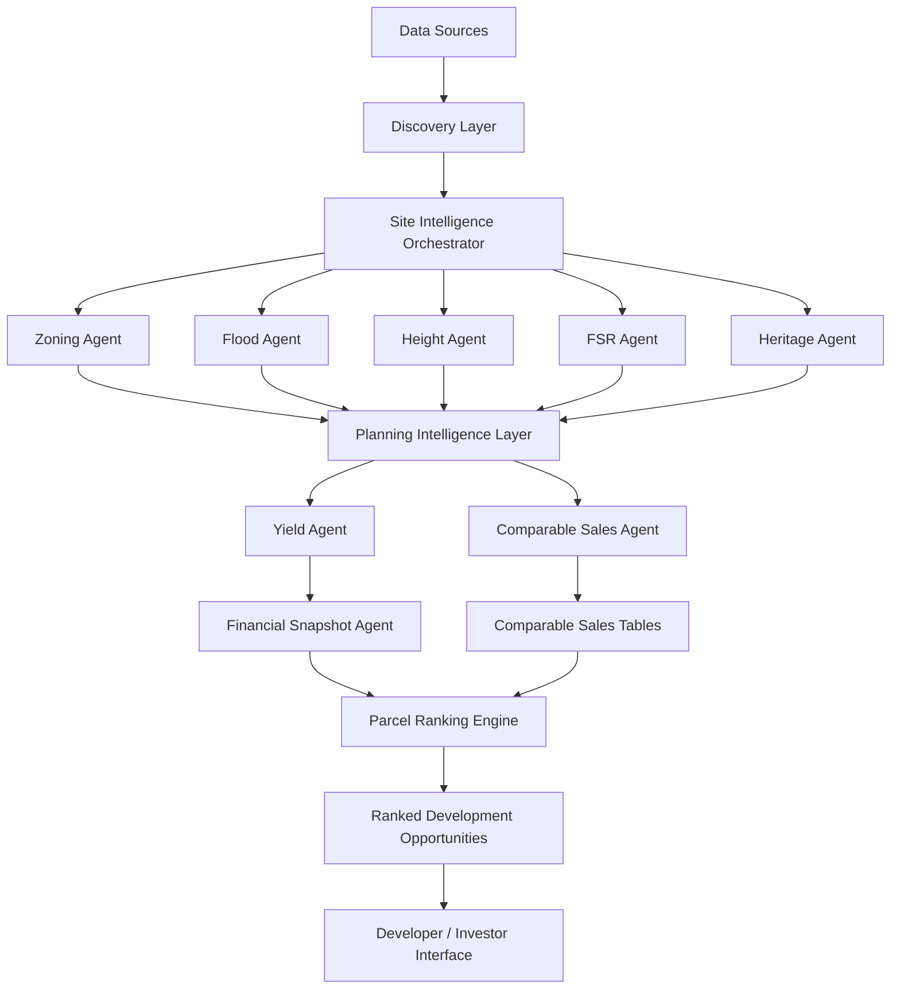
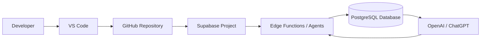

# SYSTEM_ARCHITECTURE_DIAGRAM.md

## AI Deal Platform -- System Architecture

This document provides a visual and conceptual overview of the AI Deal Platform architecture.

It describes how agents, infrastructure, and data layers interact to produce development opportunity intelligence.

------------------------------------------------------------------------

# High Level System Diagram

------------------------------------------------------------------------

# Infrastructure Architecture

------------------------------------------------------------------------

# Core System Layers

## 1. Discovery Layer

Responsible for bringing candidate development sites into the system.

Sources may include:

- inbound email leads
- real estate listings
- planning portal data
- developer submissions
- automated site scanning

Agents:

- email-agent
- domain-discovery-agent
- site-discovery-agent

------------------------------------------------------------------------

## 2. Site Intelligence Layer

This layer retrieves planning controls and constraints for each site.

Agents:

- zoning-agent
- flood-agent
- height-agent
- fsr-agent
- heritage-agent

Outputs:

- zoning classification
- height limits
- FSR limits
- environmental overlays
- heritage restrictions

------------------------------------------------------------------------

## 3. Feasibility Layer

This layer estimates development potential.

Agents:

- yield-agent
- comparable-sales-agent
- add-financial-snapshot

Outputs:

- gross floor area (GFA)
- estimated unit count
- development revenue
- construction cost
- projected margin
- estimated sale price per sqm from nearby comparable developments

------------------------------------------------------------------------

## 4. Ranking Layer

The ranking engine evaluates opportunities based on development viability.

Example scoring inputs:

- zoning flexibility
- site size
- yield potential
- planning constraints
- feasibility margin

Output:

Development opportunity score and ranking tier.

------------------------------------------------------------------------

# Database Architecture

The database acts as the system memory.

Key tables:

- deals
- communications
- site_candidates
- planning_constraints
- yield_estimates
- financial_snapshots
- comparable_sales_estimates
- comparable_sales_evidence
- knowledge_documents

Agents read and write to the database so intelligence accumulates over time.

------------------------------------------------------------------------

# AI Integration

AI is used primarily for:

- interpreting unstructured data
- summarizing deal intelligence
- assisting with decision support
- generating reports

AI does not replace deterministic logic for planning or financial calculations.

------------------------------------------------------------------------

# Future Architecture Expansion

Planned additions:

### Parcel Scanner

Scan the entire NSW cadastre for development potential.

### DA Discovery Agent

Monitor planning approvals and rezoning proposals.

### Machine Learning Ranking

Improve opportunity scoring based on historical deal success.

### Automated Feasibility Reports

Generate investor-ready development memorandums.

### Investor Opportunity Feed

Notify developers or investors of ranked opportunities.

------------------------------------------------------------------------

# Long-Term Vision

The platform evolves into:

**An AI-powered development acquisition engine** capable of:

- scanning property markets
- identifying development opportunities
- analyzing planning constraints
- estimating feasibility
- ranking deals
- notifying investors

------------------------------------------------------------------------

# Diagram Usage

This document serves as a visual reference for the system architecture and should be updated whenever:

- new agents are added
- major pipelines change
- infrastructure architecture evolves
